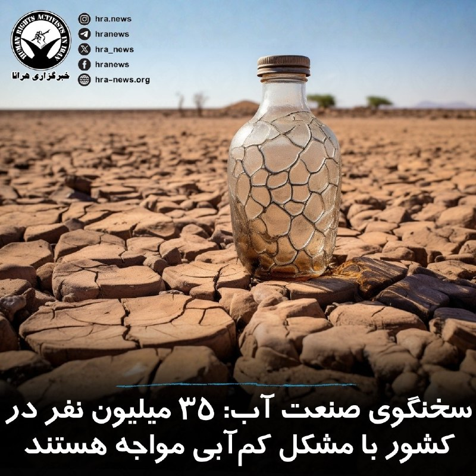

# خواننده تلگرام

<!-- TOP_NAV START -->

<a href="https://github.com/ProAlit/aio-downloader/blob/main/telegram/content/archive_1.md" style="display:inline-block; padding:6px 12px; margin:0 4px; background-color:#2ea44f; color:white; text-decoration:none; border-radius:4px; font-weight:bold;">صفحه بعد</a>

<!-- TOP_NAV END -->

<!-- MSG START -->

---
📅 بروزرسانی: 1405/02/21 18:33
---

## VahidOOnLine — post 239536

  

کول آلن، متهم به تلاش برای ترور دونالد ترامپ در مراسم شام خبرنگاران کاخ سفید، در دادگاه اتهامات علیه خود را رد کرد.
او متهم است ۲۵ آوریل با عبور از ایست بازرسی امنیتی، به سمت یکی از مأموران سرویس مخفی آمریکا شلیک کرده باشد.

در زمان حادثه، ترامپ، ملانیا ترامپ و شماری از مقام‌های ارشد دولت آمریکا در محل حضور داشتند و پس از شنیده شدن صدای تیراندازی از سالن خارج شدند.

دادستان‌ها می‌گویند هنگام بازداشت، چند چاقو و یک اسلحه کمری نیز همراه آلن بوده است. او در صورت محکومیت با احتمال حبس ابد روبه‌رو خواهد شد.
‌🏁 🇬🇧 ManotoTV

🤖 @VahidOOnLine

## VahidOOnLine — post 239535

♦️آریانا سعید، خواننده مشهور افغان، در ایالت ویرجینیای آمریکا کنسرتی ویژه زنان برگزار کرد؛ برنامه‌ای که با استقبال گسترده افغان‌های ساکن آمریکا همراه شد و فضای پرشوری را برای حاضران رقم زد.

او در این کنسرت مجموعه‌ای از ترانه‌ها را به زبان‌های فارسی، پشتو، ازبکی و اردو اجرا کرد و ویدیوهای منتشرشده از این برنامه نیز به‌سرعت در شبکه‌های اجتماعی مورد توجه کاربران قرار گرفت و به شکل گسترده بازنشر شد.

آریانا سعید از شناخته‌شده‌ترین چهره‌های موسیقی افغانستان به شمار می‌رود که پیش از بازگشت طالبان، بارها در کابل و دیگر شهرهای افغانستان روی صحنه رفته بود. اما پس از تسلط دوباره طالبان بر افغانستان، اجرای موسیقی و فعالیت بسیاری از هنرمندان با محدودیت‌های شدید روبه‌رو شد و شماری از خوانندگان و موسیقیدان‌ها ناچار به ترک کشور شدند.

در ماه‌های اخیر، تعدادی از هنرمندان افغان مقیم خارج از کشور تلاش کرده‌اند با برگزاری کنسرت‌ها و برنامه‌های موسیقی، فعالیت هنری خود را ادامه دهند و ارتباطشان را با مخاطبان افغان حفظ کنند.
‌🇸🇦 Indypersian

🤖 @VahidOOnLine

## WithYashar — post 10937

ترامپ به فاکس نیوز: تا زمانی که معامله‌ای صورت نگیرد با ایران برخورد خواهیم کرد. ایران عقب‌نشینی خواهد کرد
@withyashar

## WithYashar — post 10936

ترامپ به فاکس‌نیوز : آنها تسلیم خواهند شد... من با آنها معامله خواهم کرد تا زمانی که به توافق برسند.
@withyashar

## WithYashar — post 10935

همچنین ترامپ به فاکس نیوز گفت که او "به طور جدی" در حال بررسی طرحی برای تبدیل ونزوئلا به ایالت پنجاه و یکم است.
@withyashar

## mwarmonitor — post 8897

  <a href="telegram/content/mwarmonitor_8897_1778511795.mp4" target="_blank">🎬 Download video</a>

🇮🇱نیروهای لشکر ۱۴۶ یک انبار تسلیحاتی را هدف قرار داده و نیروهای حزب‌الله را که تهدیدی برای نیروهای ما بودند، به‌ هلاکت ‌رساندند

نیروهای لشکر ۱۴۶ دیروز (یکشنبه) دو تروریست وابسته به سازمان تروریستی حزب‌الله را که وارد ساختمانی در نزدیکی نیروهای ما در جنوب لبنان شده بودند، شناسایی کردند. از داخل این ساختمان، این تروریست ها برای پیشبرد طرحی تروریستی علیه نیروهای ارتش اسرائیل که در منطقه فعالیت می‌کنند، اقدام می‌کردند.

بلافاصله پس از شناسایی، نیروی هوایی با هدایت نیروهای لشکر، این تروریست ها را که در ساختمان فعالیت داشتند، هدف قرار داده و به هلاکت رساند.

همچنین زیرساخت‌ها و یک انبار تسلیحاتی که مورد استفاده سازمان تروریستی حزب‌الله بود، هدف قرار گرفت و تروریست های دیگری که تهدیدی برای نیروهای ما بودند نیز به هلاکت رسیدند.

علاوه بر این، در ساعات اخیر سازمان تروریستی حزب‌الله چندین راکت و پهپاد انفجاری به سوی نیروهای ارتش اسرائیل در جنوب لبنان شلیک کرد.
در جریان این رویدادها، دو پهپاد انفجاری به تجهیزات مهندسی بدون سرنشین اصابت کردند.

@mwarmonitor

## FoxNewsTwitter — post 341532

  <a href="telegram/content/FoxNewsTwitter_341532_1778511796.mp4" target="_blank">🎬 Download video</a>

Fox News (Twitter/X)

NEW: "The data that we have now all suggest that transmission that spread between people happens when people are symptomatic."

"That gives us one layer of added protection to know when the risk is going to be greatest and how we can best protect the health and safety of the passenger and the American public."

## pm_afshaa — post 90554

🔴ترامپ به فاکس نیوز: تا زمانی که معامله‌ای صورت نگیرد با ایران برخورد خواهیم کرد. ایران عقب‌نشینی خواهد کرد

💧 Rainbet.com the #1 Non-KYC Crypto Casino & Sportsbook @rainbetcom

😁 @Pm_Afshaa

## pm_afshaa — post 90553

🔴رئیس شرکت رافائل اسرائیل : اسرائیل هیچ کمبودی در موشک‌های رهگیر سامانه گنبد آهنین ندارد

💧 Rainbet.com the #1 Non-KYC Crypto Casino & Sportsbook @rainbetcom

😁 @Pm_Afshaa

## pm_afshaa — post 90552

🔴ترامپ: تیم مذاکره‌کننده جمهوری اسلامی به ما گفت که آمریکا باید اورانیوم غنی‌شده را خارج کند، زیرا جمهوری اسلامی فناوری انجام این کار را ندارد

💧 Rainbet.com the #1 Non-KYC Crypto Casino & Sportsbook @rainbetcom

😁 @Pm_Afshaa

## VahidOnline — post 75406

AmirKh1982

📡 @VahidOnline

## IranIntlTV — post 336668

  <a href="telegram/content/IranIntlTV_336668_1778511798.mp4" target="_blank">🎬 Download video</a>

سرخط خبرهای دوشنبه ۲۱ اردیبهشت
@iranintltv

## IranIntlTV — post 336667

  <a href="telegram/content/IranIntlTV_336667_1778511799.mp4" target="_blank">🎬 Download video</a>

پس از رد پیشنهاد دیپلماتیک جدید جمهوری اسلامی از سوی دونالد ترامپ، سناتورها در کنگره آمریکا به ابراز نظر و واکنش پرداختند. سناتور لیندسی گراهام از احیای پروژه آزادی پلاس حمایت کرد.

مرضیه حسینی، خبرنگار ایران‌اینترنشنال، گزارش می‌دهد
@iranintltv

## ManotoTV — post 105309

  

کول آلن، متهم به تلاش برای ترور دونالد ترامپ در مراسم شام خبرنگاران کاخ سفید، در دادگاه اتهامات علیه خود را رد کرد.
او متهم است ۲۵ آوریل با عبور از ایست بازرسی امنیتی، به سمت یکی از مأموران سرویس مخفی آمریکا شلیک کرده باشد.

در زمان حادثه، ترامپ، ملانیا ترامپ و شماری از مقام‌های ارشد دولت آمریکا در محل حضور داشتند و پس از شنیده شدن صدای تیراندازی از سالن خارج شدند.

دادستان‌ها می‌گویند هنگام بازداشت، چند چاقو و یک اسلحه کمری نیز همراه آلن بوده است. او در صورت محکومیت با احتمال حبس ابد روبه‌رو خواهد شد.

## FarsiVOA — post 217445

🔺آمادگی اسرائیل برای اقدام نظامی علیه جمهوری اسلامی؛ تمرکز بر ضربه به حزب‌الله و حماس با حذف بیش از ۲۲۰ تروریست

▪️بنا بر اطلاعاتی که در اختیار بخش فارسی صدای آمریکا قرار گرفته، اسرائیل در حالی‌که آمادگی کامل خود را برای هرگونه پاسخ به حملات احتمالی جمهوری اسلامی حفظ کرده، تمرکز عملیاتی خود را بر ادامه ضربه‌زدن به گروه‌های نیابتی جمهوری اسلامی، به‌ویژه حزب‌الله لبنان و حماس، ادامه خواهد داد.

⬇️ بیشتر بخوانید:

https://ir.voanews.com/a/8148806.html/?nocach=1

## Persian_Trend_Official — post 13923

  <a href="telegram/content/Persian_Trend_Official_13923_1778511801.webm" target="_blank">🎬 Download video</a>

🔴 ترامپ: ایران از آمریکا خواسته «گرد و غبار هسته‌ای» را جمع‌آوری کند

💢دونالد ترامپ مدعی شد مذاکره‌کنندگان ایرانی به او گفته‌اند آمریکا باید مواد رادیواکتیو باقی‌مانده در تأسیسات هسته‌ای تخریب‌شده ایران را خارج کند، زیرا تهران فناوری لازم برای استخراج و پاکسازی آن را در اختیار ندارد.

ترامپ در توصیف این مواد از عبارت «گرد و غبار هسته‌ای» استفاده کرده است.

📌 این ادعا تاکنون از سوی منابع رسمی ایران تأیید نشده است.

🫆:Tony

📌 @persian_trend_official
پرشین ترند | متفاوت‌ترین کانال نظامی

## Persian_Trend_Official — post 13922

🔴 ترامپ: احتمال ازسرگیری «پروژه آزادی» با ابعادی گسترده‌تر

💢دونالد ترامپ اعلام کرد در حال بررسی ازسرگیری «پروژه آزادی» است، اما این بار نه فقط برای اسکورت کشتی‌ها در تنگه هرمز، بلکه در قالبی گسترده‌تر.

💢او همچنین مدعی شد:
«رهبران تندروی ایران در نهایت تسلیم خواهند شد.»

«با ایران تعامل خواهیم کرد تا زمانی که به توافق برسیم.»

📌 این اظهارات در حالی مطرح می‌شود که فضای مذاکرات و تنش‌های منطقه‌ای همچنان ناپایدار و مبهم باقی مانده است.

🫆:Tony

📌 @persian_trend_official
پرشین ترند | متفاوت‌ترین کانال نظامی

## IranianMinds — post 19946

🔴 ترامپ به فاکس نیوز :

در حال بررسی تمدید عملیات پروژه آزادی اما گسترده‌تر کردن آن، نه محدود به اسکورت کشتی‌ها در تنگه هرمز

@IranianMinds

## IranianMinds — post 19945

  <a href="https://t.me/IranianMinds/19945" target="_blank">📎 Download file</a>

📲#اپلیکیشن اندروید سایت جهانی دربی بت

👍اسپانسر لیگ انگلیس
👍
🔥امکان شارژ امن از طریق کارت بانکی
➖➖➖➖➖➖➖➖➖

🪙همین حالا عضو شوید 👇
https://t.me/+aCbq7yy8QY80NzQ0

## IranianMinds — post 19944

  

😤دنبال یه سایت شرط بندی بین المللی بودی که به ایرانیا خدمات بده؟!
⛔

👍دربی بت همون انتخاب  100%

💎ویژگی های سایت جهانی Derby Bet:

⬅️امکان شارژ امن با کارت بانکی

⬅️واریز اول دوبل شارژ می شوید(بونوس۱۰۰٪)

⬅️پر اپشن ترین سایت فعال در ایران

⬅️تسویه حساب کمتر از 5 دقیقه

⬅️برگشت بخشی از باخت به صورت هفتگی

🚨کد هدیه ثبت نام:GG007

⚠️برای دانلود اپلکیشن کلیک کنید
👉
ge21

🔔کانال دربی بت :

🪙https://t.me/+aCbq7yy8QY80NzQ0

## Hranews — post 112884

  

سخنگوی صنعت آب کشور، اعلام کرد که ۳۵ میلیون نفر در ایران با مشکل #کم‌آبی مواجه هستند و ۱۱ استان همچنان شرایط بارشی زیر نرمال دارند. وی با اشاره به نامتوازن بودن بارش‌ها گفت که با وجود بارندگی مناسب در استان‌هایی مانند بوشهر، هرمزگان و ایلام، استان‌هایی از جمله تهران، قم، یزد، مرکزی و اصفهان همچنان با کاهش شدید بارش روبه‌رو هستند و تهران در صدر مناطق بحرانی قرار دارد.

عیسی بزرگ‌زاده، با تاکید بر اینکه مدیریت منابع آبی باید «کاملا محلی» باشد، گفت افزایش بارش یا سرریز سدها در برخی مناطق تاثیری در تامین آب استان‌های دچار تنش آبی ندارد. او با اشاره به ادامه بحران آب در بخش‌هایی از کشور، بر ضرورت مدیریت مصرف و اصلاح الگوی مصرف آب تاکید کرد.

↘️
@hranews_bot تماس ✉️ -  @Hranews  کانال هرانا 🆑

## manototv — post 105309

  

کول آلن، متهم به تلاش برای ترور دونالد ترامپ در مراسم شام خبرنگاران کاخ سفید، در دادگاه اتهامات علیه خود را رد کرد.
او متهم است ۲۵ آوریل با عبور از ایست بازرسی امنیتی، به سمت یکی از مأموران سرویس مخفی آمریکا شلیک کرده باشد.

در زمان حادثه، ترامپ، ملانیا ترامپ و شماری از مقام‌های ارشد دولت آمریکا در محل حضور داشتند و پس از شنیده شدن صدای تیراندازی از سالن خارج شدند.

دادستان‌ها می‌گویند هنگام بازداشت، چند چاقو و یک اسلحه کمری نیز همراه آلن بوده است. او در صورت محکومیت با احتمال حبس ابد روبه‌رو خواهد شد.

## alonews — post 119307

  <a href="telegram/content/alonews_119307_1778511804.webm" target="_blank">🎬 Download video</a>

👈ترامپ: رهبران تندرو ایران را تسلیم میکنیم

✅ @AloNews خبر جنگ

## alonews — post 119306

  <a href="telegram/content/alonews_119306_1778511804.webm" target="_blank">🎬 Download video</a>

👈ترامپ به فاکس نیوز: تا زمانی که معامله‌ای صورت نگیرد با ایران برخورد خواهیم کرد. ایران عقب‌نشینی خواهد کرد

✅ @AloNews خبر جنگ

## alonews — post 119305

  <a href="telegram/content/alonews_119305_1778511804.webm" target="_blank">🎬 Download video</a>

👈ترامپ به فاکس نیوز گفت که او «به طور جدی در حال بررسی» انتقال ونزوئلا به عنوان ایالت ۵۱ام است.

✅ @AloNews خبر جنگ

---
📅 بروزرسانی: 1405/02/21 18:23
---

## WithYashar — post 10934

ترامپ : در حال بررسی از سرگیری پروژه آزادی هستم، اما با دامنه گسترده‌تر که فقط به اسکورت کشتی‌ها از طریق تنگه هرمز محدود نشود.
@withyashar

## WithYashar — post 10933

ترامپ: تیم مذاکره‌کننده جمهوری اسلامی به ما گفت که آمریکا باید اورانیوم غنی‌شده را خارج کند، زیرا جمهوری اسلامی فناوری انجام این کار را ندارد
@withyashar

## mwarmonitor — post 8896

🔴 ترامپ به فاکس‌نیوز:
در حال بررسی ازسرگیری «پروژه آزادی» هستم، اما با دامنه‌ای گسترده‌تر که صرفاً به اسکورت کشتی‌ها از طریق تنگه هرمز محدود نباشد.

@mwarmonitor

## FoxNewsTwitter — post 341531

Fox News (Twitter/X)

JUST IN: Two passengers from the MV Hondius cruise ship who have been exposed to the deadly hantavirus outbreak arrive in Atlanta for medical care and assessments.

The passengers are reportedly being transported to Emory University Hospital, as health officials say both are asymptomatic and are following guidance from the Centers for Disease Control and Prevention.

## pm_afshaa — post 90551

🔴شبکه 14 اسرائیل، تو حمله بعدی اهدافمون شامل موارد زیر میشه:

تاسیسات انرژی و صنعت پتروشیمی

صنعت خودروسازی و پایگاه‌ های موشک بالستیک

صنعت نفت و صنعت فولاد

💧 Rainbet.com the #1 Non-KYC Crypto Casino & Sportsbook @rainbetcom

😁 @Pm_Afshaa

## VahidOnline — post 75405

قطع اینترنت نه تنها ربطی به تأمین امنیت زیرساخت‌ها ندارد، که «اقدام علیه امنیت ملی» است.
در ۷۲ روز گذشته میلیون‌ها گوشی، کامپیوتر و سرور ایرانی از صدها پچ امنیتی حیاتی محروم ماندند و در معرض انواع نفوذ و هک قرار گرفته‌اند.
در این #رشتو بخشی از این آپدیتها را مرور می‌کنم: @hamedbd_channel

hamedbd

📡 @VahidOnline

## FarsiVOA — post 217444

  <a href="telegram/content/FarsiVOA_217444_1778511184.mp4" target="_blank">🎬 Download video</a>

گلایه یک شهروند از گرانی روزافزون روغن و مواد خوراکی؛ «سپاه ما را به خواری و ذلت انداخته.»

در سایه بی‌ثباتی اقتصادی و فشارهای مداوم، زندگی روزمره بسیاری از مردم به میدان مبارزه‌ای خاموش برای تأمین حداقل‌ها تبدیل شده است.

## DW_Farsi — post 124565

  

🔶 کاهش شدید صادرات آلمان به خاورمیانه در پی جنگ

بر اساس ارزیابی خبرگزاری رویترز بر پایه نخستین داده‌های اداره فدرال آمار آلمان، در پی جنگ در خاورمیانه، صادرات به ایران در ماه مارس در مقایسه با ماه مشابه سال گذشته، ۶۷ درصد کاهش یافت و به کمتر از ۲۵ میلیون یورو رسید.

صادرات به کشورهای همسایه ایران در منطقه خلیج فارس نیز به شدت کاهش یافت.

صادرات به قطر با افتی نزدیک به ۶۰ درصد به حدود ۵۴ میلیون یورو رسید و صادرات به عراق با ۵۵ درصد کاهش به ۵۸ میلیون یورو رسید.

صادرات به کویت نیز با ۵۸ درصد کاهش به حدود ۴۴ میلیون یورو سقوط کرد و صادرات به عربستان سعودی با بیش از ۱۳ درصد کاهش به ۶۴۳ میلیون یورو رسید.

حجم تجارت با امارات متحده عربی نیز بیش از ۳۸ درصد کاهش یافت و به ۵۸۲ میلیون یورو رسید.

در عین حال صادرات به عمان ۱۷ درصد کاهش یافت و به کمتر از ۴۵ میلیون یورو و حجم صادرات به بحرین نیز با ۶۴ درصد افت به ۱۴.۲ میلیون یورو رسید.

طبق آمار منتشر شده، صادرات آلمان به این هشت کشور یادشده در ماه مارس به کمتر از ۱.۵ میلیارد یورو رسیده است. این رقم ۷۵۷ میلیون یورو کمتر از مدت مشابه در سال گذشته بوده است.
@dw_farsi

## IranianMinds — post 19943

  

🔴جمهوری اسلامی ورشکسته شده و قادر به پرداخت حقوق به مزدوران داخلی خود نیست...

@IranianMinds

## BBCPersian — post 280770

  

🔻مردی که به تیراندازی در هتل محل ضیافت خبرنگاران کاخ سفید در واشنگتن متهم شده است، اتهامات را رد کرد و در دادگاه اعلام بی‌گناهی کرد. این اتفاق دو هفته پیش رخ داد و ماموران سرویس مخفی آمریکا به‌سرعت دونالد ترامپ و همسرش و مقا‌های ارشد دولت را به محل امن بردند.

کول توماس آلن، ۳۱ ساله، به جرایم فدرال مرتبط با سلاح گرم و تلاش برای ترور دونالد ترامپ، رئیس‌جمهوری آمریکا، متهم شده است.

به گزارش شبکه سی‌بی‌اس، شریک خبری بی‌بی‌سی در آمریکا، آقای آلن روز دوشنبه با لباس نارنجی زندان و در حالی که دست‌ها و پاهایش زنجیر شده بود، در دادگاه حاضر شد.

کول توماس آلن در رشته مهندسی مکانیک در مؤسسه فناوری کالیفرنیا، یک دانشگاه بسیار معتبر، تحصیل کرده است.

دادستان‌ها می‌گویند او تلاش کرد از یک ایست بازرسی عبور کند و در مراسم در هتل هیلتون واشنگتن به یک مأمور سرویس مخفی آمریکا شلیک کرده است. جلیقه ضدگلوله‌اش جان این مامور را نجات داد.

ادامه خبر را از لینک زیر در وبسایت بی‌بی‌سی فارسی بخوانید.
📷 Reuters
https://bbc.in/4djpGT5
@BBCPersian

## idfinfarsi — post 11563

  <a href="telegram/content/idfinfarsi_11563_1778511188.mp4" target="_blank">🎬 Download video</a>

نیروهای لشکر ۱۴۶ یک انبار تسلیحاتی را هدف قرار داده و نیروهای حزب‌الله را که تهدیدی برای نیروهای ما بودند، به‌ هلاکت ‌رساندند

ارتش اسرائیل به اقدام برای رفع تهدیدها علیه شهروندان این کشور و نیروهای ارتش در جنوب لبنان ادامه می‌دهد.

نیروهای لشکر ۱۴۶ دیروز (یکشنبه) دو تروریست وابسته به سازمان تروریستی حزب‌الله را که وارد ساختمانی در نزدیکی نیروهای ما در جنوب لبنان شده بودند، شناسایی کردند. از داخل این ساختمان، این تروریست ها برای پیشبرد طرحی تروریستی علیه نیروهای ارتش اسرائیل که در منطقه فعالیت می‌کنند، اقدام می‌کردند.

بلافاصله پس از شناسایی، نیروی هوایی با هدایت نیروهای لشکر، این تروریست ها را که در ساختمان فعالیت داشتند، هدف قرار داده و به هلاکت رساند.

همچنین زیرساخت‌ها و یک انبار تسلیحاتی که مورد استفاده سازمان تروریستی حزب‌الله بود، هدف قرار گرفت و تروریست های دیگری که تهدیدی برای نیروهای ما بودند نیز به هلاکت رسیدند.

علاوه بر این، در ساعات اخیر سازمان تروریستی حزب‌الله چندین راکت و پهپاد انفجاری به سوی نیروهای ارتش اسرائیل در جنوب لبنان شلیک کرد.
در جریان این رویدادها، دو پهپاد انفجاری به تجهیزات مهندسی بدون سرنشین اصابت کردند. هیچ‌گونه تلفات جانی برای نیروهای ما گزارش نشده است، اما به تجهیزات خسارت وارد شده است.

ارتش اسرائیل به اقدام برای رفع تهدیدها علیه نیروهای خود و شهروندان این کشور ادامه خواهد داد.

## alonews — post 119304

  <a href="telegram/content/alonews_119304_1778511190.webm" target="_blank">🎬 Download video</a>

👈ترامپ: ایران گفته که آمریکا باید گرد و غبار هسته‌ای رو پاک کنه، چون خودشون وسایلشو ندارن

✅ @AloNews خبر جنگ

## alonews — post 119303

  <a href="telegram/content/alonews_119303_1778511190.webm" target="_blank">🎬 Download video</a>

👈ترامپ: از سرگیری پروژه آزادی در تنگه هرمز را بررسی می‌کنم

✅ @AloNews خبر جنگ

<!-- MSG END -->

<!-- NAV START -->

<a href="https://github.com/ProAlit/aio-downloader/blob/main/telegram/content/archive_1.md" style="display:inline-block; padding:6px 12px; margin:0 4px; background-color:#2ea44f; color:white; text-decoration:none; border-radius:4px; font-weight:bold;">صفحه بعد</a>

<!-- NAV END -->
