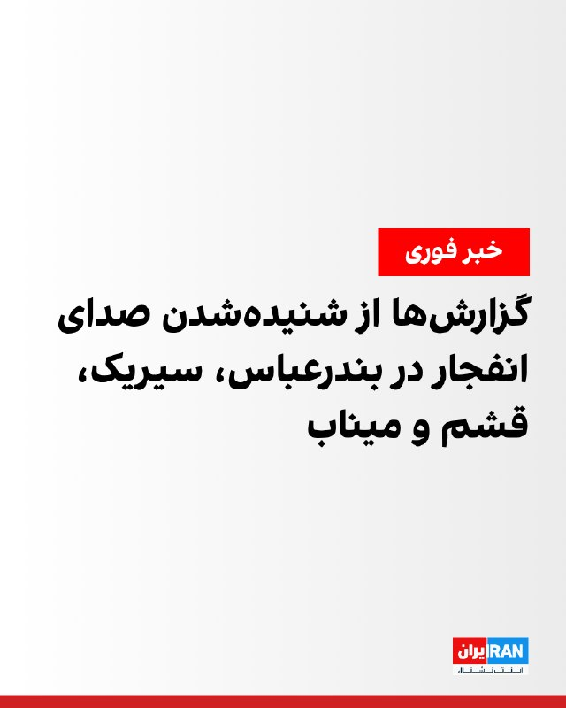
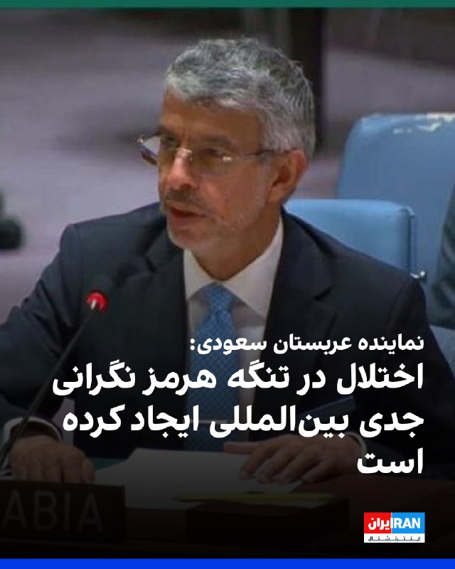
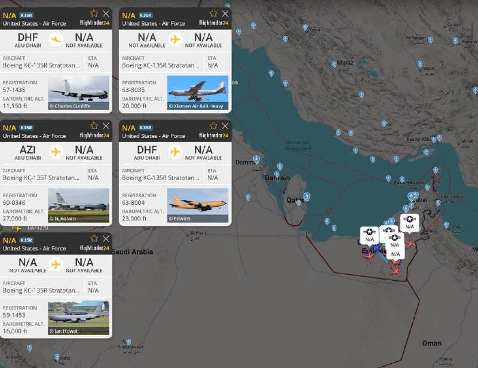
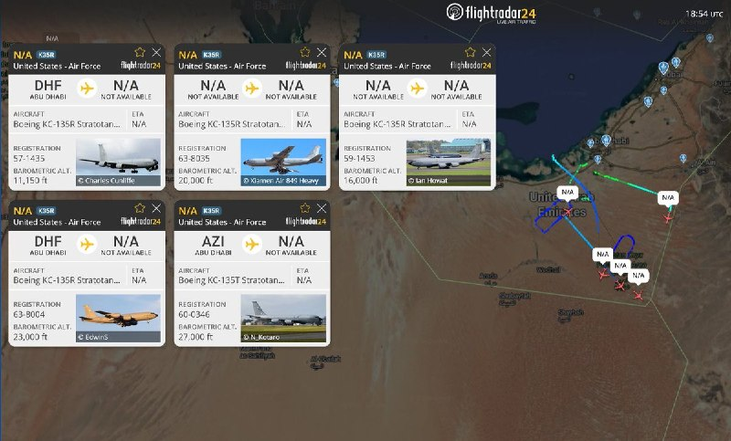
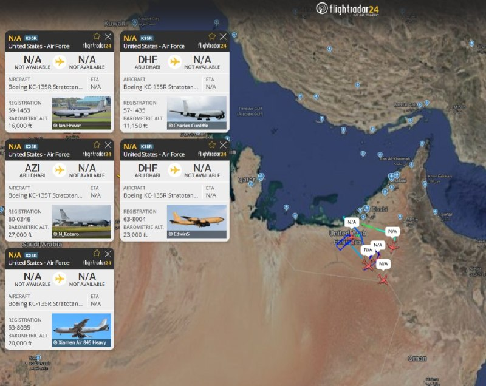
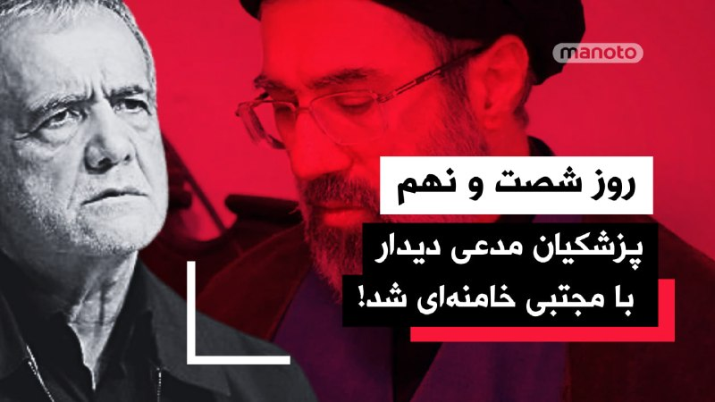
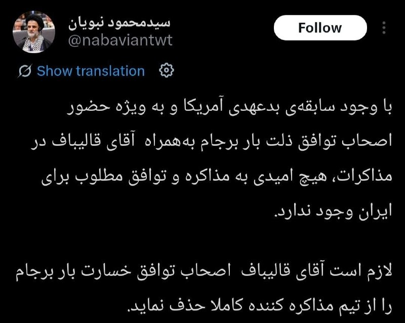
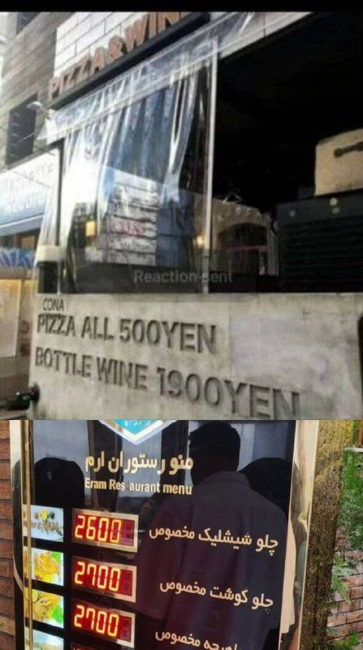

# خواننده تلگرام

<!-- MSG START -->

---
📅 بروزرسانی: 1405/02/17 22:33
---

## VahidOOnLine — post 238716

🗣روایت شما از شنیدن صدای انفجار- پنجشنبه ۱۷ اردیبهشت ۱۴۰۵

🔹در جزیره قشم صدای انفجار به گوش می‌رسه

🔹من از بندرعباس گزارش می‌دم. همین نیم ساعت پیش، شامگاه پنجشنبه، صدای انفجاری مهیب شنیدیم اما مشخص نیست از کجا بود

🔹در ساعت ۱۰:۰۶ شب، در قشم اسکله ۲۲ بهمن، صدای انفجار اومد و هوا کامل روشن شد

🔹الان، شامگاه پنجشنبه حدود ساعت ۱۰ شب، صدای سه انفجار در جزیره قشم شنیده شد. کل خونه‌ها دارن می‌لرزن
‌🏁 🇬🇧 IranintlTV

🤖 @VahidOOnLine

## VahidOOnLine — post 238715

  

خبرگزاری فارس، وابسته به سپاه پاسداران، از شنیده شدن صدای چند انفجار در بندرعباس در شامگاه پنجشنبه خبر داد و اعلام کرد که هنوز منشا و محل دقیق این صداها مشخص نیست.
همزمان اسکان‌نیوز نوشت گزارش‌ها از شنیده‌شدن صدای ۶ انفجار با فاصله ۴۰ ثانیه از یکدیگر در سیریک در استان هرمزگان خبر می‌دهند.
وحید آنلاین نیز از شنیده شدن صداهای انفجار در قشم، میناب، بندرعباس، بندر خمیر، چابهار و سیریک در شامگاه پنجشنبه خبر داد.
‌🏁 🇬🇧 IranintlTV

🤖 @VahidOOnLine

## VahidOOnLine — post 238714

  

عبدالعزیز بن محمد الواصل، نماینده عربستان سعودی در سازمان ملل در نشست شورای امنیت گفت تنگه هرمز همچنان شریان حیاتی تجارت جهانی است و هرگونه اختلال در امنیت آن موجب نگرانی جدی بین‌المللی می‌شود. او افزود تحولات اخیر در این تنگه تنش‌ها را افزایش داده و خطر پیامدهای انسانی، اقتصادی و امنیتی قابل توجهی را به همراه داشته است.

نماینده عربستان سعودی گفت اختلال در عبور و مرور دریایی بازارهای جهانی انرژی را تحت تاثیر قرار داده و روند تحویل کالاهای اساسی از جمله مواد غذایی، تجهیزات پزشکی و کمک‌های بشردوستانه را با مشکل مواجه کرده است. به گفته او، این وضعیت پیامدهای سنگینی برای کشورهای آسیب‌پذیر و وابسته به واردات دارد.

او تاکید کرد این تحولات ضرورت فوری جلوگیری از تشدید تنش‌ها و حفاظت از ثبات و امنیت این آبراه راهبردی را نشان می‌دهد. به گفته نماینده عربستان، پیش‌نویس قطعنامه خواستار اقدام فوری و هماهنگ بین‌المللی برای تضمین جریان آزاد و ایمن تجارت دریایی، انتقال کمک‌های بشردوستانه و بازگرداندن ثبات به بازارهای جهانی است.
‌🏁 🇬🇧 IranintlTV

🤖 @VahidOOnLine

## mwarmonitor — post 8647

  

✈️برخاست سریع تانکرها؟

🔰با گزارش‌هایی که از شنیده شدن انفجار در بندرعباس ایران منتشر شده، ناوگان هواپیماهای سوخت‌رسان مستقر در امارات متحده عربی به‌صورت گروهی به پرواز درآمده‌اند؛ این اقدام ممکن است به دلیل نگرانی امارات از حملات بیشتر ایران باشد، یا احتمالاً در راستای حمایت از یک پاسخ تلافی‌جویانه امارات (در حال حاضر هیچ تأیید رسمی در این مورد وجود ندارد، اما امارات اعلام کرده که حق پاسخ به حملات اخیر ایران را برای خود محفوظ می‌داند).

@mwarmonitor

## mwarmonitor — post 8646

ظاهراً اتفاقاتی در حال رخ دادن

## DEJradio — post 4479

  <a href="telegram/content/DEJradio_4479_1778180595.jpg">🎬 Download video</a>

⭕️
🧨
🚨 منابع محلی و گزارش‌های داخلی از وقوع چندین انفجار در منطقه بندرعباس حکایت دارند. #انفجار #بندرعباس @DEJradio

## kianmeli1 — post 87223

  <a href="telegram/content/kianmeli1_87223_1778180596.mp4">🎬 Download video</a>

🔴 فوری-تهرانپارس؛ یک شی نورانی مانند پهپاد در فاصله‌ی چند صدمتری از سطح زمین پرواز می‌کند.
https://t.me/kianmeli1

## kianmeli1 — post 87222

🔴فوری-سپاه در حالت آماده باش جنگی قرار گرفت
https://t.me/kianmeli1

## kianmeli1 — post 87221

  

🔴فوری-برخاستن تانکرهای سوخت‌رسان از امارات
https://t.me/kianmeli1

## kianmeli1 — post 87220

🔴فوری-یک منبع اسراییلی نوشت

جنگنده های امارات ٫ اسکله بهمن قشم را بمباران کرد
https://t.me/kianmeli1

## IranIntlTV — post 336017

🗣روایت شما از شنیدن صدای انفجار- پنجشنبه ۱۷ اردیبهشت ۱۴۰۵

🔹در جزیره قشم صدای انفجار به گوش می‌رسه

🔹من از بندرعباس گزارش می‌دم. همین نیم ساعت پیش، شامگاه پنجشنبه، صدای انفجاری مهیب شنیدیم اما مشخص نیست از کجا بود

🔹در ساعت ۱۰:۰۶ شب، در قشم اسکله ۲۲ بهمن، صدای انفجار اومد و هوا کامل روشن شد

🔹الان، شامگاه پنجشنبه حدود ساعت ۱۰ شب، صدای سه انفجار در جزیره قشم شنیده شد. کل خونه‌ها دارن می‌لرزن

## IranIntlTV — post 336016

  

خبرگزاری فارس، وابسته به سپاه پاسداران، از شنیده شدن صدای چند انفجار در بندرعباس در شامگاه پنجشنبه خبر داد و اعلام کرد که هنوز منشا و محل دقیق این صداها مشخص نیست.
همزمان اسکان‌نیوز نوشت گزارش‌ها از شنیده‌شدن صدای ۶ انفجار با فاصله ۴۰ ثانیه از یکدیگر در سیریک در استان هرمزگان خبر می‌دهند.
وحید آنلاین نیز از شنیده شدن صداهای انفجار در قشم، میناب، بندرعباس، بندر خمیر، و سیریک در شامگاه پنجشنبه خبر داد.
https://iranintl.com/202605074248

## Shin_Persian — post 5850

  

DefenceGeek 🇬🇧 ✓ @DefenceGeek Thu, 07 May 2026 18:56:55 UTC Tankers Scramble? #FreeIran‌ --- Operation EPIC FURY / Project FREEDOM --- With reports coming in of explosions heard in Bandar Abbas in Iran, the fleet of tankers stationed in the UAE have gotten…

## Shin_Persian — post 5849

DefenceGeek 🇬🇧 ✓ @DefenceGeek
Thu, 07 May 2026 18:56:55 UTC

Tankers Scramble? #FreeIran‌
--- Operation EPIC FURY / Project FREEDOM ---

With reports coming in of explosions heard in Bandar Abbas in Iran, the fleet of tankers stationed in the UAE have gotten airborne as a group, potentially with the UAE either fearing further Iranian attacks, or supporting a potential UAE retaliation (there is no confirmation of this presently, but the UAE have said they reserve the right to respond for recent Iranian attacks)

@MATA_osint

فارسی

تکاپوی تانکرها؟ #FreeIran
--- عملیات خشم حماسی / پروژه آزادی ---

با انتشار گزارش‌هایی از شنیده شدن صدای انفجار در بندرعباس ایران، ناوگان تانکرهای مستقر در امارات متحده عربی به‌صورت گروهی به پرواز درآمده‌اند؛ این اقدام احتمالاً ناشی از ترس امارات از حملات بیشتر ایران، یا در راستای حمایت از پاسخ احتمالی امارات است (در حال حاضر تأییدی در این باره وجود ندارد، اما امارات پیش‌تر اعلام کرده است که حق پاسخگویی به حملات اخیر ایران را برای خود محفوظ می‌دارد).

@MATA_osint

𝕏 · @shin_persian

## Shin_Persian — post 5845

Shin ✓ @hey_itsmyturn
Thu, 07 May 2026 18:52:12 UTC

State-owned MehrNews confirms the explosion sounds in Qeshm and Bandar Abbas, Hormozgan Province, #Iran

فارسی

خبرگزاری دولتی مهر صدای انفجار در قشم و بندرعباس در استان هرمزگان، #Iran را تأیید کرد.

𝕏 · @shin_persian

## FarsiVOA — post 217131

تصمیم عجیب «چین» برای عدم ارائه تسهیلات بانکی به پتروشیمی‌هایی که با «جمهوری اسلامی» مراوده اقتصادی دارند؛ گفت گو با مهدی مصلحی

## IranianMinds — post 19710

🔴در اسکله‌های قشم هم چندین انفجار شنیده شد.

@IranianMinds

## IranianMinds — post 19709

  

🔴 5 تا هواپیمای سوخت رسان از امارات بلند شدن

@IranianMinds

## IranianMinds — post 19708

به نظر من تنها حالتی که بخواد باشه ، ( تازه اگر باشه ) اینه که امارات برای انتقام یک حمله کوچیک به یک اسلکه ایران کرده باشه

وگرنه اگر کار اسرائیل و آمریکا بود اعلام میشد و عکس و فیلم هاش همون لحظه میومد

تجربه اینو ثابت کرده

## IranianMinds — post 19707

یه صدا اومده باز همه شروع کردن جو دادن
تو بعضی چنلا آمریکا نیروی زمینیشم از مرز وارد کرده دارن میجنگن

## IranianMinds — post 19706

🔴 خبرگزاری فارس : دقایقی پیش مردم بندرعباس چند صدای شبیه به انفجار از حوالی این شهر شنیدند. @IranianMinds

## officialrezapahlavi — post 1828

در روز جهانی کارگر، به همه‌ی شما کارگران زحمتکش و شجاع ایران درود می‌فرستم.

در این روزهای سخت و طاقت‌فرسا -حاصل عملکرد ویرانگر چهل‌وهفت‌ساله‌ی جمهوری اسلامی- در کنار شما ایستاده‌ام. می‌دانم که شما کارگران و زحمت‌کشان، همچون اکثر هم‌میهنان، زیر فشار سنگین اقتصادی و تنگنای معیشتی هستید؛ سفره‌های‌تان هر روز کوچک‌تر و خالی‌تر می‌شود، در حالی که جمهوری اسلامی ثروت ملی ما را صرف جنگ‌افروزی و حمایت از گروه‌های تروریستی می‌کند.

این وضعیت شایسته‌ی کارگر و شهروند ایرانی نیست؛ و با سرنگونی این رژیم و به ثمر نشستن جان‌فشانی‌ها و خون پاک ده‌ها هزار جان‌فدای راه آزادی ایران، پایان خواهد یافت.

رسیدن به این هدف، به مشارکت تک‌تک ما نیاز دارد. در هر لحظه و هر قدم، از خود بپرسیم: آیا این اقدام بر عمر رژیم می‌افزاید یا اینکه به پیروزی انقلاب شیروخورشید کمک می‌کند؟ هر اقدام، هرچند کوچک، در از کار انداختن دستگاه سرکوب رژیم، در تعیین سرنوشت یک ملت بزرگ و تاریخی موثر است.

از آموزه‌های زرتشت تا دوران پرافتخار هخامنشیان، جایگاه کار و کارگر، به عنوان یکی از اصلی‌ترین بازوان توسعه، آبادانی و رفاه، همواره در تاریخ و فرهنگ ایرانی گرامی و ارجمند بوده است. داریوش بزرگ بیش از ۲۵۰۰ سال پیش شخصا به امور کارگران و کارمندان زن و مرد شاغل در تخت‌جمشید رسیدگی می‌کرد و دستور پرداخت مستقیم حق و حقوق‌شان را می‌داد. در دوران معاصر نیز شاهد بازیابی این فرهنگ کهن بودیم. پدربزرگ و پدرم همواره توجه ویژه‌ای به کار و کارگران داشتند. در زمان پدرم با انقلاب سفید شاه و ملت، رفاه و معیشت کارگران در کانون توجه قرار گرفت: از سهیم کردن کارگران در سود کارخانه‌ها، تا تسهیل خرید مسکن، و ایجاد امکانات آموزشی، رفاهی و ورزشی برای کارگران و خانواده‌هایشان.

موضوع توسعه‌ی اقتصادی و صنعتی، کار و کارآفرینی با محوریت رفاه، آسایش و زندگی شرافتمندانه‌ی کارگران، برای من نیز اهمیتی ویژه و اساسی دارد. از این‌رو، تیم من در پروژه‌ی شکوفایی ایران، به‌طور کامل و هدفمند بر این موضوع متمرکز شده و ایده‌ها و راهکارهای متناسب با شرایط ایران را به‌صورت دقیق مطالعه، بررسی و ارائه کرده است.

باور دارم که با قرار گرفتن دوباره ایران بر ریل ترقی و‌ توسعه، و بازگشت رونق و آبادانی، کارگران کشور و خانواده‌های شریف آنان بار دیگر از احترام، رفاه، و کرامتی که شایسته همه ایرانیان است برخوردار خواهند شد.

پاینده ایران،
رضا پهلوی

@OfficialRezaPahlavi

## officialrezapahlavi — post 1827

  <a href="telegram/content/officialrezapahlavi_1827_1778180599.mp4">🎬 Download video</a>

ساختار رژیم را هدف بگیرید و فشار بر آن را ادامه دهید تا مردم فرصت بازگشت به خیابان‌ها را به دست آورند.

مصاحبه با شان هنیتی در فاکس‌نیوز، با زیرنویس فارسی

۲۸ آوریل ۲۰۲۶ (۸ اردیبهشت ۱۴۰۵/۲۵۸۵)

@OfficialRezaPahlavi

## officialrezapahlavi — post 1826

سخنرانی در کنفرانس مطبوعاتی فدرال آلمان

برلین - ۳ اردیبهشت ۱۴۰۵/۲۵۸۵

Remarks at the Federal Press Conference (Bundespressekonferenz)
Berlin – April 23, 2026

@OfficialRezaPahlavi

## officialrezapahlavi — post 1825

  <a href="telegram/content/officialrezapahlavi_1825_1778180600.mp4">🎬 Download video</a>

در چند هفته اخیر در سفر به دور اروپا با اعضای پارلمان‌ها، دولت‌ها و رسانه‌ها گفت‌وگو کرده‌ام.

سفر من یک هدف داشت: این که صدای میلیون‌ها ایرانی باشم که تحت سلطه جمهوری اسلامی، ترورهای آن و قطع اینترنت، گروگان گرفته شده‌اند؛ میلیون‌ها ایرانی که صدایشان خاموش شده است.

اما اکنون با اطمینان می‌توانم بگویم این سکوت، این سانسور، نه‌تنها توسط رژیم در ایران، بلکه توسط رسانه‌های بین‌المللی و به‌ویژه اروپایی انجام می‌شود.

بنابراین، می‌خواهم به طور مستقیم با مردم اروپا صحبت کنم.

I have spent the past several weeks traveling across Europe, speaking to members of parliaments, governments, and the press.

My visit had one objective: to give a voice to the millions of Iranians held hostage by the Islamic Republic, its terror, and its Internet blackout. The millions of Iranians who have been silenced.

But I can now say with confidence that that silencing, that censorship, is not just happening at the hands of the regime in Iran, but by the international, and particularly the European, media.

So I want to speak directly to the people of Europe.

@OfficialRezaPahlavi

## officialrezapahlavi — post 1824

گفتگو با برنامه پورتا پورتا، شبکه رای-۱ ایتالیا

با زیرنویس فارسی
آوریل ۲۰۲۶ (فروردین ۱۴۰۵/۲۵۸۵)

@OfficialRezaPahlavi
https://youtu.be/DYnFKU782n8

## officialrezapahlavi — post 1816

در جریان سفر به ایتالیا با شماری از سناتورها و نمایندگان مجلس این کشور از احزاب مختلف دیدار و درباره جنگ جمهوری اسلامی علیه ملت ایران، و مسئولیت اخلاقی ایتالیا و اروپا بر پشتیبانی از انقلاب ملی ایرانیان با هدف پایان دادن به جمهوری اسلامی و رسیدن به آزادی و دموکراسی گفتگو کردیم.

من در این دیدارها بر لزوم فشار دیپلماتیک بر جمهوری اسلامی برای برقراری اینترنت، آزادی زندانیان سیاسی، و توقف فوری اعدام‌ها تاکید کردم.

ازجمله این دیدارها، دیدار با سناتور مائوریتزیو گاسپاری، رئیس کمیته امور خارجی و دفاع سنای ایتالیا بود.

@OfficialRezaPahlavi

## officialrezapahlavi — post 1815

نسخه کامل سخنرانی در پارلمان سوئد (با زیرنویس فارسی)

دوشنبه ١٣ آوریل ٢٠٢۶
٢۴ فروردین ١۴٠۵/٢۵٨۵

نسخه با کیفیت بهتر در یوتیوب

@OfficialRezaPahlavi

## officialrezapahlavi — post 1811

از کشور سوئد به خاطر استقبال گرم در جریان سفرم به استکهلم و پارلمان این کشور صمیمانه سپاسگزارم.

I would like to extend my sincere thanks to Sweden for the warm welcome during my visit to Stockholm and the Parliament.

@OfficialRezaPahlavi

## configx2ray — post 38607

🚨خبرگزاری فارس :
چند صدای انفجار حوالی بندرعباس شنیده شده؛
مردم بندرعباس دقایقی پیش چند صدای شبیه انفجار از اطراف شهر شنیدن.
هنوز معلوم نیست دقیقاً صداها از کجا بوده و ماجرا چی بوده، ولی پیگیری‌ها ادامه داره.

## configx2ray — post 38606

دوستان اینجا کسی کانال تلگرامی با ممبر های واقعی برا فروش داره بیاد پیوی

ترجیحا چنل بالای ده کا باشه ممنون

@Mehrabhabo

## configx2ray — post 38605

  <a href="https://t.me/ConfigX2ray/38605">📎 Download file</a>

کانفیگ برای Npv tunnel ⭕️

به هیچ وج دانلود نزنید باهاش
❤️

رمز فایل : @ConfigX2ray

Channel : https://t.me/ConfigX2ray

## configx2ray — post 38604

https://t.me/socks?server=api.nirvana-smoke.com&port=443&user=Azir_0a7948188115c46e86&pass=Azir_0a7948188115c46e86 https://t.me/socks?server=api.nirvana-smoke.com&port=443&user=Azir_0a7948188115c46e86&pass=Azir_0a7948188115c46e86 https://t.me/socks?server=api.nirvana…

## configx2ray — post 38603

https://t.me/socks?server=api.nirvana-smoke.com&port=443&user=Azir_0a7948188115c46e86&pass=Azir_0a7948188115c46e86

https://t.me/socks?server=api.nirvana-smoke.com&port=443&user=Azir_0a7948188115c46e86&pass=Azir_0a7948188115c46e86

https://t.me/socks?server=api.nirvana-smoke.com&port=443&user=Azir_0a7948188115c46e86&pass=Azir_0a7948188115c46e86

هرسه پروکسی بالا وصله بدونه ویپین وصل بشید یک دقیقه‌ زمان بدید راحت وصله 
❤️
Channel : https://t.me/ConfigX2ray

## configx2ray — post 38602

  <a href="https://t.me/ConfigX2ray/38602">📎 Download file</a>

کانفیگ برای Npv tunnel ⭕️

به هیچ وج دانلود نزنید باهاش
❤️

رمز فایل : @ConfigX2ray

Channel : https://t.me/ConfigX2ray

## configx2ray — post 38599

  <a href="telegram/content/configx2ray_38599_1778180602.jpg">🎬 Download video</a>

socks://Og@5.190.247.76:1080#https://t.me/ConfigX2ray

ترکیبی با سایفون وصله 
✅

آموزش استفادع : 
👇
https://t.me/ConfigX2ray0/1665

Channel : https://t.me/ConfigX2ray

## configx2ray — post 38598

  <a href="https://t.me/ConfigX2ray/38598">📎 Download file</a>

کانفیگ برای Npv tunnel ⭕️

به هیچ وج دانلود نزنید باهاش
❤️

رمز فایل : @ConfigX2ray

Channel : https://t.me/ConfigX2ray

## configx2ray — post 38596

  <a href="telegram/content/configx2ray_38596_1778180603.jpg">🎬 Download video</a>

socks://Og@45.94.213.213:443#https://t.me/ConfigX2ray

ترکیبی با سایفون وصله 
✅

آموزش استفادع : 
👇
https://t.me/ConfigX2ray0/1665

Channel : https://t.me/ConfigX2ray

## configx2ray — post 38593

  <a href="https://t.me/ConfigX2ray/38593">📎 Download file</a>

کانفیگ برای Npv tunnel ⭕️

به هیچ وج دانلود نزنید باهاش
❤️

رمز فایل : @ConfigX2ray

Channel : https://t.me/ConfigX2ray

## configx2ray — post 38592

  <a href="https://t.me/ConfigX2ray/38592">📎 Download file</a>

کانفیگ برای Npv tunnel ⭕️

به هیچ وج دانلود نزنید باهاش
❤️

رمز فایل : @ConfigX2ray

Channel : https://t.me/ConfigX2ray

## configx2ray — post 38591

  <a href="https://t.me/ConfigX2ray/38591">📎 Download file</a>

کانفیگ برای Npv tunnel ⭕️

به هیچ وج دانلود نزنید باهاش
❤️

رمز فایل : @ConfigX2ray

Channel : https://t.me/ConfigX2ray

## configx2ray — post 38590

  <a href="https://t.me/ConfigX2ray/38590">📎 Download file</a>

کانفیگ برای Npv tunnel ⭕️

به هیچ وج دانلود نزنید باهاش
❤️

رمز فایل : @ConfigX2ray

Channel : https://t.me/ConfigX2ray

## configx2ray — post 38589

🛜 پروکسی مخصوص اینترنت ملی؛ متصل بر روی وایفای(مخابرات)

پروکسی - پروکسی

Channel : https://t.me/ConfigX2ray

## configx2ray — post 38585

  <a href="https://t.me/ConfigX2ray/38585">📎 Download file</a>

کانفیگ برای Npv tunnel ⭕️

به هیچ وج دانلود نزنید باهاش
❤️

رمز فایل : @ConfigX2ray

Channel : https://t.me/ConfigX2ray

## configx2ray — post 38584

  <a href="telegram/content/configx2ray_38584_1778180605.jpg">🎬 Download video</a>

ss://Y2hhY2hhMjAtaWV0Zi1wb2x5MTMwNTpsWE16VFlyUmw4TGU1Mnk2aDZmcU5pakJNdkhXQVR0NQ%3D%3D@vip3.myspacex.shop:80#https://t.me/ConfigX2ray

ترکیبی با سایفون وصله 
✅

آموزش استفادع : 
👇
https://t.me/ConfigX2ray0/1665

Channel : https://t.me/ConfigX2ray

## configx2ray — post 38583

  <a href="telegram/content/configx2ray_38583_1778180605.jpg">🎬 Download video</a>

socks://Og@45.94.213.213:443#https://t.me/ConfigX2ray

ترکیبی با سایفون وصله 
✅

آموزش استفادع : 
👇
https://t.me/ConfigX2ray0/1665

Channel : https://t.me/ConfigX2ray

## configx2ray — post 38580

  <a href="telegram/content/configx2ray_38580_1778180606.jpg">🎬 Download video</a>

vless://4ea381a1-6af5-4d2f-af08-4ba432fd7210@79.143.85.9:4430?mode=auto&path=%2F&security=none&encryption=none&host=varzesh3.com&type=xhttp#https://t.me/ConfigX2ray

ترکیبی با سایفون وصله 
✅

آموزش استفادع : 
👇
https://t.me/ConfigX2ray0/1665

Channel : https://t.me/ConfigX2ray

## configx2ray — post 38576

  <a href="https://t.me/ConfigX2ray/38576">📎 Download file</a>

کانفیگ برای Npv tunnel ⭕️

به هیچ وج دانلود نزنید باهاش
❤️

رمز فایل : @ConfigX2ray

Channel : https://t.me/ConfigX2ray

## configx2ray — post 38575

  <a href="telegram/content/configx2ray_38575_1778180607.jpg">🎬 Download video</a>

vless://9692c29e-f714-44a5-abef-430d1169635a@45.90.75.168:2015?security=none&encryption=none&headerType=none&type=tcp#https://t.me/ConfigX2ray

vmess://eyJhZGQiOiIxODUuMjM2LjM4LjQ0IiwiYWlkIjoiMCIsImFscG4iOiIiLCJmcCI6IiIsImhvc3QiOiIiLCJpZCI6ImM5ZTQyNTM3LTg2NTItNGE0Yy04NWQzLTBkMzZhYmYzOGY4OCIsIm5ldCI6InRjcCIsInBhdGgiOiIiLCJwb3J0IjoiMTk5NDYiLCJwcyI6IkBDb25maWdYMnJheSDwn5GI8J+PliDaqdin2YbYp9mEINiq2YTar9ix2KfZhduMINmF2KciLCJzY3kiOiJhdXRvIiwic25pIjoiIiwidGxzIjoiIiwidHlwZSI6Im5vbmUiLCJ2IjoiMiJ9

ترکیبی با سایفون وصله 
✅

آموزش استفادع : 
👇
https://t.me/ConfigX2ray0/1665

Channel : https://t.me/ConfigX2ray

## manototv — post 105101

  <a href="telegram/content/manototv_105101_1778180607.mp4">🎬 Download video</a>

در تجمعات شرکت کنید و نمره ۲۰ بگیرید٬ تماس یک معلم از درون وطن

## manototv — post 105100

  <a href="telegram/content/manototv_105100_1778180609.mp4">🎬 Download video</a>

فایننشال‌تایمز گزارش داد دونالد ترامپ، رئیس‌جمهور آمریکا، پس از مخالفت عربستان سعودی با همکاری در طرح نظامی برای هدایت و اسکورت کشتی‌های تجاری در تنگه هرمز ، تنها یک روز پس از آغاز عملیات آن را متوقف کرد.

بر اساس این گزارش، ریاض به واشینگتن اعلام کرده اجازه استفاده از پایگاه‌ها و حریم هوایی خود را برای اجرای این طرح — موسوم به «پروژه آزادی» — نخواهد داد و آن را «تنش‌زا و فاقد برنامه‌ریزی دقیق» ارزیابی کرده است. کاخ سفید در این‌باره اظهار نظری نکرده است.

این تصمیم، نشانه‌ای از افزایش نارضایتی برخی متحدان عرب آمریکا از نحوه مدیریت جنگ از سوی ترامپ تلقی می‌شود.

مخالفت ریاض با این طرح، که نخستین‌بار توسط رسانه‌های آمریکایی گزارش شد، نشان‌دهنده افزایش نگرانی عربستان از رویکرد غیرقابل پیش‌بینی ترامپ در مدیریت جنگ است؛ به‌ویژه در شرایطی که کشورهای حاشیه خلیج فارس هدف حملات تلافی‌جویانه ایران قرار گرفته‌اند.

عربستان پیش‌تر با برخی کشورهای عربی دیگر نسبت به آغاز جنگ هشدار داده و بر لزوم پیگیری راه‌حل دیپلماتیک تأکید کرده بود. با وجود آن‌که ریاض در ابتدا از تضعیف توان موشکی و پهپادی جمهوری اسلامی استقبال کرده بود، اکنون نسبت به نبود یک راهبرد مشخص و تهدیدهای ترامپ برای حمله به زیرساخت‌های غیرنظامی، از جمله نیروگاه‌های برق، ابراز نگرانی کرده است.

این کشور در حال حاضر از تلاش‌های میانجی‌گرانه پاکستان برای پایان دادن به جنگ و بازگشایی تنگه هرمز حمایت می‌کند.

## manototv — post 105099

  <a href="telegram/content/manototv_105099_1778180610.mp4">🎬 Download video</a>

‌
مایک والتز، نماینده آمریکا در سازمان ملل، گفت اقدام جمهوری اسلامی در بستن تنگه هرمز نقض اصول پایه حقوق دریاها و قوانین بین‌المللی است.

او همچنین گزارش‌ها درباره ایجاد نهادی با عنوان «مرجع تنگه خلیج فارس» برای دریافت عوارض از کشتی‌ها را محکوم کرد و آن را «تلاشی فرصت‌طلبانه برای کسب اهرم فشار» خواند.

والتز گفت: «مجازات جمعی کل جهان برای حل یک اختلاف، غیرقابل قبول، غیراخلاقی و برخلاف حقوق بین‌الملل است.»

او افزود: «این باید یک خواسته ساده باشد؛ پاک‌سازی مین‌ها از یک آبراه بین‌المللی و عدم تحمیل عوارض غیرقانونی.»

نماینده آمریکا در سازمان ملل تأکید کرد این موارد باید در شورای امنیت بررسی شود و افزود: «اگر کشوری با چنین خواسته ساده‌ای مخالفت کند، باید پرسید آیا واقعاً به‌دنبال صلح است یا نه.»

## manototv — post 105098

  <a href="telegram/content/manototv_105098_1778180611.mp4">🎬 Download video</a>

تعدادی از جاویدنامان اصفهان (چمگردان)٬ اگر اطلاعات بیشتری از این عزیزان دارید با ما به اشترک بگذارید.

## manototv — post 105097

  <a href="telegram/content/manototv_105097_1778180614.mp4">🎬 Download video</a>

‌
نماینده امارات متحده عربی در سازمان ملل از ارائه پیش‌نویس قطعنامه‌ای خبر داد که بر ضرورت حفاظت از آبراه‌های بین‌المللی در پی افزایش تهدیدها در تنگه هرمز تأکید دارد.
محمد عیسی ابوشهاب گفت این قطعنامه بر اصول تثبیت‌شده حقوق بین‌الملل استوار است و تأکید می‌کند «آبراه‌های بین‌المللی را نمی‌توان از طریق اجبار، حمله یا تهدید علیه کشتیرانی غیرنظامی و تجاری کنترل کرد.»
او افزود جمهوری اسلامی طی ماه‌های گذشته «به حملات و تهدیدها علیه کشتی‌های تجاری ادامه داده، در ناوبری قانونی اختلال ایجاد کرده، در اطراف تنگه هرمز مین‌گذاری کرده و تلاش کرده عوارض غیرقانونی بر کشتیرانی بین‌المللی تحمیل کند.»
نماینده امارات گفت این قطعنامه خواستار افشای محل مین‌های دریایی و پاک‌سازی آن‌ها در تنگه هرمز است و هرگونه تحمیل عوارض غیرقانونی و مداخله در آزادی کشتیرانی را رد می‌کند.
او همچنین تأکید کرد این طرح از ایجاد یک کریدور بشردوستانه برای تسهیل انتقال کمک‌های انسانی، کود شیمیایی و سایر کالاهای اساسی از طریق این آبراه حمایت می‌کند.

## manototv — post 105096

  <a href="telegram/content/manototv_105096_1778180614.mp4">🎬 Download video</a>

آرسنیو دومینگز، دبیرکل سازمان بین‌المللی دریانوردی سازمان ملل، گفته است به‌دلیل اختلال‌ها در تنگه هرمز، حدود ۱۵۰۰ کشتی در خلیج فارس متوقف شده‌اند. او که در کنوانسیون دریایی قاره آمریکا در پاناما سخن می‌گفت، افزود حدود ۲۰ هزار خدمه نیز همراه این کشتی‌ها سرگردان مانده‌اند.

## manototv — post 105095

  <a href="telegram/content/manototv_105095_1778180615.mp4">🎬 Download video</a>

مقام‌های آمریکایی اعلام کرده‌اند اسرائیل و لبنان هفته آینده دور تازه‌ای از مذاکرات را در واشنگتن برگزار خواهند کرد.
به گزارش الجزیره عربی به نقل از یک منبع لبنانی، دو کشور قرار است هیئت‌هایی را برای این گفت‌وگوها به واشنگتن اعزام کنند.
بر اساس این گزارش، مذاکرات بر موضوعاتی از جمله خروج کامل نیروهای اسرائیلی از لبنان، وضعیت آوارگان و روند بازسازی متمرکز خواهد بود.
رویترز و خبرگزاری فرانسه نیز به نقل از یک مقام وزارت خارجه آمریکا گزارش داده‌اند این مذاکرات در روزهای ۱۴ و ۱۵ مه برگزار می‌شود.
این گفت‌وگوها در حالی انجام می‌شود که آتش‌بس میان اسرائیل و حزب‌الله لبنان طی هفته‌های اخیر بارها از سوی دو طرف نقض شده است.

## manototv — post 105094

  <a href="telegram/content/manototv_105094_1778180615.mp4">🎬 Download video</a>

کریس رایت، وزیر انرژی آمریکا، گفته است به نظر می‌رسد ایران تولید نفت خود را روزانه حدود ۴۰۰ هزار بشکه کاهش داده باشد.
او در گفت‌وگو با شبکه «فاکس نیوز» افزود که احتمال می‌رود تولید نفت ایران باز هم کاهش پیدا کند.

## manototv — post 105093

  <a href="telegram/content/manototv_105093_1778180616.mp4">🎬 Download video</a>

‌
سخنگوی وزارت خارجه جمهوری اسلامی اعلام کرد تهران هنوز به جمع‌بندی نرسیده و پاسخی به آمریکا ارائه نکرده است.

خبرگزاری حکومتی تسنیم با انتشار این نقل قول از اسماعیل بقایی نوشت جمهوری اسلامی در حال بررسی پیام‌ها با میانجیگری طرف پاکستانی است.

## manototv — post 105092

  <a href="telegram/content/manototv_105092_1778180616.mp4">🎬 Download video</a>

‌
وزارت خزانه‌داری ایالات متحده آمریکا اعلام کرد در ادامه فشار بر ایران، چند مقام و نهاد مرتبط با شبکه‌های نفتی و شبه‌نظامیان در عراق را تحریم کرده است.

بر اساس این بیانیه، علی معارج البهادلی، معاون وزیر نفت عراق، به‌دلیل کمک به انتقال و فروش نفت به نفع جمهوری اسلامی و گروه‌های همسو با آن، در فهرست تحریم‌ها قرار گرفته است.

هم‌زمان، چند عضو ارشد گروه‌های عصائب اهل الحق و کتائب سیدالشهدا نیز به‌اتهام قاچاق نفت، تامین مالی و همکاری با سپاه پاسداران انقلاب اسلامی و حزب‌الله لبنان تحریم شده‌اند.

به گفته وزارت خزانه‌داری، این شبکه با جعل اسناد و مخلوط کردن نفت ایران با نفت عراق، آن را به بازار جهانی عرضه می‌کرد.

واشینگتن تاکید کرده دارایی‌های افراد تحریم‌شده مسدود می‌شود و هرگونه همکاری با آنها، از جمله برای نهادهای مالی خارجی، می‌تواند منجر به تحریم‌های ثانویه شود.

## manototv — post 105091

  <a href="telegram/content/manototv_105091_1778180617.mp4">🎬 Download video</a>

هم‌زمان با آماده‌سازی برای دور دوم مذاکرات لبنان و اسرائیل در واشنگتن؛ یک مقام لبنانی به الجزیره عربی گفته است آمریکا تلاش کرده تنش‌ها و اقدامات اسرائیل در لبنان را کاهش دهد.
به گفته این مقام، مذاکرات هفته آینده بر مسائل امنیتی و سیاسی، از جمله خروج کامل نیروهای اسرائیلی از لبنان، آزادی زندانیان و بازسازی متمرکز خواهد بود.
او همچنین حمله روز گذشته اسرائیل به ضاحیه جنوبی بیروت، که یکی از فرماندهان نیروی رضوان حزب‌الله را هدف قرار داد، «پیامی برای برهم زدن مذاکرات» توصیف کرد.
این مقام لبنانی تأکید کرد لبنان به دنبال امضای توافق صلح با اسرائیل نیست، بلکه خواهان «بازگرداندن حقوق در برابر توافق عدم تجاوز» است.
او همچنین گفت تلاش‌های جمهوری‌اسلامی برای حمایت از موضع لبنان در صورتی قابل تقدیر است که به برقراری آتش‌بس منجر شود و از طریق نهادهای رسمی لبنان دنبال شود.

## manototv — post 105090

  <a href="telegram/content/manototv_105090_1778180617.mp4">🎬 Download video</a>

«قطع اینترنت خاموش کردن صدای مردم است»

## manototv — post 105089

  <a href="telegram/content/manototv_105089_1778180619.mp4">🎬 Download video</a>

مسعود پزشکیان در نشست اصناف و بازاریان مدعی شد با مجتبی خامنه‌ای دیدار داشته است.

پزشکیان گفت آن‌چه در دیدار با مجتبی خامنه‌ای بیش از هر موضوع دیگری برای او برجسته شد، برخورد «متواضعانه و صمیمی رهبر» بوده است .

## manototv — post 105088

  <a href="telegram/content/manototv_105088_1778180620.mp4">🎬 Download video</a>

رسانه‌های حکومتی گزارش داده‌اند عباس عراقچی، وزیر امور خارجه جمهوری‌اسلامی، و محمد اسحاق دار، وزیر خارجه پاکستان، عصر پنج‌شنبه در تماس تلفنی درباره آخرین تحولات منطقه گفت‌وگو کردند.
در این گزارش‌ها آمده، دو طرف بر اهمیت ادامه مسیر گفت‌وگو و دیپلماسی تأکید کرده و خواستار گسترش همکاری‌های منطقه‌ای برای حفظ ثبات و جلوگیری از تشدید تنش‌ها شدند.

## manototv — post 105087

  <a href="telegram/content/manototv_105087_1778180620.mp4">🎬 Download video</a>

ای۲۴ نیوز اسرائیل از قول منابعی در خلیج فارس گزارش داده عربستان سعودی اعلام کرده تا زمانی که ایالات متحده «حفاظت مناسب» در برابر حملات جمهوری‌اسلامی را تضمین نکند، دسترسی ارتش آمریکا به پایگاه‌ها و حریم هوایی این کشور محدود خواهد شد.
بر اساس این گزارش، ریاض به واشنگتن اطلاع داده که استفاده از پایگاه‌های نظامی و همچنین عبور هواپیماهای آمریکایی از حریم هوایی عربستان برای عملیات‌های مرتبط با جنگ در منطقه، متوقف یا محدود می‌شود.منابع این رسانه اسرائیلی گفته‌اند عربستان خواستار «تضمین امنیتی جدی‌تر» از سوی آمریکا در برابر تهدیدات جمهوری‌اسلامی شده و تا زمان دریافت این تضمین‌ها، همکاری‌های نظامی را کاهش می‌دهد.

## manototv — post 105086

  <a href="telegram/content/manototv_105086_1778180621.mp4">🎬 Download video</a>

رویترز در گزارشی اختصاصی نوشته منابع کشتیرانی می‌گویند امارات همچنان بخشی از نفت خود را از تنگه هرمز عبور می‌دهد؛ آن هم با کشتی‌هایی که برای جلوگیری از هدف قرار گرفتن، سیستم‌های ردیابی‌شان خاموش شده است.
بر اساس داده‌های ردیابی، شرکت ملی نفت ابوظبی در ماه آوریل چندین میلیون بشکه نفت خام را از پایانه‌های داخل خلیج فارس صادر کرده که بخشی از آن از طریق انتقال کشتی‌به‌کشتی یا تخلیه در عمان به مقصد پالایشگاه‌های آسیایی منتقل شده است.
این روش صادراتی در حالی انجام می‌شود که صادرات نفت امارات از آغاز جنگ کاهش یافته و ریسک حمل‌ونقل دریایی در منطقه به‌شدت افزایش پیدا کرده است.

## manototv — post 105085

  <a href="telegram/content/manototv_105085_1778180622.mp4">🎬 Download video</a>

قیمت نفت کاهش یافت و بازارهای جهانی سهام در معاملات روز پنج‌شنبه عملکردی متضاد داشتند؛ در حالی که سرمایه‌گذاران در انتظار به‌روزرسانی درباره طرح آمریکا برای پایان جنگ با ایران و بازگشایی تنگه هرمز هستند.
پس از آنکه قیمت نفت روز چهارشنبه در پی امید به صلح تا بیش از ۱۰ درصد سقوط کرده بود، روز پنج‌شنبه افت آن ملایم‌تر شد و حدود ۲ درصد کاهش ثبت کرد. در بازارهای سهام، بورس‌های اروپایی پس از رشد قابل توجه روز قبل کاهش یافتند، در حالی که بازارهای اصلی آسیا روند صعودی داشتند.
استراتژیست‌ها باور دارند هیجان شدیدی که با امید به کاهش تنش‌ها در بازارها ایجاد شده بود، در حال فروکش کردن است و این واقعیت در حال شکل‌گیری است که برای رسیدن به یک توافق پایدار، موانع بیشتری وجود دارد؛ حتی با وجود اینکه گزارش شده جمهوری‌اسلامی در حال بررسی یک پیشنهاد صلح آمریکا برای پایان رسمی درگیری است.

## manototv — post 105084

  <a href="telegram/content/manototv_105084_1778180622.mp4">🎬 Download video</a>

استاندار تهران اعلام کرد از روز شنبه ۱۹ اردیبهشت ۱۴۰۵، حضور کارکنان همه وزارتخانه‌ها، سازمان‌ها و دستگاه‌های اجرایی مستقر در استان تهران به‌صورت ۱۰۰ درصدی خواهد بود.
محمدصادق معتمدیان همچنین گفت فعالیت مدارس و دانشگاه‌ها نیز طبق تصمیم وزارت آموزش و پرورش و وزارت علوم، به شکل حضوری و طبق روال اعلام‌شده ادامه خواهد داشت.

## manototv — post 105083

  

https://youtube.com/live/cPjJ1JkeQaw?feature=share

## manototv — post 105082

  <a href="telegram/content/manototv_105082_1778180623.mp4">🎬 Download video</a>

پاکستان اعلام کرده است که انتظار دارد توافقی میان آمریکا و جمهوری‌اسلامی در آینده نزدیک حاصل شود؛ در حالی که این کشور در طول جنگ علیه ایران نقش میانجی میان واشنگتن و تهران را ایفا کرده است.
وزارت خارجه پاکستان با انتشار بیانیه‌ای جدید بر خوش‌بینی خود تأکید کرده است. تَحیر اندرابی، سخنگوی وزارت خارجه پاکستان، گفت: «انتظار داریم هرچه زودتر توافقی حاصل شود.»
او افزود: «امیدواریم طرف‌ها به یک راه‌حل مسالمت‌آمیز و پایدار برسند که نه‌تنها به صلح در منطقه ما، بلکه به صلح بین‌المللی نیز کمک کند.»
با این حال، او از ارائه زمان‌بندی خودداری کرد و گفت پاکستان جزئیات تلاش‌های دیپلماتیک در حال انجام را منتشر نخواهد کرد.
او تأکید کرد: «آنچه می‌توانم بگویم این است که ما همچنان امیدوار و خوش‌بین هستیم و امیدواریم این توافق هرچه زودتر حاصل شود.»
این موضع‌گیری در ادامه گزارش‌هایی است که از پیشرفت مذاکرات غیرمستقیم میان آمریکا و جمهوری‌اسلامی حکایت دارد؛ مذاکراتی که گفته می‌شود بر موضوع هسته‌ای و تنگه هرمز متمرکز است.

## alonews — post 118454

  

👈پنج هواپیمای سوخت‌رسان KC-135 استراتوتانکر نیروی هوایی ایالات متحده از امارات متحده عربی برخاستند

✅ @AloNews خبر جنگ

## alonews — post 118453

  <a href="telegram/content/alonews_118453_1778180624.jpg">🎬 Download video</a>

👈الو امارات خودتی... ؟

✅ @AloNews خبر جنگ

## alonews — post 118452

  <a href="telegram/content/alonews_118452_1778180625.jpg">🎬 Download video</a>

👈تسنیم: بعضی منابع می‌گویند که برخی از این صداها مربوط به عملیاتهای نیروی دریایی سپاه برای اخطار به بعضی کشتی‌ها درباره عبور غیرمجاز از تنگه هرمز است.

✅ @AloNews خبر جنگ

## alonews — post 118451

  <a href="telegram/content/alonews_118451_1778180625.jpg">🎬 Download video</a>

👈فعالیت سنگین هواپیماهای نظامی در آسمان عراق گزارش شده است

✅ @AloNews خبر جنگ

## alonews — post 118450

  <a href="telegram/content/alonews_118450_1778180625.jpg">🎬 Download video</a>

👈انفجارهای مجدد در جزیره قشم گزارش شد

✅ @AloNews خبر جنگ

## alonews — post 118449

  <a href="telegram/content/alonews_118449_1778180625.jpg">🎬 Download video</a>

👈خبرهایی از هدف قرار گرفتن اسکله بهمن قشم است!

✅ @AloNews خبر جنگ

## alonews — post 118448

  <a href="telegram/content/alonews_118448_1778180625.mp4">🎬 Download video</a>

👈تصاویر تکمیلی از پرنده ناشناس بر فراز تهران

✅ @AloNews خبر جنگ

## alonews — post 118447

  <a href="telegram/content/alonews_118447_1778180627.jpg">🎬 Download video</a>

👈منابع محلی گزارش می‌دهند که حداقل چند انفجار از بندر بهمن و اسکله‌های مجاور در جزیره قشم شنیده شد. صدای جنگنده‌ها نشنیده است

✅ @AloNews خبر جنگ

## alonews — post 118446

  <a href="telegram/content/alonews_118446_1778180627.jpg">🎬 Download video</a>

👈اهالی استان هرمزگان از شنیده شدن صدای سه انفجار خبر می دهند

✅ @AloNews خبر جنگ

## alonews — post 118445

  <a href="telegram/content/alonews_118445_1778180627.jpg">🎬 Download video</a>

👈فارس: هنوز منشأ و محل دقیق این صداها مشخص نیست

✅ @AloNews خبر جنگ

## alonews — post 118444

  <a href="telegram/content/alonews_118444_1778180627.jpg">🎬 Download video</a>

👈ساعت ۲۲:۰۵ پنجشنبه؛ ساکنان نزدیک به اسکله‌ی بندرعباس از شنیده شدن صدای انفجار در دریا خبر می‌دهند. 
✅ @AloNews خبر جنگ

## alonews — post 118443

  <a href="telegram/content/alonews_118443_1778180628.jpg">🎬 Download video</a>

👈ساعت ۲۲:۰۵ پنجشنبه؛ ساکنان نزدیک به اسکله‌ی بندرعباس از شنیده شدن صدای انفجار در دریا خبر می‌دهند.

✅ @AloNews خبر جنگ

## alonews — post 118442

  

👈بازگشت نبویانِ تندرو به تنظیمات کارخانه!

🔴 عراقچی را از مذاکره بیرون کنید!

✅ @AloNews خبر جنگ

## alonews — post 118441

  

ژاپن: حک قیمت منو غذا روی بتن
ایران: استفاده از تابلوی قیمت لحظه‌ای

[@AloTweet]

## alonews — post 118440

  <a href="telegram/content/alonews_118440_1778180629.jpg">🎬 Download video</a>

تخفیف ویژه هر‌گیگ فقط 200 هزار تومان

🚀اینترنت پرسرعت بدون محدودیت! 
📶

❌بدون فیلتر، قطعی و کندی 
📶
🎮 مناسب بازی | 
🎬 استریم | 
⬇️دانلود سریع

💎مزایا:

✔️سرعت پایدار

✔️بدون ضریب

✔️ پشتیبانی ۲۴ ساعته

✔️تحویل فوری

💵پلن‌ها:
۱ گیگ ➜ 200 هزار
۵ گیگ ➜ 1000
۱۰ گیگ ➜,2000 تومان
💳پرداخت: کارت‌به‌کارت و رمز ارز

⚡سفارش سریع:
👇

👉 https://t.me/+yzgejJG2S8o0OTlk

⏳ظرفیت محدود همین الان اقدام کن
👆
تخفیف 24 ساعت رو هر کانفینگ 20 درصد تخفیف ب مناسبت 100 کای شدنمون

## alonews — post 118439

  

👈 ترامپ در تروث‌سوشال: «همین‌اکنون جلسه‌ام با لوئیز ایناسیو لولا دا سیلوا، رئیس‌جمهور بسیار پویای برزیل را به پایان رساندم. در مورد موضوعات متعددی از جمله تجارت و به‌طور خاص تعرفه‌ها گفت‌وگو کردیم. جلسه بسیار خوب پیش رفت. نمایندگان برنامه‌ریزی کرده‌اند تا برای بحث در مورد برخی عناصر کلیدی گرد هم آیند. جلسات اضافی در ماه‌های آینده، در صورت نیاز، برنامه‌ریزی خواهند شد. دونالد جی. ترامپ»

✅ @AloNews خبر جنگ

## alonews — post 118437

  <a href="telegram/content/alonews_118437_1778180630.jpg">🎬 Download video</a>

👈عراقچی: بخاطر تنگه هرمز کشورهایی بهمون زنگ میزنن که سالی یکبار هم حال مارو نمیپرسیدن

✅ @AloNews خبر جنگ

## alonews — post 118436

  <a href="telegram/content/alonews_118436_1778180630.jpg">🎬 Download video</a>

✅ از ساعاتی پیش گسیل گسترده پروازهای ترابری نظامی ایالات متحده به سمت منطقه برای انتقال نیروها،‌ مهمات و تجهیزات نظامی آغاز شده است. 
✅ @AkhbareFouri

## alonews — post 118435

  <a href="telegram/content/alonews_118435_1778180630.jpg">🎬 Download video</a>

🔴فوری / کنفرانس خبری پرزیدنت ترامپ و رئیس‌جمهور برزیل لغو شد

✅ @AloNews خبر جنگ

## alonews — post 118434

  <a href="telegram/content/alonews_118434_1778180630.jpg">🎬 Download video</a>

👈اسرائیل در حالت آماده‌باش بالا برای احتمال حمله تلافی‌جویانه از حزب‌الله پس از ترور فرمانده نیروی رضوان این گروه در حومه جنوبی بیروت دیشب قرار دارد، طبق گزارش کانال ۱۲ اسرائیل.

🔴 فرماندهی شمالی ارتش اسرائیل برای حملات احتمالی از لبنان در ساعات آینده آماده می‌شود، در حالی که مقامات در شمال اسرائیل به عنوان اقدام احتیاطی رویدادها و تجمعات عمومی را لغو کرده‌اند

✅ @AloNews خبر جنگ

---
📅 بروزرسانی: 1405/02/17 22:22
---

## VahidOOnLine — post 238713

  

♦️دن جارویس، وزیر امنیت بریتانیا، روز پنجشنبه ۱۷ اردیبهشت در بیانیه‌ای اعلام کرد که در پی محکومیت دو مرد به اتهام جاسوسی برای هنگ‌کنگ و در نهایت برای دولت چین، سفیر این کشور به وزارت امور خارجه احضار خواهد شد.

جارویس در این باره گفت: «فعالیت‌های انجام شده توسط این افراد به نیابت از چین، نقض حاکمیت ملی ماست و هرگز تحمل نخواهد شد.»

او افزود: «ما به پاسخگو کردن چین ادامه می‌دهیم و به‌طور مستقیم با اقداماتی که امنیت مردم کشورمان را به خطر می‌اندازد، مقابله خواهیم کرد. به همین دلیل، وزارت امور خارجه سفیر چین را احضار می‌کند تا به روشنی اعلام کند که چنین فعالیت‌هایی در خاک بریتانیا غیرقابل قبول بوده است و همیشه نیز خواهد بود.»

محکومیت این دو مرد هنگ‌کنگی که به نیابت از دولت چین، مخالفان هنگ‌کنگی در بریتانیا را تهدید کرده و اطلاعاتی درباره آن‌ها به پکن می‌دادند، اولین مورد از محکومیت جاسوسان چین در تاریخ بریتانیا است.
‌🇸🇦 Indypersian

🤖 @VahidOOnLine

## VahidOOnLine — post 238712

  

♦️دبیرکل سازمان بین‌المللی دریانوردی (IMO) روز پنجشنبه، ۱۷ اردیبهشت در پاناما اعلام کرد که در پی مسدود شدن تنگه هرمز توسط جمهوری اسلامی، حدود ۱۵۰۰ کشتی و خدمه آن‌ها در خلیج‌فارس گرفتار شده‌اند.

آرسنیو دومینگز در جریان کنفرانس دریانوردی قاره آمریکا گفت: «در حال حاضر تقریبا ۲۰ هزار دریانورد و حدود ۱۵۰۰ کشتی در منطقه گرفتار هستند.»

دومینگز در جمع مدیران صنعت دریانوردی و نمایندگان این سازمان تاکید کرد که خدمه این کشتی‌ها «افراد بی‌گناهی هستند که هر روز برای منافع کشورهای دیگر تلاش می‌کنند، اما اکنون در دام موقعیت‌های ژئوپلیتیکی افتاده‌اند که خارج از کنترل آن‌هاست.»
‌🇸🇦 Indypersian

🤖 @VahidOOnLine

## pm_afshaa — post 90302

🔴شبکه 14 اسرائیل: بعد از اینکه ایران پیشنهاد آمریکا رو رد کنه، ترامپ دوباره پروژه «آزادی» رو راه میندازه

💧 Rainbet.com the #1 Non-KYC Crypto Casino & Sportsbook @rainbetcom

😁 @Pm_Afshaa

## DEJradio — post 4478

  <a href="telegram/content/DEJradio_4478_1778179936.jpg">🎬 Download video</a>

⭕️
🚨 منابع محلی و گزارش‌های داخلی از وقوع چندین انفجار در منطقه بندرعباس حکایت دارند.

#انفجار #بندرعباس
@DEJradio

## VahidOnline — post 75302

هرمزگان
پیام‌های دریافتی با جزئیات تایید نشده از ساعت ۹:۲۵:
درود
ما غرب جزیره قشمیم. از ساعت ۹:۲۵ به فاصله چند دقیقه ۴ بار صدای انفجار اومد و موجش شیشه ها رو لرزوند.
ساعت ۹:۴۸ یه صدای انفجار و ۱۰:۰۲ صدای دو انفجار دیگه. صدای جنگنده نیومده ولی

صدای چندین انفجار پیاپی قشم همین الان

بندرعباس همین الان صدای انفجار اومد مثل صدای برخورد بمب بود

بندرعباس صدای انفجار اومد حدود ساعت ۹ و نیم شب

سلام، ساعت 21:30 بندر خمیر استان هرمزگان انفجارهای پیاپی و شدید

سلام وحید جان قشم صدای پنج انفجار

سلام وحید جان بندر کنگ ساعت 21:50 صدای چندین لانچ موشک شنیده شد

ساعت 22:01 شهر قشم در محدوده [محله‌های] دوحه و چابهار صدای دو انفجار پشت هم شنیده شد
ظاهرا انفجار ها از سمت اسکله بهمن شهر قشم بوده
خودم حاضر بودم و شنیدم
صدا بسیار بلند بود و موج انفجار هم حس شد
امروز ۱۷ اردیبهشت ۱۴۰۵

سلام داداش
قشم دقیقا الان ساعت ۱۰
دوتا موشک زدن اسکله دوحه
خیلی وحشتناک بود کل آسمون قرمز شد

همین الان بندرعباس صدای دوتا انفجار پشت سر هم از سمت دریا اومد نمیدونم لانچ بود یا برخورد ولی هم صدا داشت هم پنجره ها لرزید

درود بر آقا وحید گل
بندرعباس ، الان ساعت ده و دو دقیقه شب صدای دو انفجار پشت سر هم آمد
ساعات پایانی روز پنجشنبه

سلام آقا وحید. قشم همین چند دقیقه پیش ساعت ۱۰ شب دوتا صدای انفجار اومد همراه یا نور روی دریا. چیزی رو توی دریا زدن

همین الان ۲۲:۰۴ دقیقه
صدای سه تا انفجار سمت دریا میاد
سمت سیریک استان هزمزگان
یه موشک هم بلند شد
با فاصله نورش دیده میشد
به سمت دریا رفت

الان سمت میناب دوبار صدای انفجار اومد
با شهر فاصله داره

📡 @VahidOnline

## kianmeli1 — post 87219

🔴خبرهایی از هدف قرار گرفتن اسکله بهمن قشم است!
https://t.me/kianmeli1

## kianmeli1 — post 87218

  <a href="telegram/content/kianmeli1_87218_1778179936.mp4">🎬 Download video</a>

⚠️فوری-بر اساس این گزارش‌ها

در غرب جزیره قشم، چندین صدای انفجار در فاصله‌های کوتاه (حدود ساعت ۹:۲۵ تا ۱۰:۰۲ شب) شنیده شده که برخی ساکنان از لرزش شیشه‌ها و احساس موج انفجار خبر داده‌اند.
در بندرعباس، چند مورد صدای انفجار در حوالی ساعت ۲۱:۳۰ تا ۲۲:۰۴ گزارش شده است.
در بندر خمیر نیز انفجارهای پیاپی و نسبتاً شدید در حدود ساعت ۲۱:۳۰ گزارش شده است.
در بندر کنگ، برخی افراد از شنیدن صداهای متعدد و احتمال پرتاب یا لانچ شئ ناشناس در حوالی ساعت ۲۱:۵۰ خبر داده‌اند.
در محدوده‌های ساحلی قشم (از جمله حوالی اسکله‌ها)، گزارش‌هایی از شنیده شدن چند صدای انفجار و مشاهده نور در آسمان منتشر شده است.
در مناطق سیریک و میناب نیز صداهای انفجار و مشاهده نور یا حرکت جسم نورانی در آسمان گزارش شده است
https://t.me/kianmeli1

## kianmeli1 — post 87217

🔴دقایقی پیش صدای چندین انفجار در بندرعباس شنیده شد

دلیل اصلی مشخص نیست
https://t.me/kianmeli1

## IranIntlTV — post 336015

  

عبدالعزیز بن محمد الواصل، نماینده عربستان سعودی در سازمان ملل در نشست شورای امنیت گفت تنگه هرمز همچنان شریان حیاتی تجارت جهانی است و هرگونه اختلال در امنیت آن موجب نگرانی جدی بین‌المللی می‌شود. او افزود تحولات اخیر در این تنگه تنش‌ها را افزایش داده و خطر پیامدهای انسانی، اقتصادی و امنیتی قابل توجهی را به همراه داشته است.

نماینده عربستان سعودی گفت اختلال در عبور و مرور دریایی بازارهای جهانی انرژی را تحت تاثیر قرار داده و روند تحویل کالاهای اساسی از جمله مواد غذایی، تجهیزات پزشکی و کمک‌های بشردوستانه را با مشکل مواجه کرده است. به گفته او، این وضعیت پیامدهای سنگینی برای کشورهای آسیب‌پذیر و وابسته به واردات دارد.

او تاکید کرد این تحولات ضرورت فوری جلوگیری از تشدید تنش‌ها و حفاظت از ثبات و امنیت این آبراه راهبردی را نشان می‌دهد. به گفته نماینده عربستان، پیش‌نویس قطعنامه خواستار اقدام فوری و هماهنگ بین‌المللی برای تضمین جریان آزاد و ایمن تجارت دریایی، انتقال کمک‌های بشردوستانه و بازگرداندن ثبات به بازارهای جهانی است.
https://iranintl.com/202605079251

## Iliaen — post 4426

ساعت ۲۲:۱۴ پنجشنبه؛ انفجار بسیار مهیب در سیریک هرمزگان گزارش می‌شود.

@iliaen

## Iliaen — post 4425

  <a href="telegram/content/Iliaen_4425_1778179937.mp4">🎬 Download video</a>

تهرانپارس؛ یک شی نورانی مانند پهپاد در فاصله‌ی چند صدمتری از سطح زمین پرواز می‌کند.

@iliaen

## FarsiVOA — post 217130

  <a href="telegram/content/FarsiVOA_217130_1778179939.mp4">🎬 Download video</a>

یکی از مخاطبان صدای آمریکا با ارسال ویدئویی از یک سوپرمارکت در ایران، از گرانی، کمبود کالا و فشار اقتصادی گلایه می‌کند و می‌گوید: مردم به خاطر جنگ و جدال سپاه پاسداران بیکارند. خودشان هر چی پول هست را زدند به جیب‌شان و ما اینجا برای یک تیکه نان خشک می‌میریم.

🔴ویدئوی ارسالی یکی از مخاطبان صدای آمریکا (صدا تغییر داده شده است)

## FarsiVOA — post 217129

انتخابات محلی و شورای شهر در بریتانیا، آزمون سیاسی سخت برای دولت حزب کارگر

## Persian_Trend_Official — post 13613

چندین انفجار با فاصله کم در بندر سیریک استان هرمزگان گزارش شده است.

☆Phantom☆

📌 @persian_trend_official
پرشین ترند | متفاوت‌ترین کانال نظامی

## IranianMinds — post 19705

🔴شبکه ۱۴ اسرائیل:

بعد از اینکه ایران پیشنهاد آمریکا را رد کند، ترامپ مجددأ پروژه آزادی تنگه هرمز را راه می‌اندازد .

@IranianMinds

## Dirty_Kids — post 389051

دوست دخترم چهار روز خونمون بود فهمیدم چرا همه ازدواج میکنن، یبار هم دو هفته با هم زندگی کردیم فهمیدم چرا همه طلاق میگیرن❤️

@Dirty_Kids 👻

## Dirty_Kids — post 389050

  

آیا انقدری پیر هستی که به اینا بگی شلوار دمپا گشاد؟

@Dirty_Kids 👻

<!-- MSG END -->
<!-- NAV START -->
*پایان پیام‌ها*
<!-- NAV END -->
