## 1405/02/16 21:29 — VahidOOnLine
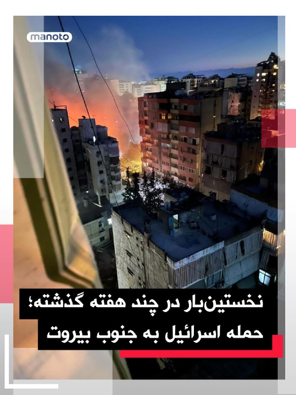

> اسرائیل اعلام کرده که نیروهای نظامی‌اش حمله‌ای را در حومه جنوبی پایتخت لبنان انجام داده‌اند که هدف آن فرمانده نیروی رضوان حزب‌الله بوده است.
> منابع امنیتی در ابتدا این حمله را به خبرگزاری رویترز گزارش دادند و گفتند که این نخستین حمله در حومه جنوبی بیروت طی چند هفته اخیر بوده است.
> پیش‌تر گزارش شده بود اسرائیل از توافق احتمالی میان آمریکا و جمهوری اسلامی بی‌اطلاع بوده و برای تشدید تنش‌ها آماده است.
> اسرائیل در حالی به حملات خود در جنوب لبنان ادامه می‌دهد که حزب‌الله گروه مورد حمایت جمهوری اسلامی را هدف قرار داده است.
> ‌🏁 🇬🇧 ManotoTV
> 
> 🤖 @VahidOOnLine

## 1405/02/16 21:29 — VahidOnline
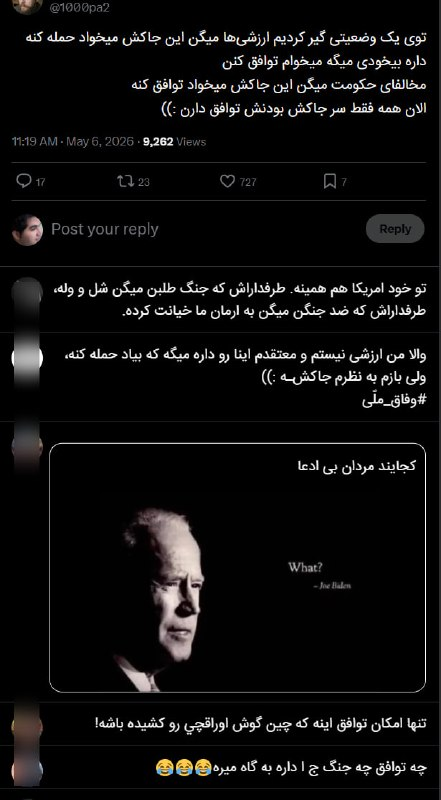

> 1000pa2
> 
> 📡 @VahidOnline

## 1405/02/16 21:27 — mamlekate
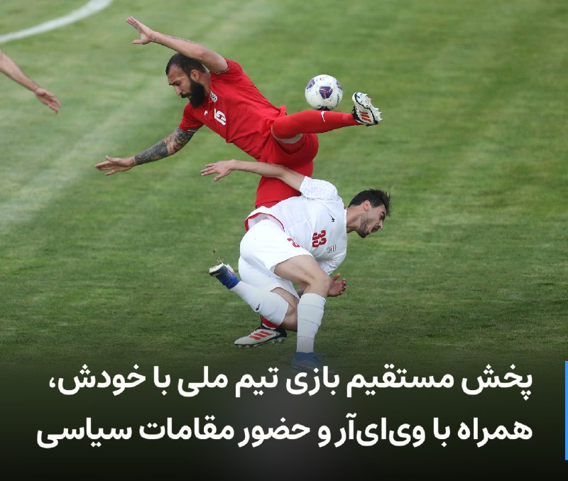

> 📝 پخش مستقیم بازی تیم ملی با خودش، همراه با وی‌ای‌آر و حضور مقامات سیاسی
> 
> در حالی که فوتبال ایران در تعطیلی مطلق به سر می‌برد و حریفان تدارکاتی تیم ملی، در آستانه جام جهانی، بازی با ایران را لغو کرده‌اند، تیم ملی فوتبال دومین بازی‌ تدارکاتی درون تیمی را در استادیوم پاس قوامین، وابسته به نیروی انتظامی، برگزار کرد.
> 
> این دیدار علاوه بر اینکه از صدا و سیمای جمهوری اسلامی به طور مستقیم پخش شد، وی ای آر هم داشت.
> 
> اسماعیل بقایی، سخنگوی وزارت امور خارجه، این بازی بدون تماشاگر را که با نتیجه سه بر یک به سود تیم سفید به پایان رسید، از نزدیک تماشا کرد.
> 
> قرار بود تیم ملی فوتبال در اردوی ترکیه با تیم های مقدونیه و آنگولا دیدار کند که این دو تیم به دلیل شرایط فعلی در ایران از بازی با تیم ملی انصراف دادند.
> 
> @mamlekate

## 1405/02/16 21:23 — VahidOOnLine
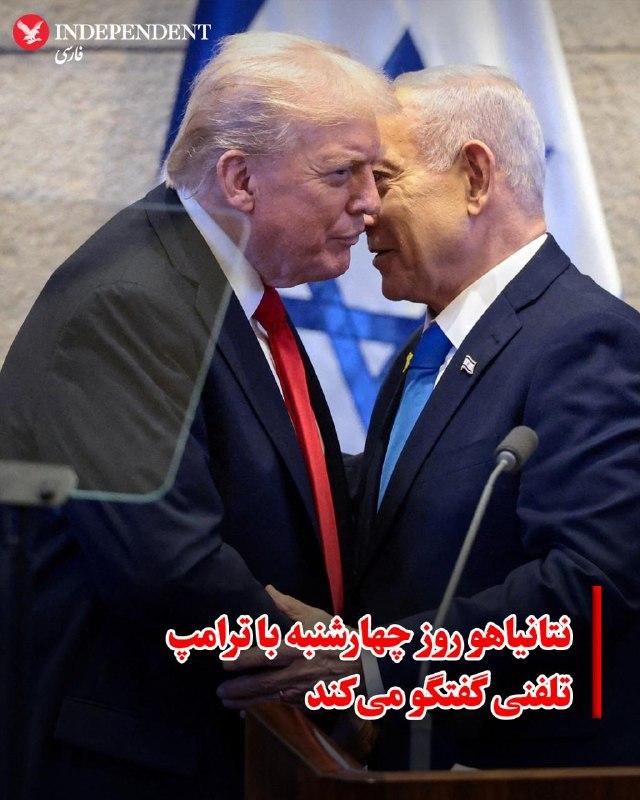

> ♦️بنیامین نتانیاهو، نخست‌وزیر اسرائیل، در پیامی ویدیویی اعلام کرد که اواخر امروز، چهارشنبه ۱۶ اردیبهشت، با دونالد ترامپ، رئیس‌جمهوری آمریکا درباره مذاکرات جاری میان ایالات متحده و ایران برای پایان دادن به جنگ گفتگو خواهد کرد. او با تاکید بر هماهنگی کامل میان دو طرف اظهار داشت که هیچ غافلگیری در کار نیست.
> 
> نتانیاهو تصریح کرد: «ما اهداف مشترکی داریم و مهم‌ترین هدف ما، خروج تمامی مواد غنی‌شده از ایران و برچیدن کامل توانمندی‌های غنی‌سازی این کشور است». این اظهارات در حالی مطرح می‌شود که پیش‌تر سی‌ان‌ان به نقل از منابع خود از تلاش‌های نتانیاهو برای کسب اطلاع از مفاد پیشنهاد واشنگتن برای مذاکره با تهران خبر داده بود.
> ‌🇸🇦 Indypersian
> 
> 🤖 @VahidOOnLine

## 1405/02/16 21:23 — VahidOOnLine
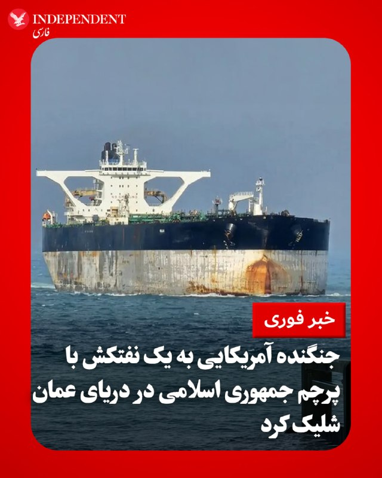

> ♦️ ستاد فرماندهی مرکزی ایالات متحده (سنتکام) اعلام کرد که نیروهای این کشور در راستای اجرای محاصره دریایی علیه ایران، یک نفتکش با پرچم جمهوری اسلامی را در دریای عمان متوقف کرده‌اند. این حادثه در ساعت ۹ صبح به وقت شرق آمریکا در روز ۶ می رخ داد؛ زمانی که نفتکش خالی«حسنا» در حال حرکت به سمت یکی از بنادر ایران بود.
> 
> به گفته سنتکام، نیروهای آمریکایی پس از مشاهده این شناور در آب‌های بین‌المللی، هشدارهای متعددی مبنی بر نقض محاصره صادر کردند. پس از بی‌توجهی خدمه نفتکش به اخطارهای مکرر، یک جنگنده F/A-18 سوپر هورنت برخاسته از ناو هواپیمابر «یواس‌اس آبراهام لینکلن» با شلیک چندین گلوله از توپ ۲۰ میلی‌متری خود، سکان این تانکر را از کار انداخت.
> 
> سنتکام تاکید کرده است که نفتکش «حسنا» دیگر به سمت ایران در حرکت نیست و محاصره دریایی علیه تمامی کشتی‌هایی که قصد ورود یا خروج از بنادر ایران را دارند، با قاطعیت ادامه خواهد یافت.
> ‌🇸🇦 Indypersian
> 
> 🤖 @VahidOOnLine

## 1405/02/16 21:20 — VahidOOnLine
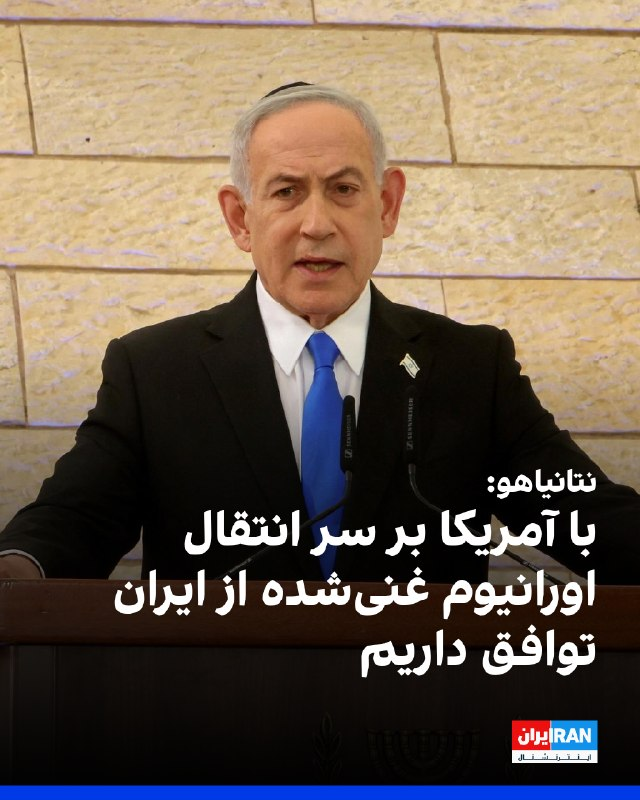

> رسانه‌های اسرائیلی گزارش دادند بنیامین نتانیاهو، نخست‌وزیر اسرائیل، در آغاز نشست کابینه امنیتی این کشور گفت که قرار است شامگاه چهارشنبه ۱۶ اردیبهشت با دونالد ترامپ، رییس‌جمهوری آمریکا، تلفنی گفت‌وگو کند.
> 
> نتانیاهو گفت او و ترامپ «تقریبا هر روز» با یکدیگر صحبت می‌کنند و تیم‌های دو طرف نیز به‌طور روزانه در تماس هستند.
> 
> او با تاکید بر «هماهنگی کامل» میان اسرائیل و آمریکا افزود: «هیچ غافلگیری‌ای در کار نیست. ما اهداف مشترکی داریم و مهم‌ترین هدف، خارج کردن همه مواد غنی‌شده از ایران و برچیدن توانایی‌های غنی‌سازی ایران است.»
> 
> نخست‌وزیر اسرائیل گفت ترامپ معتقد است می‌تواند این هدف را «به‌شکلی» محقق کند، اما اسرائیل برای «هر سناریویی» آماده است و همین دستور را به ارتش و نهادهای امنیتی این کشور داده است.
> ‌🏁 🇬🇧 IranintlTV
> 
> 🤖 @VahidOOnLine

## 1405/02/16 21:17 — VahidOOnLine
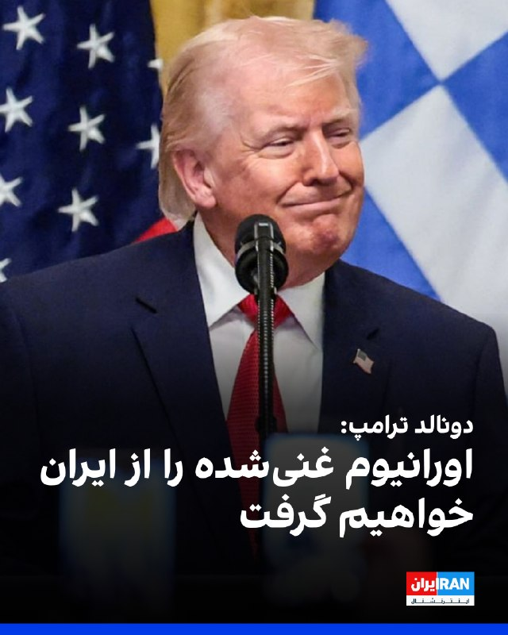

> دونالد ترامپ گفت اگر جمهوری اسلامی با شرایط مورد نظر واشینگتن موافقت نکند، «خیلی زود مجبور به موافقت خواهد شد» و تاکید کرد که اوضاع تحت کنترل ایالات متحده است.
> 
> او با تاکید بر اینکه «اجازه نمی‌دهیم ایران سلاح هسته‌ای داشته باشد»، افزود: «ما اورانیوم غنی‌شده را از ایران خواهیم گرفت.»
> ‌🏁 🇬🇧 IranintlTV
> 
> 🤖 @VahidOOnLine

## 1405/02/16 21:15 — mwarmonitor
> 🚨خبر فوری: به گفته یک بیانیه مشترک از سوی نتانیاهو و وزیر دفاع کاتس، ارتش اسرائیل (IDF) در بیروت حمله‌ای را انجام داده که هدف آن «فرمانده نیروی رضوان حزب‌الله» بوده است. @mwarmonitor

## 1405/02/16 21:12 — pm_afshaa
> فقط گیگی 250 با تست رایگان ✅ اول تست کن، بعد با خیال راحت خرید کن! ❌ دیگه چرا گیگی ۵۰۰ تا ۶۰۰ بدی؟! اونم بدون اینکه بدونی کیفیتش چطوره 😐 ⚡️ تخفیف ویژه محدود ⏳ فقط تا پایان امشب 🌍 آی‌پی استار واقعی + پینگ عالی 🛡 ضمانت بازگشت وجه بدون شرط 🚀 اتصال پایدار…

## 1405/02/16 21:12 — pm_afshaa

> فقط گیگی 250 با تست رایگان ✅
> اول تست کن، بعد با خیال راحت خرید کن!
> 
> ❌ دیگه چرا گیگی ۵۰۰ تا ۶۰۰ بدی؟!
> اونم بدون اینکه بدونی کیفیتش چطوره 😐
> 
> ⚡️ تخفیف ویژه محدود ⏳
> فقط تا پایان امشب
> 
> 🌍 آی‌پی استار واقعی + پینگ عالی
> 🛡 ضمانت بازگشت وجه بدون شرط
> 🚀 اتصال پایدار و بدون قطعی
> 
> خرید آنی از ربات :
> 
> @Lexvpnbot
> @Lexvpnbot
> تایم سرورامون نامحدوده❤️
> 
> Link chanel : @lex_server

## 1405/02/16 21:11 — VahidOnline
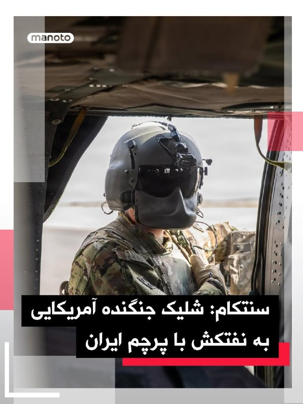

> سنتکام در بیانیه‌ای اعلام کرده نیروهای آمریکایی در دریای عمان «در چارچوب اجرای محاصره»، یک نفتکش خالی با پرچم ایران را که در حال حرکت به سمت یکی از بنادر ایران بود، از کار انداختند.
> سنتکام اعلام کرد پیش از این اقدام، چندین هشدار به این نفتکش داده شده، اما خدمه از دستورات تبعیت نکرده‌اند.
> در ادامه آمده است که نیروهای آمریکایی با شلیک چند گلوله از توپ ۲۰ میلی‌متری یک جنگنده اف/ای-۱۸ سوپر هورنت سکان نفتکش را از کار انداختند.
> @VahidOOnLine
> فکر کنم ترامپ قانون گذاشته از یه حدی بیشتر نباید خرج محاصره دریایی بشه. نفتکش قبلی را با توپ ناوشکن متوقف کردند این یکی را با تیربار اف-۱۸ زدند به سکانش.
> _KhodaBiamorz
> 
> 📡 @VahidOnline

## 1405/02/16 21:10 — VahidOOnLine
> ♦️ امانوئل مکرون، رئیس‌جمهوری فرانسه، روز چهارشنبه ۱۶ اردیبهشت در پیامی در شبکه اجتماعی ایکس از گفتگوی خود با مسعود پزشکیان، رئیس‌جمهوری اسلامی، خبر داد. او ضمن ابراز نگرانی شدید از تشدید تنش‌ها، حملات به زیرساخت‌های غیرنظامی امارات و کشتی‌های تجاری را محکوم کرد و خواستار لغو بدون قید و شرط محاصره تنگه هرمز، از سوی «همه طرف‌ها» شد. مکرون تاکید کرد که باید به رژیم آزادی کامل کشتیرانی که پیش از درگیری‌ها برقرار بود، بازگشت.
> 
> رئیس‌جمهوری فرانسه با اشاره به ماموریت چندملیتی پاریس و لندن برای بازگرداندن اعتماد به شرکت‌های کشتیرانی و بیمه، اعلام کرد که استقرار ناو هواپیمابر «شارل دوگل» در همین راستا صورت گرفته است. او این ماموریت را از طرف‌های درگیر در جنگ متمایز دانست و از پزشکیان خواست از این فرصت استفاده کند. مکرون همچنین اعلام کرد که قصد دارد در این باره با دونالد ترامپ نیز گفتگو کند. او خاطرنشان کرد که بازگشت آرامش به منطقه می‌تواند به پیشرفت در مذاکرات هسته‌ای و موشکی کمک کند و اروپایی‌ها نقش خود را در زمینه لغو تحریم‌ها ایفا خواهند کرد.
> ‌🇸🇦 Indypersian
> 
> 🤖 @VahidOOnLine

## 1405/02/16 21:09 — VahidOOnLine
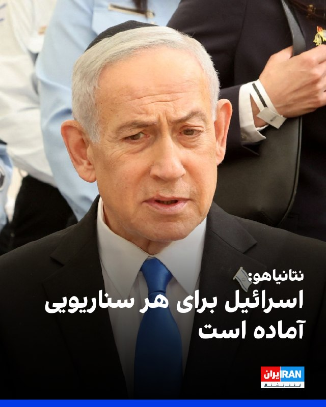

> بنیامین نتانیاهو، نخست‌وزیر اسرائیل، در پیام ویدئویی اعلام کرد این کشور برای هر سناریویی آماده است و به گفته او، این دستور به ارتش و نهادهای امنیتی ابلاغ شده است.
> 
> نتانیاهو با تاکید بر آمادگی کامل اسرائیل افزود کشورش «از هر زمان دیگری قوی‌تر» است و جمهوری اسلامی و نیروهای نیابتی آن «از هر زمان دیگری ضعیف‌تر» شده‌اند.
> 
> او همچنین گفت میان اسرائیل و ایالات متحده «هماهنگی کامل» وجود دارد و «هیچ غافلگیری در کار نیست»، زیرا دو طرف اهداف مشترکی را دنبال می‌کنند.
> 
> ‌🏁 🇬🇧 IranintlTV
> 
> 🤖 @VahidOOnLine

## 1405/02/16 21:08 — VahidOnline
> خواهر مصطفی حیدری‌تبار: Akitakii731
> 
> 📡 @VahidOnline

## 1405/02/16 21:08 — pm_afshaa
> 🔴آکسیوس: اسرائیل آماده بازگشت به درگیری با ایران است
> 
> 
> 💧 Rainbet.com the #1 Non-KYC Crypto Casino & Sportsbook @rainbetcom
> 
> 😁 @Pm_Afshaa

## 1405/02/16 21:07 — VahidOOnLine
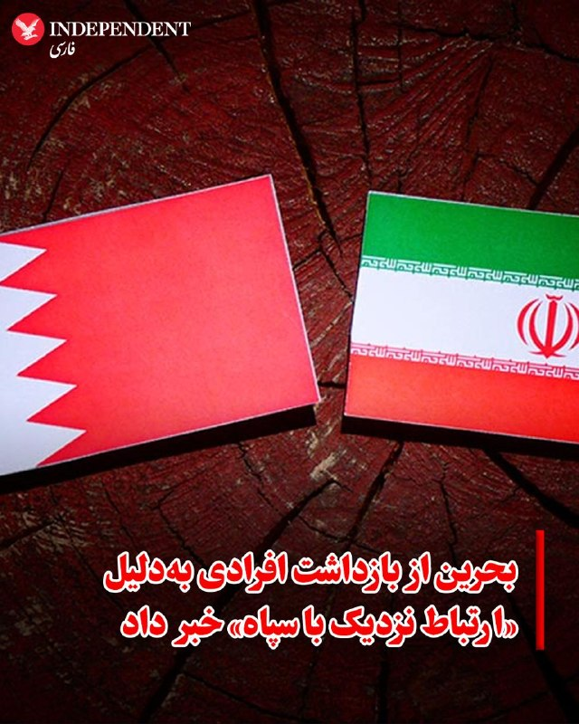

> ♦️وزارت کشور بحرین، روز چهارشنبه ۱۶ اردیبهشت اعلام کرد که تعداد نامشخصی از افراد دارای «ارتباطات نزدیک» با سپاه پاسداران انقلاب اسلامی اخیرا در این کشور بازداشت شده‌اند که برخی از آن‌ها مظنون به جاسوسی هستند.
> 
> این خبر پس از آن منتشر می‌شود که بحرین در اواخر آوریل اعلام کرد تابعیت ۶۹ نفر را به دلیل حمایت از حملات جمهوری اسلامی به این کشور سلب کرده است. منامه این افراد را به همدلی با تهران و «تبانی با نهادهای خارجی» متهم کرده است.
> ‌🇸🇦 Indypersian
> 
> 🤖 @VahidOOnLine

## 1405/02/16 21:02 — VahidOOnLine

> سنتکام در بیانیه‌ای اعلام کرده نیروهای آمریکایی در دریای عمان «در چارچوب اجرای محاصره»، یک نفتکش خالی با پرچم ایران را که در حال حرکت به سمت یکی از بنادر ایران بود، از کار انداختند.
> سنتکام اعلام کرد پیش از این اقدام، چندین هشدار به این نفتکش داده شده، اما خدمه از دستورات تبعیت نکرده‌اند.
> در ادامه آمده است که نیروهای آمریکایی با شلیک چند گلوله از توپ ۲۰ میلی‌متری یک جنگنده اف/ای-۱۸ سوپر هورنت سکان نفتکش را از کار انداختند.
> ‌🏁 🇬🇧 ManotoTV
> 
> 🤖 @VahidOOnLine

## 1405/02/16 21:02 — VahidOOnLine
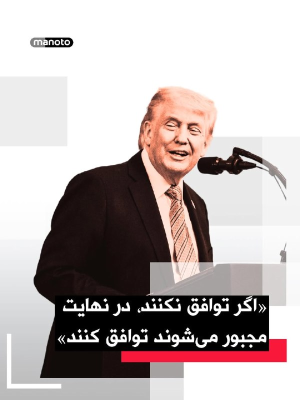

> دونالد ترامپ بار دیگر از احتمال دستیابی به توافق با جمهوری‌اسلامی برای پایان دادن به جنگ ابراز اطمینان کرد و گفت: «اگر توافق نکنند، در نهایت مجبور می‌شوند توافق کنند.»
> او در مراسمی در کاخ سفید با حضور مادران نظامیان آمریکایی، جنگ با ایران را «درگیری محدود» توصیف کرد و افزود: «اوضاع خیلی خوب پیش می‌رود.» ترامپ گفت: «همه‌چیز خیلی روان جلو می‌رود و باید دید چه اتفاقی می‌افتد. آن‌ها می‌خواهند توافق کنند و وارد مذاکره شوند.»
> او بار دیگر تأکید کرد که آمریکا «به‌مراتب قدرتمندترین ارتش جهان» را دارد و افزود: «الان داریم آن‌ها را کاملاً تحت فشار قرار می‌دهیم… اجازه نخواهیم داد ایران به سلاح هسته‌ای دست پیدا کند.»
> رئیس‌جمهور آمریکا همچنین با اشاره به محاصره دریایی ایران گفت: «همه‌چیز را کاملاً تحت کنترل داریم؛ این محاصره بی‌سابقه است و نیروی دریایی عملکرد فوق‌العاده‌ای داشته.»
> او افزود: «هیچ چیزی وارد یا خارج نمی‌شود… آن‌ها عملاً از کار افتاده‌اند و باید دید آیا با توافق موافقت می‌کنند یا نه.»
> او در پایان تاکید کرد: «اگر توافق نکنند، خیلی زود مجبور خواهند شد توافق کنند.»
> ‌🏁 🇬🇧 ManotoTV
> 
> 🤖 @VahidOOnLine

## 1405/02/16 20:59 — VahidOOnLine
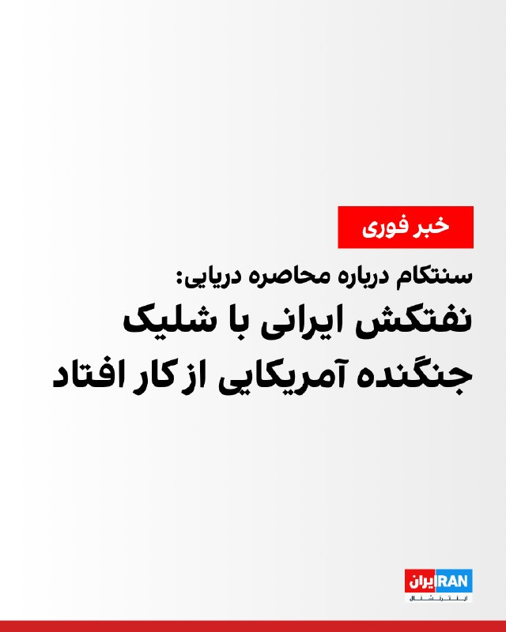

> فرماندهی مرکزی آمریکا، سنتکام، در شبکه ایکس اعلام کرد نیروهای نظامی آمریکا روز چهارشنبه چندین گلوله به سوی نفتکش بدون بار با پرچم ایران «ام‌تی حسنا» شلیک کردند و این شناور را هنگام تلاش برای حرکت به سوی یک بندر ایرانی در نقض محاصره، از کار انداختند.
> 
> بر اساس گزارش سنتکام، نفتکش «حسنا» پس از آنکه به هشدار نیروهای آمریکایی توجه نکرد، یک جنگنده نیروی دریایی آمریکا از ناو هواپیمابر «لینکلن» به پرواز درآمد و با شلیک چند گلوله ۲۰ میلی‌متری به سمت سکان کشتی، آن را از کار انداخت. در نتیجه، نفتکش دیگر قادر به ادامه مسیر به سمت ایران نبود.
> ‌🏁 🇬🇧 IranintlTV
> 
> 🤖 @VahidOOnLine

## 1405/02/16 20:58 — VahidOOnLine
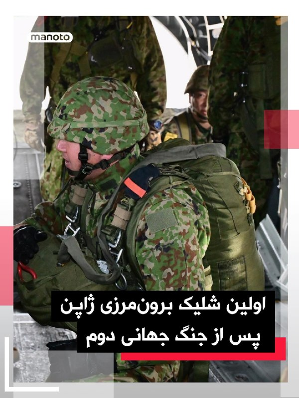

> برای نخستین‌بار از زمان جنگ جهانی دوم، ژاپن نیروهای رزمی خود را در خاک فیلیپین مستقر کرد؛ حدود ۱۴۰۰ نیروی نظامی در چارچوب رزمایش «بالیکاتان ۲۰۲۶» که بزرگ‌ترین دوره این مانور مشترک میان آمریکا و فیلیپین تا امروز به‌شمار می‌رود.
> در جریان این رزمایش، نیروهای زمینی دفاع از خود ژاپن با شلیک موشک‌های ضدکشتی Type 88 از منطقه ایلوکوس نورته، یک ناو از رده خارج فیلیپینی به نام BRP Quezon را در فاصله حدود ۵۰ تا ۷۵ کیلومتری از ساحل غرق کردند. این نخستین‌بار است که ژاپن از این سامانه خارج از قلمرو خود استفاده می‌کند.
> این مانور با مشارکت نیروهای آمریکا، فیلیپین و استرالیا برگزار می‌شود و سناریوی آن شبیه‌سازی مقابله با یک تهاجم آبی‌-خاکی در دریای جنوبی چین است. چین این رزمایش را «نظامی‌سازی مجدد» و «بازی با آتش» توصیف کرده است.
> رزمایش از ۲۰ آوریل آغاز شده و تا ۸ مه ادامه دارد و حدود ۱۷ هزار نیروی نظامی از هفت کشور در آن حضور دارند.
> ‌🏁 🇬🇧 ManotoTV
> 
> 🤖 @VahidOOnLine

## 1405/02/16 20:57 — VahidOOnLine
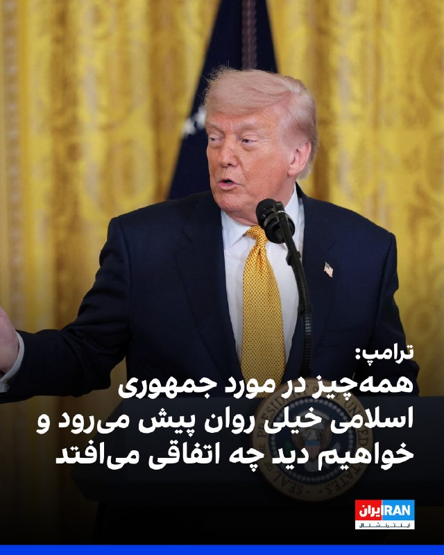

> دونالد ترامپ، رییس‌جمهوری آمریکا، در مراسمی نظامی به مناسبت روز مادر درباره تحولات مرتبط با جمهوری اسلامی گفت ایالات متحده «در ایران بسیار خوب عمل می‌کند» و اوضاع «به‌طور روان پیش می‌رود». او با اشاره به مذاکرات احتمالی افزود: «آن‌ها می‌خواهند به توافق برسند و مذاکره کنند، و خواهیم دید آیا می‌توانند توافقی ارائه دهند که برای ما رضایت‌بخش باشد یا نه.»
> 
> ترامپ تاکید کرد آمریکا اجازه نخواهد داد جمهوری اسلامی به سلاح هسته‌ای دست یابد و مدعی شد بزرگ‌ترین و قوی‌ترین ارتش جهان را در اختیار دارد. او همچنین محاصره دریایی اعمال‌شده علیه ایران را «فوق‌العاده» توصیف کرد و گفت نیروی دریایی آمریکا همچون «دیوار فولادی» عمل کرده و مانع هرگونه عبور شده است.
> 
> رییس‌جمهوری آمریکا در پایان افزود اگر جمهوری اسلامی با شرایط مورد نظر واشینگتن موافقت نکند، «خیلی زود مجبور به موافقت خواهد شد» و تاکید کرد که اوضاع تحت کنترل ایالات متحده است.
> 
> ‌🏁 🇬🇧 IranintlTV
> 
> 🤖 @VahidOOnLine

## 1405/02/16 20:54 — mwarmonitor
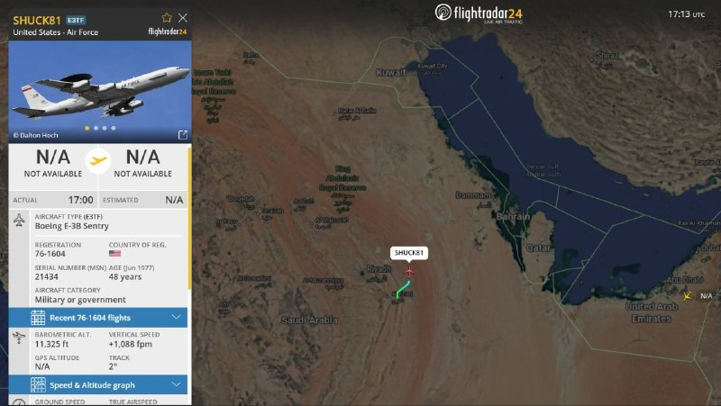

> ✈️🇺🇸📡 نیروی هوایی آمریکا یک فروند E-3G سنتری AWACS اضافی (با شماره 77-0351) را به منطقه اعزام کرده است؛ احتمالاً به پایگاه هوایی «پرینس سلطان» منتقل می‌شود. @mwarmonitor

## 1405/02/16 20:51 — kianmeli1
> 🔴فوری
> وزیر دفاع اسرائیل از ترور فرمانده کل نیرو های ویژه رضوان حزب الله در جنوب بیروت خبر داد
> https://t.me/kianmeli1

## 1405/02/16 20:51 — mwarmonitor
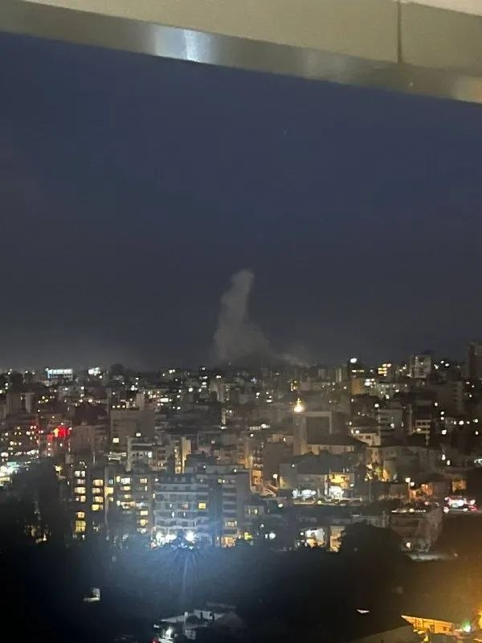

> 🚨خبر فوری: به گفته یک بیانیه مشترک از سوی نتانیاهو و وزیر دفاع کاتس، ارتش اسرائیل (IDF) در بیروت حمله‌ای را انجام داده که هدف آن «فرمانده نیروی رضوان حزب‌الله» بوده است.
> 
> @mwarmonitor

## 1405/02/16 20:49 — mwarmonitor
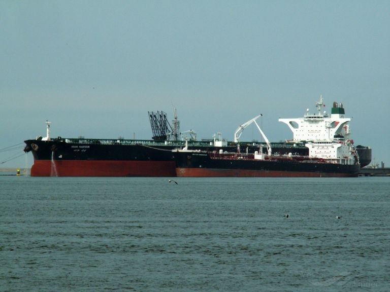

> 🇺🇸نیروهای ایالات متحده یک کشتی را در دریای عمان که قصد شکستن محاصره را داشت، از کار انداختند 🔴فرماندهی مرکزی ایالات متحده (سنتکام) 📌تامپا، فلوریدا — نیروهای ایالات متحده مستقر در دریای عمان، با از کار انداختن یک نفتکش خالی با پرچم ایران که در ساعت ۹ صبح…

## 1405/02/16 20:46 — VahidOOnLine
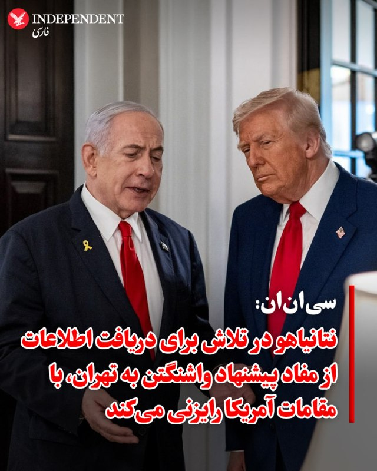

> ♦️ سی‌ان‌ان روز چهارشنبه ۱۶ اردیبهشت به نقل از منابع خود گزارش داد که بنیامین نتانیاهو، نخست‌وزیر اسرائیل، در حال گفتگو با مقامات دولت ترامپ است تا از آخرین تحولات مذاکرات میان ایالات متحده و ایران مطلع شود. یک منبع آگاه به سی‌ان‌ان اعلام کرد که نتانیاهو به دنبال دریافت به‌روزرسانی‌هایی درباره مفاد پیشنهادی روی میز است.
> 
> ارزیابی این منابع این است که اسرائیل نگران امتیازات احتمالی و لحظه‌آخری واشنگتن برای دستیابی به توافقی جهت پایان دادن به جنگ با ایران است. بر اساس این گزارش، نگرانی اصلی تل‌آویو معطوف به لغو احتمالی تحریم‌های اقتصادی علیه تهران است. اسرائیل علاوه بر پافشاری بر اعمال محدودیت بر برنامه موشک‌های بالستیک و شبکه گروه‌های نیابتی جمهوری اسلامی، خواهان تضمین این مسئله است که هرگونه توافق، «آزادی عمل نظامی اسرائیل» را در مقابله با تهدیدات منطقه‌ای حفظ کند.
> 
> مقامات آمریکایی در پاسخ به پیگیری‌های سی‌ان‌ان تایید کرده‌اند که نتانیاهو به طور منظم برای پیگیری روند مذاکرات با آن‌ها در تماس است، هرچند کاخ سفید هنوز در این باره اظهارنظر رسمی نکرده است.
> ‌🇸🇦 Indypersian
> 
> 🤖 @VahidOOnLine

## 1405/02/16 20:42 — mwarmonitor
> 🇺🇸نیروهای ایالات متحده یک کشتی را در دریای عمان که قصد شکستن محاصره را داشت، از کار انداختند
> 
> 🔴فرماندهی مرکزی ایالات متحده (سنتکام)
> 
> 📌تامپا، فلوریدا — نیروهای ایالات متحده مستقر در دریای عمان، با از کار انداختن یک نفتکش خالی با پرچم ایران که در ساعت ۹ صبح (به وقت منطقه زمانی شرقی) ۶ می قصد حرکت به سمت یکی از بنادر ایران را داشت، اقدامات مربوط به محاصره را به اجرا گذاشتند.
> 🔸نیروهای فرماندهی مرکزی ایالات متحده (CENTCOM) نفتکش M/T Hasna را در حالی که در آب‌های بین‌المللی به سمت بندری در ایران در دریای عمان در حال حرکت بود، شناسایی کردند. نیروهای آمریکایی هشدارهای متعددی صادر کرده و به این شناور با پرچم ایران اطلاع دادند که در حال نقض محاصره ایالات متحده است.
> 🔹پس از آنکه خدمه کشتی «حسنا» از امتثال به هشدارهای مکرر خودداری کردند، نیروهای آمریکایی با شلیک چندین گلوله از توپ ۲۰ میلی‌متری یک جنگنده F/A-18 Super Hornet نیروی دریایی آمریکا (برخاسته از ناو هواپیمابر یواس‌اس آبراهام لینکلن - CVN 72)، سکان نفتکش را از کار انداختند. نفتکش حسنا دیگر به سمت ایران در حرکت نیست.
> 🔸محاصره ایالات متحده علیه کشتی‌هایی که قصد ورود به بنادر ایران یا خروج از آن‌ها را دارند، همچنان با قوت کامل در حال اجراست. نیروهای سنتکام به اقدامات سنجیده و حرفه‌ای خود برای اطمینان از پایبندی به این محاصره ادامه می‌دهند.
> 
> @mwarmonitor

## 1405/02/16 20:37 — VahidOOnLine
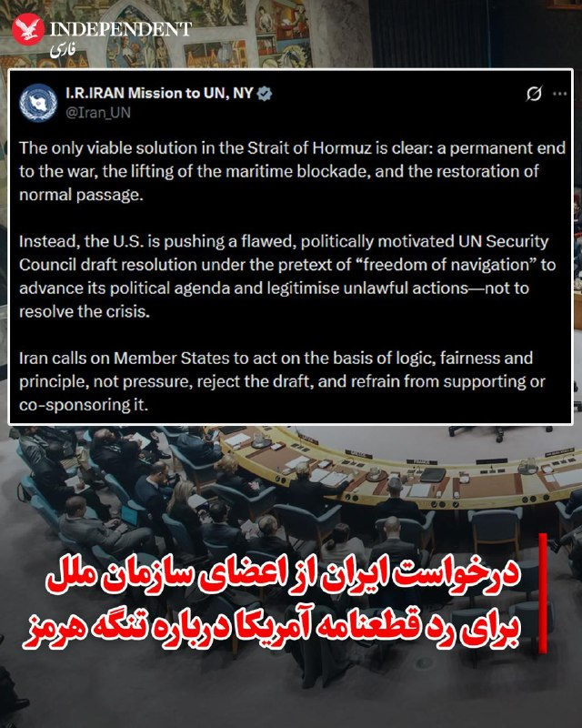

> ♦️نمایندگی دائم جمهوری اسلامی در سازمان ملل متحد از کشورهای عضو خواست تا پیش‌نویس قطعنامه ارائه‌شده توسط ایالات متحده و متحدانش در خلیج فارس را که ایران را برای تضمین امنیت کشتیرانی در تنگه هرمز تحت فشار قرار می‌دهد، رد کنند. این نمایندگی، قطعنامه مذکور را «ناقص» و دارای «انگیزه‌های سیاسی» توصیف کرد.
> 
> نمایندگی ایران در پیامی در شبکه اجتماعی ایکس اعلام کرد: «تنها راهکار عملی در تنگه هرمز روشن است: پایان دائمی جنگ، رفع محاصره دریایی و بازگرداندن شرایط عادی برای عبور و مرور». این نهاد در ادامه، ایالات متحده را متهم کرد که از این قطعنامه برای «پیشبرد دستور کار سیاسی خود و مشروعیت بخشیدن به اقدامات غیرقانونی» استفاده می‌کند، نه برای حل بحران.
> 
> مارکو روبیو، وزیر امور خارجه آمریکا، روز سه‌شنبه اعلام کرد که دولت ترامپ در حال تدوین و پیش‌برد قطعنامه‌ای در شورای امنیت سازمان ملل متحد است که هدف آن محکومیت اقدام رژیم ایران در مسدود کردن تنگه هرمز و فراخوان برای بازگشایی این مسیر حیاتی کشتیرانی است.
> ‌🇸🇦 Indypersian
> 
> 🤖 @VahidOOnLine

## 1405/02/16 20:23 — mwarmonitor
> 🇮🇷ایران طی ۴۰ تا ۴۵ روز آینده ذخایر نفتی خشکی و فراساحلی خود را به پایان خواهد رساند و در نتیجه شروع به بستن چاه‌های نفت خواهد کرد؛ برخی از این تعطیلی‌ها ممکن است دائمی باشند، یک مقام وزارت نفت ایران به روزنامه نیویورک تایمز گفته است.
> 
> @mwarmonitor

## 1405/02/16 20:22 — iaghapour
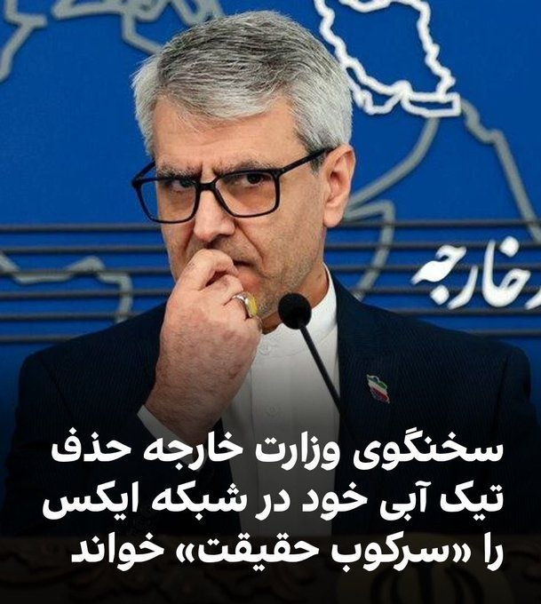

> 💢 سخنگو وزارت خارجه حذف تیک آبی خود در شبکه X را (سرکوب حقیقت) خواند.
> 
> 68 روزه اینترنت مردم ایران رو قطع کردن، بعد یه تیک آبی‌شو گرفتن میگه حقیقت سرکوب شد.
> 
> 🆔 @iaghapour

## 1405/02/16 20:16 — VahidOOnLine
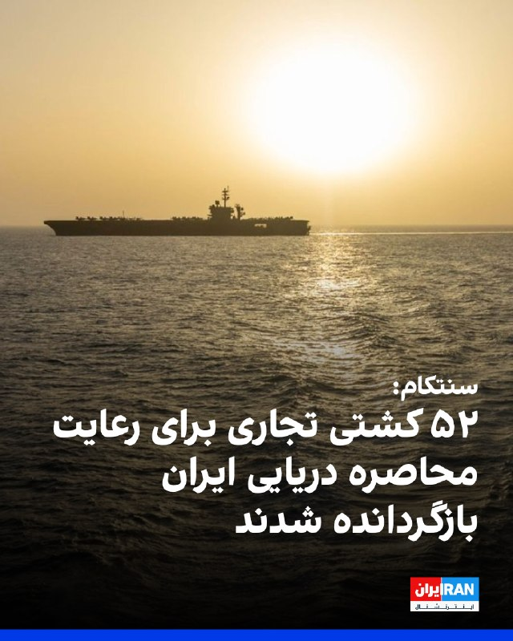

> فرماندهی مرکزی ارتش آمریکا، سنتکام، در پستی در شبکه اجتماعی ایکس اعلام کرد تاکنون ۵۲ کشتی تجاری برای رعایت محاصره دریایی آمریکا علیه جمهوری اسلامی مجبور به بازگشت شده‌اند یا مسیرشان را به سوی بندر مبدا هدایت کرده‌اند.
> 
> سنتکام افزود ناو هواپیمابر یواس‌اس جورج اچ. دبلیو. بوش در میان شمار گسترده‌ای از کشتی‌های جنگی، هواپیماها و نیروهای آمریکایی است که به گفته این فرماندهی، «به‌طور کامل» محاصره دریایی بندرهای جنوب ایران را اجرا می‌کنند.
> ‌🏁 🇬🇧 IranintlTV
> 
> 🤖 @VahidOOnLine

## 1405/02/16 19:58 — mwarmonitor
> 🔴ناوهای هواپیمابر ائتلاف که در حال حاضر در منطقه، نزدیک منطقه، یا درگیر عملیات در خاورمیانه هستند (تا تاریخ ۶ مه):
> 
> ناوهای هواپیمابر بزرگ:
> 
> 🇺🇸 یو‌اس‌اس ابراهام لینکلن (دریای عرب)
> 
> 🇺🇸 یو‌اس‌اس جرج اچ. دبلیو. بوش (دریای عرب)
> 
> 🇫🇷 اف‌اس شارل دو گل (کانال سوئز، در حال حرکت به سمت خلیج عدن)
> 
> 
> ناوهای سبک / تهاجمی آبی-خاکی:
> 
> 🇺🇸 یو‌اس‌اس تریپولی (دریای عرب)
> 
> 🇺🇸 یو‌اس‌اس باکسر (در حال حرکت، اقیانوس هند)
> 
> 🇫🇷 اف‌اس میسترال (دریای مدیترانه)
> 
> 🇫🇷 اف‌اس تونر (تولون، مدیترانه)
> 
> 🇫🇷 اف‌اس دیکس‌مود (اقیانوس اطلس)
> 
> 
> در حال خروج از منطقه:
> 
> 🇺🇸 یو‌اس‌اس جرالد آر. فورد (اقیانوس اطلس، منطقه جبل‌الطارق)
> 
> 
> 📌تمام سه ناو آبی-خاکی فرانسه (میسترال، تونر و دیکس‌مود) به دلیل جنگ در خاورمیانه، تغییراتی در استقرار خود داشته‌اند. ناو «دیکس‌مود» به‌طور مشخص حضور خود در رزمایش چندملیتی بالیکاتان در فیلیپین را لغو کرده است، زیرا احتمال نیاز عملیاتی در خاورمیانه وجود داشته. این ناو در حال حاضر در اقیانوس اطلس و نزدیک یا در آب‌های برزیل قرار دارد. ناوهای «میسترال» و «تونر» نیز پیش‌تر همراه با ناو «شارل دو گل» در شرق مدیترانه پس از حملات ایران به قبرس مستقر بودند، اما اکنون به بندر تولون بازگشته‌اند و ناو «میسترال» نیز روز ۵ مه از بندر خارج شده است.
> 
> @mwarmonitor

## 1405/02/16 19:53 — kianmeli1
> 🔴ناوهای هواپیمابر ائتلاف که در حال حاضر در منطقه، نزدیکی آن یا در عملیات خاورمیانه از تاریخ ۶ مه حضور دارند:
> 
> ناوهای بزرگ:
> - 🇺🇸یو اس اس آبراهام لینکلن (دریای عرب)
> - 🇺🇸یو اس اس جورج اچ. دبلیو. بوش (دریای عرب)
> - 🇫🇷ناو هواپیمابر شارل دوگل (کانال سوئز، در حال حرکت به سمت خلیج عدن)
> 
> ناوهای سبک:
> - 🇺🇸یو اس اس تریپولی (دریای عرب)
> - 🇺🇸یو اس اس باکسر (در حال حرکت، اقیانوس هند)
> - 🇫🇷ناو میسترال (مدیترانه)
> - 🇫🇷ناو هواپیمابر تونر (تولون، مدیترانه)
> - 🇫🇷ناو هواپیمابر دیکسمود (اقیانوس اطلس)
> 
> در حال ترک صحنه نبرد:
> - 🇺🇸 ناو هواپیمابر جرالد آر. فورد (اقیانوس اطلس، جبل الطارق)
> 
> هر سه ناو هواپیمابر بزرگ فرانسه، میسترال، تونر و دیکسمود، به دلیل جنگ در خاورمیانه، محل استقرارشان تغییر کرده است، به طوری که ناو هواپیمابر دیکسمود به طور خاص نقش خود را در رزمایش‌های چندملیتی بالیکتان در فیلیپین به دلیل نیازهای عملیاتی بالقوه در خاورمیانه لغو کرده است.
> 
> این ناو در حال حاضر در اقیانوس اطلس، نزدیک یا در آب‌های برزیل قرار دارد.
> 
> ناو هواپیمابر میسترال و تونر هر دو پیش از این پس از حملات ایران به قبرس، در کنار ناو هواپیمابر شارل دوگل به مدیترانه شرقی اعزام شده بودند، اما از آن زمان به بندر تولون بازگشته‌اند و ناو هواپیمابر میسترال دیروز در تاریخ ۵ مه بندر را ترک کرد.
> https://t.me/kianmeli1

## 1405/02/16 19:49 — kianmeli1
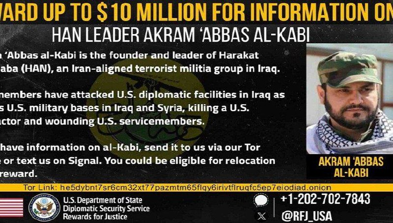

> 🔴جایزه 10 میلیون دلاری امریکا برای شناسایی محل دبیرکل جنبش النجباء
> 
> وزارت خارجه امریکا برای اطلاعاتی که موجب شناسایی شیخ اکرم الکعبی دبیرکل جنبش النجباء عراق شود یا محل اقامت او را مشخص کند، 10 میلیون دلار پاداش در نظر گرفت.
> https://t.me/kianmeli1

## 1405/02/16 19:48 — kianmeli1
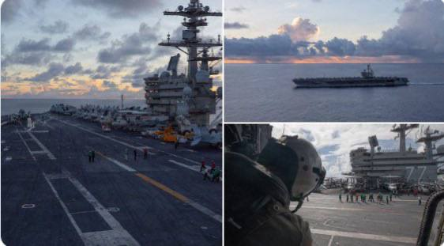

> 🔴بر اساس بیانیه‌ای که از سوی ستاد فرماندهی مرکزی ایالات متحده منتشر شده است، از زمان آغاز محاصره تنگه هرمز توسط ایالات متحده، ۵۲ کشتی از عبور از این تنگه منع شده یا به بنادر ایران بازگردانده شده‌اند.
> https://t.me/kianmeli1

## 1405/02/16 19:47 — VahidOnline

> ♦️ دونالد ترامپ، رئیس‌جمهوری ایالات متحده روز چهارشنبه ۱۶ اردیبهشت، در تماس تلفنی با شبکه پی‌بی‌اس اعلام کرد ایالات متحده به توافقی برای پایان جنگ با ایران نزدیک شده است. او اشاره کرد که این توافق ممکن است شامل انتقال ذخیره اورانیوم با غنای بالای ایران به آمریکا باشد. ترامپ با ابراز خوش‌بینی نسبت به توقف جنگ پیش از سفر هفته آینده‌اش به چین، هشدار داد که در صورت شکست مذاکرات، حملات سنگین هوایی از سر گرفته خواهد شد.
> @VahidOOnLine
> 
> 📡 @VahidOnline

## 1405/02/16 19:46 — mwarmonitor
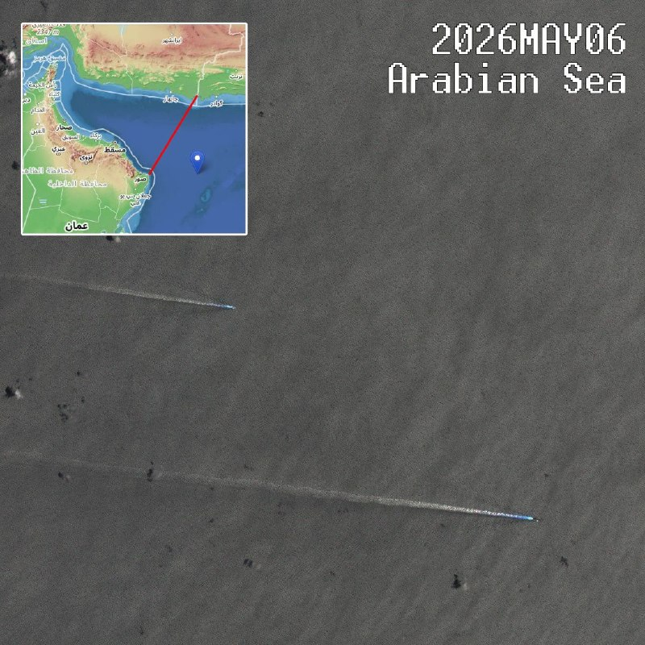

> ناو یو‌اس‌اس لینکلن 🇺🇸 امروز در مختصات 22.530، 61.612 مشاهده شد، همراه با یک ناوشکن اسکورت در حال حرکت در دریای عرب. این گروه به سمت شرق در حرکت است و حدود ۱۸۵ کیلومتر با خط محاصره آمریکا 🇺🇸🇮🇷 علیه ایران فاصله دارد.
> 
> @mwarmonitor

## 1405/02/16 19:30 — DEJradio
[🎬 Video](telegram/content/DEJradio_4461_1778090642.jpg)

> 🚨
> ⭕️ دونالد ترامپ، رئیس جمهوری آمریکا به شبکه PBS:
> «اورانیوم غنی‌شده در چارچوب توافق احتمالی به آمریکا منتقل خواهد شد و جمهوری اسلامی از تأسیسات زیرزمینی استفاده نخواهد کرد. اما اگر توافقی حاصل نشود، جهنم را به روی آنها باز خواهیم کرد.»
> 
> #مذاکرات #ترامپ
> @DEJradio

## 1405/02/16 19:06 — VahidOnline
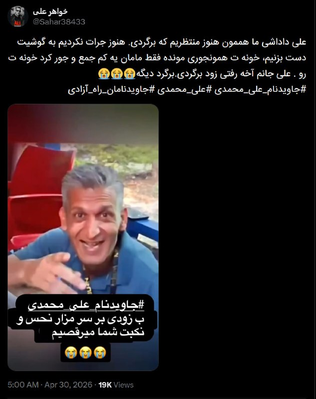

> خواهر علی محمدی: Sahar38433
> 
> 📡 @VahidOnline

## 1405/02/16 19:03 — VahidOnline
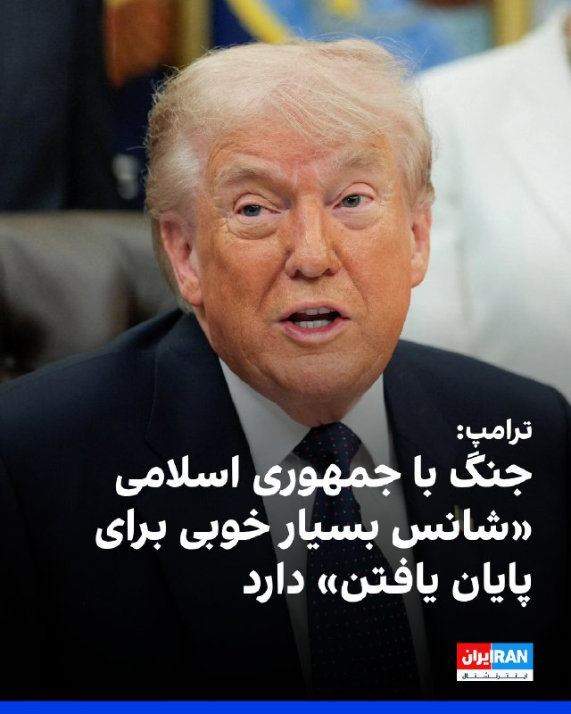

> دونالد ترامپ، رییس‌جمهوری آمریکا، در گفت‌وگو با شبکه پی‌بی‌اس نیوز اعلام کرد جنگ با ایران «شانس بسیار خوبی برای پایان یافتن» دارد و ابراز امیدواری کرد واشینگتن به توافقی با تهران نزدیک شده باشد. او گفت این توافق می‌تواند شامل صادرات اورانیوم با غنای بالا از سوی ایران به آمریکا باشد.
> 
> ترامپ با اشاره به روند مذاکرات افزود: «احساس می‌کنم به توافق نزدیک شده‌ایم، اما قبلاً هم چنین احساسی داشتم، بنابراین باید دید چه می‌شود.» او احتمال اعزام استیو ویتکاف و جرد کوشنر به مذاکرات را بعید دانست و گفت ممکن است پیش از سفر هفته آینده‌اش به چین، توافقی برای پایان جنگ حاصل شود.
> 
> رییس‌جمهوری آمریکا هشدار داد در صورت شکست مذاکرات، گزینه نظامی همچنان روی میز خواهد بود. او گفت اگر جنگ پایان نیابد «باید دوباره آن‌ها را به‌شدت بمباران کنیم.»
> 
> این اظهارات ساعاتی پس از آن مطرح شد که ترامپ در شبکه تروث سوشال اعلام کرد ماموریت اسکورت کشتی‌های تجاری در تنگه هرمز موقتاً متوقف می‌شود، زیرا کشورها به توافق نزدیک‌تر شده‌اند.
> @VahidOOnLine
> 
> 📡 @VahidOnline

## 1405/02/16 19:02 — mwarmonitor
> 🔵 (رویترز) - وزارت حمل‌ونقل آمریکا اعلام کرد شرکت‌های بزرگ هواپیمایی این کشور در ماه مارس بیش از ۵ میلیارد دلار برای سوخت جت هزینه کردند که ۵۶ درصد افزایش داشته و ۱.۸ میلیارد دلار بیشتر از هزینه‌های ماه فوریه بوده است.
> 
> @mwarmonitor

## 1405/02/16 19:02 — VahidOnline
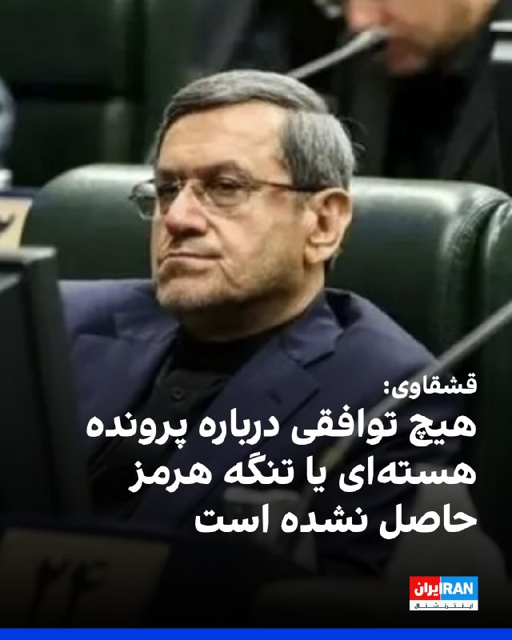

> حسن قشقاوی، عضو کمیسیون امنیت ملی مجلس اعلام کرد جمهوری اسلامی تاکنون پاسخی به پیام آمریکا نداده و هیچ توافقی درباره پرونده هسته‌ای یا تنگه هرمز حاصل نشده است.
> @VahidOOnLine
> 
> 📡 @VahidOnline

## 1405/02/16 19:01 — pm_afshaa
> 🔴ترامپ به شبکه پی‌بی‌اس: این توافق تصریح می‌کند که ایران اورانیوم غنی‌شده با غلظت بالا را به ایالات متحده صادر خواهد کرد
> 
> 
> 💧 Rainbet.com the #1 Non-KYC Crypto Casino & Sportsbook @rainbetcom
> 
> 😁 @Pm_Afshaa

## 1405/02/16 19:00 — mwarmonitor
> 🔴 (رویترز) - یک عضو ارشد پارلمان ایران روز چهارشنبه گفت گزارشی از Axios که شامل متن یک پیشنهاد آمریکا برای توافق با ایران جهت پایان دادن به جنگ است، بیشتر شبیه یک «فهرست آرزوها» است تا واقعیت.
> 
> @mwarmonitor

## 1405/02/16 18:57 — mwarmonitor
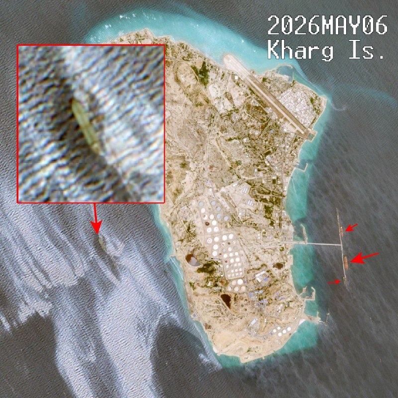

> «روز شلوغ خارگ 🇮🇷 جزیره خارگ امروز. دو نفتکش VLCC، یک نفتکش Suezmax و یک نفتکش ساحلی در حال بارگیری مشاهده شدند. یک خطا - حادثه در یکی از VLCCها در مختصات 29.2309, 50.2837 منجر به نشت نفت خام شد.
> 
> ❗️معلوم نیست میزان نشت چقدر است، چون بیشتر چیزی که دیده می‌شود یک لایه بسیار نازک و نقره‌ای‌رنگ است، نه نفت خام غلیظ و سیاه.»
> 
> @mwarmonitor

## 1405/02/16 18:56 — kianmeli1
> 🔴منبع اسرائیلی به سی‌ان‌ان گفت: نتانیاهو نگران و مضطرب از مذاکرات ایران و آمریکا است و قرار است امروز با دولت ترامپ مذاکره کند تا «آخرین تحولات مذاکرات را بهتر درک کند».
> https://t.me/kianmeli1

## 1405/02/16 18:56 — pm_afshaa
> 🔴بر اساس گزارش رسانه‌ Ynet، رئیس کل ستاد ارتش اسرائیل اعلام کرد که ارتش اسرائیل اهداف اضافی را آماده کرده و در حالت آماده‌باش کامل برای از سرگیری عملیات علیه ایران است
> 
> 
> 💧 Rainbet.com the #1 Non-KYC Crypto Casino & Sportsbook @rainbetcom
> 
> 😁 @Pm_Afshaa

## 1405/02/16 18:56 — kianmeli1
> ‏🔴محمدباقر قالیباف، رییس مجلس: احتمال حمله نظامی کم نیست
> https://t.me/kianmeli1

## 1405/02/16 18:53 — kianmeli1
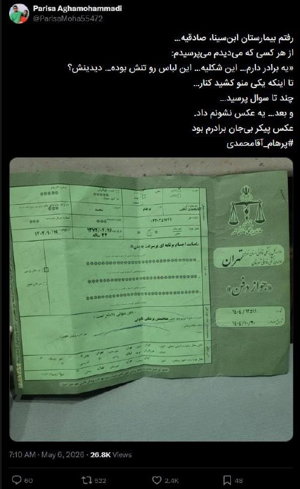

> 🔴روایت جانسوز کشته شدن پرهام آقامحمدی
> https://t.me/kianmeli1

## 1405/02/16 18:52 — kianmeli1

> عارف جعفرزاده در ۱۸ دی ۱۴۰۴ توسط حکومت اهریمنی خامنه ای کشته شد
> https://t.me/kianmeli1

## 1405/02/16 18:52 — mwarmonitor
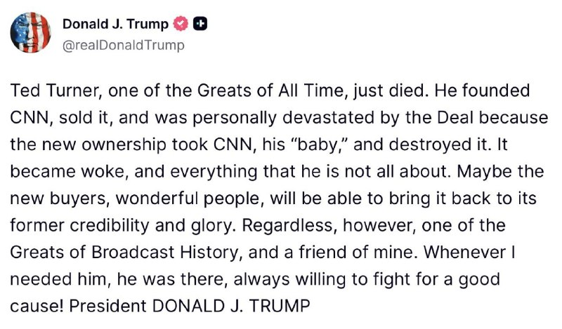

> تدی ترنر، یکی از بزرگترین‌های تمام دوران، همین حالا درگذشت. او سی‌ان‌ان (CNN) را تأسیس کرد، آن را فروخت و شخصاً از این معامله ویران شد، زیرا مدیریت جدید، سی‌ان‌ان را که «بچه» او بود گرفتند و نابودش کردند. این شبکه «ووک» (دچار تفکرات افراطی چپ) شد و تبدیل به هر آن چیزی شد که او اصلاً به آن‌ها اعتقاد نداشت. شاید خریداران جدید که افراد فوق‌العاده‌ای هستند، بتوانند آن را به اعتبار و شکوه سابقش بازگردانند. با این وجود، او یکی از بزرگان تاریخ پخش [برنامه‌های تلویزیونی] و دوست من بود. هر زمان که به او نیاز داشتم، حضور داشت و همیشه مایل بود برای یک هدف خوب مبارزه کند!
> 
> رئیس‌جمهور دونالد جی. ترامپ
> 
> @mwarmonitor

## 1405/02/16 18:48 — mwarmonitor
> 🔴پیش‌نویس جدیدِ پیشنهادیِ یادداشت تفاهم میان آمریکا و ایران برای پایان دادن به جنگ، مسائل مربوط به تنگه هرمز را حل‌وفصل نخواهد کرد و تنها «از ایران می‌خواهد که کنترل خود بر تنگه را کاهش دهد».
> 
> 🔹در این پیش‌نویس همچنین از ایالات متحده خواسته شده است که محاصره دریایی خود را به‌تدریج کاهش دهد — وال‌استریت ژورنال (WSJ).
> 
> @mwarmonitor

## 1405/02/16 18:47 — mwarmonitor
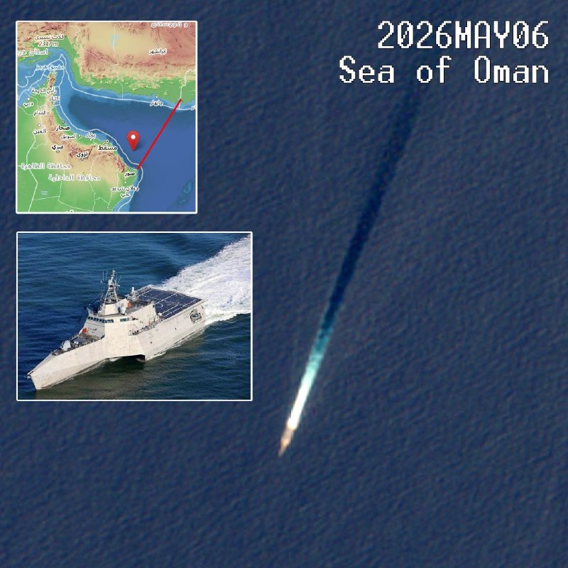

> 🔴 احتمالاً ناو ساحلی USS Canberra (LCS) 🇺🇸 امروز در مختصات زیر مشاهده شده است:
> 
> 23.2241, 59.6542
> 
> 🔸این شناور در خلیج عمان و درون خط محاصره دریایی آمریکا در حال گشت‌زنی بوده و مأموریت‌های مقابله با مین‌های دریایی را با استفاده از پهپادهای مجهز به هوش مصنوعی انجام می‌دهد؛ با هدف حفاظت از مسیرهای تجاری و رهگیری شناورهای غیرمجاز.
> 
> @mwarmonitor

## 1405/02/16 18:43 — VahidOnline
> توییت یک خانم دیگر: "امروز امین ما باید شمع ۳۴ سالگی‌ش رو فوت میکرد و به‌جاش زیر خروارها خاک‌ه، تولدت مبارک امین، فراموش‌ت نمیکنیم.❤️
> #امین_حیدری_گودرزی"
> eheyllo
> ۱۸ دی ماه در عظیمیه کرج با شلیک مستقیم نیروهای سرکوب کشته شد.
> eheyllo
> 
> 📡 @VahidOnline

## 1405/02/16 18:42 — kianmeli1
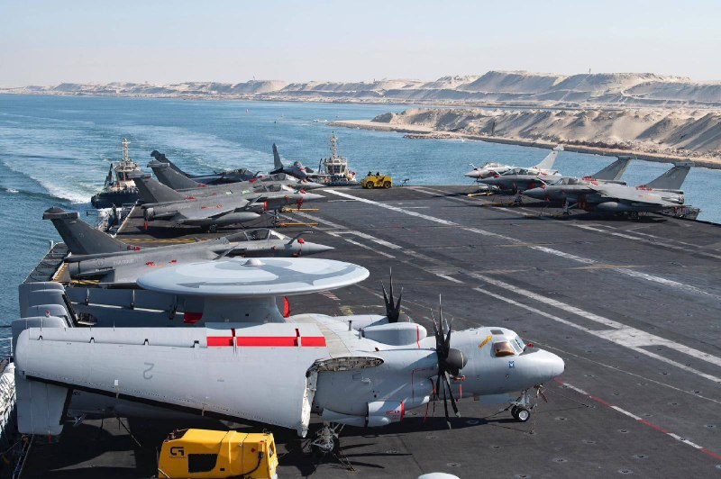

> 🔴وزارت دفاع فرانسه اعلام کرد ناو هواپیمابر شارل دوگل با عبور از کانال سوئز به سمت جنوب حرکت کرده تا در دریای سرخ و خلیج عدن مستقر شود و برای ماموریت اعلام شده قبلی بریتانیا و فرانسه در تنگه هرمز آماده شود.
> https://t.me/kianmeli1

## 1405/02/16 18:41 — mwarmonitor
> 🇺🇸ناو هواپیمابر USS George H.W. Bush (CVN-77) در میان بخش بزرگی از ناوهای جنگی، هواپیماها و نیروهای آمریکایی قرار دارد که به‌طور کامل در حال اجرای محاصره دریایی ایالات متحده علیه ایران هستند.
> 
> ❌تاکنون ۵۲ فروند کشتی تجاری برای رعایت این محاصره، ملزم شده‌اند مسیر خود را تغییر دهند یا به بندر بازگردند.
> 
> @mwarmonitor

## 1405/02/16 18:40 — mwarmonitor
> 🔴آکسیوس اختصاصی به گفته مقام‌ها: آمریکا و ایران در آستانه توافق بر سر یک یادداشت تفاهم یک‌صفحه‌ای برای پایان دادن به جنگ هستند 📝باراک راوید کاخ سفید بر این باور است که به توافقی با ایران بر سر یک یادداشت تفاهم (MOU) یک‌صفحه‌ای نزدیک می‌شود؛ توافقی که هدف…

## 1405/02/16 18:37 — mwarmonitor

> 🇫🇷ناو هواپیمابر شارل دوگل (FS Charles de Gaulle)، تنها ناو هواپیمابر فرانسه، از کانال سوئز عبور کرده و در مسیر ورود به دریای سرخ قرار دارد.
> 
> 🇫🇷وزارت دفاع فرانسه اعلام کرده است که گروه رزمی این ناو در منطقه جنوب دریای سرخ / خلیج عدن مستقر خواهد شد تا خود را برای اجرای یک عملیات احتمالی «آزادی ناوبری» در تنگه هرمز آماده کند.
> 
> @mwarmonitor

## 1405/02/16 18:36 — VahidOnline

> گفتگوی سه خواهر ایرانی درباره‌ی برادرهاشون که وقتی تو ایران «جنگ» نبود کشته شدند! lazy_haniye خواهر سینا کاظمی: sh_i_i_i خواهر سیاوش فرخی: Ferijan69 خواهر احمد خسروانی: Ahmad19101404 📡 @VahidOnline

## 1405/02/16 18:36 — VahidOnline
> 🔴مقامات ایران با هدف قرار دادن وکلای مدافع از طریق بازداشت و ارعاب، در حال تخریب آخرین خط حفاظتی از حقوق زندانیان هستند.
> ‏در این سیستم قضایی غیرشفاف، وکلای مستقل با اتهامات واهی، محدودیت‌های شدید و تهدید همیشگی بازداشت روبرو هستند.
> ‏ترکیب "سرکوبِ وکلا"، "قطع اینترنت" و "تهدید خانواده‌ها"، و جرم‌انگاری هرگونه اطلاع‌رسانی، زنگ خطر فاجعه‌ای انسانی در تضییع حقوق زندانیان را به صدا درآورده است.
> ‏⁧ #مدافعان_حقوق‌بشر
> #سرکوب_وکلا
> 
> @IranRights⁩

## 1405/02/16 18:29 — kianmeli1
> 🔴فوری
> بر اساس گزارش رسانه اسرائیلی Ynet،
> رئیس ستاد کل ارتش اسرائیل، اعلام کرد که ارتش اسرائیل اهداف اضافی را آماده کرده و در حالت آماده‌باش کامل برای از سرگیری عملیات شدید علیه ایران است.
> https://t.me/kianmeli1

## 1405/02/16 18:28 — DEJradio

> 🛩️
> 🔥 فرمانده ارتش اسرائیل: در صورت حمله به جمهوری اسلامی، لیست جدیدی از اهداف داریم
> 
> ژنرال ایال زمیر، فرمانده ارتش اسرائیل، در جریان بازدید از نیروهای مستقر در جنوب لبنان اعلام کرد اسرائیل در بحبوحه نبرد چندجبهه‌ای، فرصتی تاریخی برای تغییر معادلات منطقه‌ای در اختیار دارد.
> او با اشاره به ادامه هماهنگی و همکاری نظامی با ایالات متحده گفت ارتش اسرائیل همچنان اهدافی آماده برای حمله در داخل ایران در اختیار دارد و در آمادگی کامل برای ازسرگیری عملیات گسترده و پرقدرت علیه جمهوری اسلامی قرار دارد.
> 
> به گفته زمیر، چنین عملیاتی می‌تواند دستاوردهای اسرائیل را گسترش داده و حکومت ایران را بیش از پیش تضعیف کند.
> 
> #حملات_هدفمند #جمهوری_اسلامی
> @DEJradio

## 1405/02/16 18:07 — pm_afshaa
> 🔴سی ان ان به نقل از مقامات دولت ترامپ: کاخ سفید دیروز بازخورد مثبتی از پاکستان در مورد پیشرفت ایران در جهت سازش دریافت کرد‌‌
> 
> 
> 💧 Rainbet.com the #1 Non-KYC Crypto Casino & Sportsbook @rainbetcom
> 
> 😁 @Pm_Afshaa

## 1405/02/16 17:36 — pm_afshaa
> 🔴کانال 11 اسرائیل:آمریکا و اسرائیل در حال هماهنگی برای از سرگیری جنگ با ایران هستن
> 
> 
> 💧 Rainbet.com the #1 Non-KYC Crypto Casino & Sportsbook @rainbetcom
> 
> 😁 @Pm_Afshaa

## 1405/02/16 17:10 — DEJradio
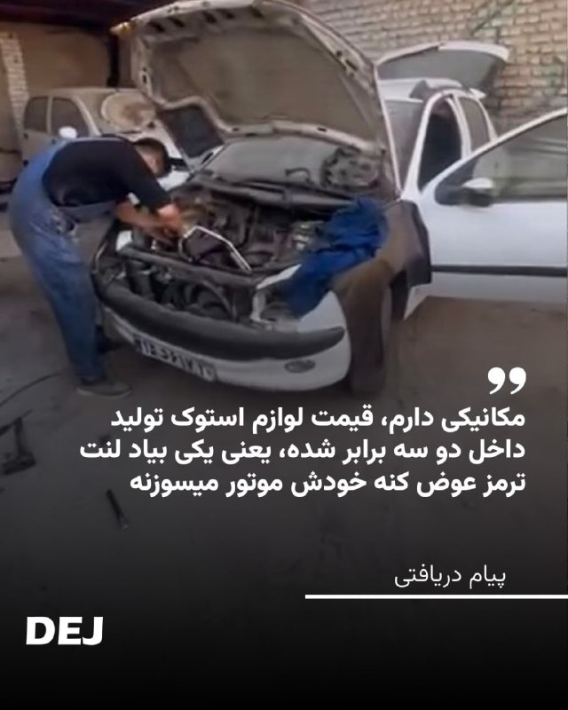

> 🔺📢 “مکانیکی دارم، قیمت لوازم استوک تازه‌تولید داخلی دو-سه برابر شده، یعنی یکی بیاد لنت‌ترمز عوض کنه خودش موتور می‌سوزنه...
> 
> پیام دریافتی
> 
> #تورم #جمهوری_اسلامی
> @DEJradio

## 1405/02/16 17:02 — kianmeli1
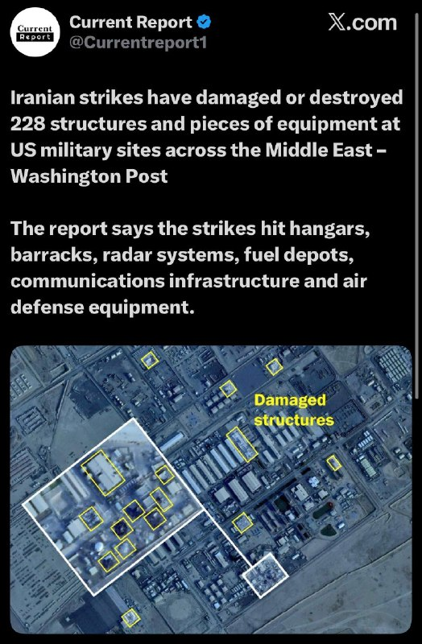

> 🔴حملات ایران ۲۲۸ سازه و قطعه از تجهیزات را در سایت‌های نظامی ایالات متحده در سراسر خاورمیانه آسیب دیده یا نابود کرده است - واشنگتن پست
> 
> این گزارش می‌گوید که حملات به آشیانه‌ها، سربازخانه‌ها، سیستم‌های راداری، انبارهای سوخت، زیرساخت‌های ارتباطی و تجهیزات دفاع هوایی آسیب رسانده است.
> https://t.me/kianmeli1

## 1405/02/16 16:43 — kianmeli1
> 🔴سپاه: تا امریکا عقب نشینی نکند٫ پاسخی به متن پیشنهادی نمی دهیم
> https://t.me/kianmeli1

## 1405/02/16 16:30 — kianmeli1
> 🔴 منابع اسرائیلی تأیید می کنند که عربستان سعودی و امارات متحده عربی اکنون ترامپ و اسرائیل را برای شروع مجدد جنگ تمام عیار علیه ایران تحت فشار قرار می دهند.
> https://t.me/kianmeli1

## 1405/02/16 16:20 — kianmeli1
> ‏🔴ترامپ در پاسخ به این پرسش نیویورک‌پست که آیا باید برای دور تازه‌ای از مذاکرات خبرنگاری را به پاکستان اعزام کند، گفت: فکر نمی‌کنم
> https://t.me/kianmeli1

## 1405/02/16 16:17 — kianmeli1
> 🔴فوری
> کانال 11 اسرائیل گزارش داد آمریکا و اسرائیل در حال هماهنگی برای از سرگیری جنگ با ایران هستند.
> https://t.me/kianmeli1

## 1405/02/16 16:14 — kianmeli1
> 🔴فوری
> ترامپ به خبرنگار نیویورک پست:
> هم اکنون قرار ملاقاتی با ژنرال های ارتش در مورد موضوع ایران دارم.
> https://t.me/kianmeli1

## 1405/02/16 16:05 — DEJradio
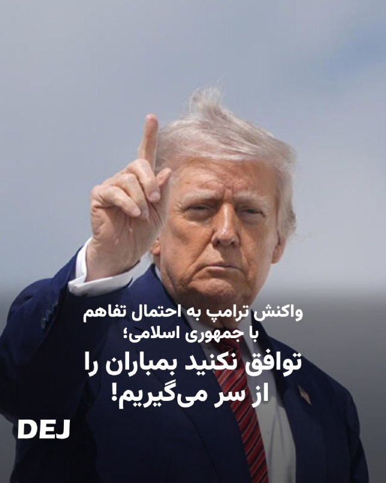

> 🚨
> ⭕️ واکنش ترامپ به احتمال تفاهم با جمهوری اسلامی؛ توافق نکنید بمباران را از سر می‌گیریم!
> 
> دونالد ترامپ، رئیس‌جمهوری ایالات متحده، با انتشار پیامی تازه در تروث سوشال، جمهوری اسلامی را میان پذیرش توافق یا روبه‌رو شدن با دور تازه‌ای از حملات سنگین قرار داد. ترامپ اعلام کرد اگر تهران با مفادی که به گفته او پیش‌تر مورد توافق قرار گرفته موافقت کند، عملیات نظامی آمریکا موسوم به «خشم حماسی» پایان خواهد یافت و مسیر بازگشایی تنگه هرمز برای همۀ کشورها، از جمله ایران، فراهم می‌شود.
> ترامپ در عین حال هشدار داد که مخالفت جمهوری اسلامی با این شروط، به ازسرگیری بمباران‌ها منجر خواهد شد؛ حملاتی که به گفتۀ او این بار «بسیار شدیدتر» از مراحل پیشین خواهد بود.
> این اظهارات در حالی مطرح می‌شود که رسانه اکسیوس گزارش داده کاخ سفید و جمهوری اسلامی به یک تفاهم‌نامۀ ۱۴بندی نزدیک شده‌اند.
> 
> #ترامپ #مذاکرات #جمهوری_اسلامی
> @DEJradio

## 1405/02/16 16:01 — DEJradio
[🎬 Video](telegram/content/DEJradio_4453_1778090650.jpg)

> 🔺📷 خسارت سنگین به هواپیماهای خطوط هوایی تحریم‌شده در جنگ چهل روزه
> 
> بر اساس تصاویر تازه منتشر شده از سوی رسانه‌های داخلی، تعدادی از هواپیماهای خطوط هوایی، از جمله ماهان‌ایر و ایران‌ایر که در انتقال تسلیحات نظامی و نیرو به نیابتی‌های جمهوری اسلامی نقش به‌سزایی داشتند، در طول جنگ چهل روزه متحمل خسارات سنگینی شده‌اند.
> 
> #جنگ۴۰روزه #جمهوری_اسلامی
> @DEJradio

## 1405/02/16 15:57 — DEJradio
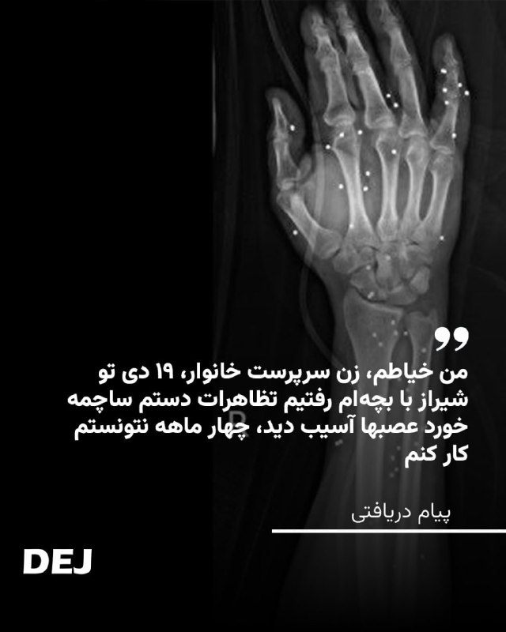

> 🔺📷 “من خیاطم، زن سرپرست خانوار، ۱۹ دی تو شیراز با بچه‌ام رفتیم تظاهرات دستم ساچمه خورد عصب‍ها آسیب دید، چهار ماهه نتونستم کار کنم...
> 
> پیام دریافتی
> 
> #دی۱۴۰۴ #ساچمه
> @DEJradio

## 1405/02/16 15:48 — pm_afshaa
> قالیباف: امنیت کشتیرانی و ترانزیت انرژی به دست آمریکا و متحدانش با نقض آتش‌بس و اعمال محاصره به خطر افتاده است؛ البته شرّشان کم خواهد شد
> 
> 
> 💧 Rainbet.com the #1 Non-KYC Crypto Casino & Sportsbook @rainbetcom
> 
> 😁 @Pm_Afshaa

## 1405/02/16 15:40 — kianmeli1
> 🔴ترامپ با کشتن خامنه ای به جمهوری اسلامی این جسارت را داد که تنگه هرمز را ببندند و جنگ نامتقارن را عملی کنند
> 
> برنامه بعدی نیز این است برای حملات بزرگتر امریکا به ایران٫ جنگ نامتقارن به دو نقطه ادامه پیدا میکند
> تنگه باب المندب و درون خاک امارات
> 
> ترامپ متوجه این موضوع است دوسال فرصت دارد و جنگ نامتقارن به مثابه باتلاق است برای ابرقدرتها
> 
> مبتکر جنگ نامتقارن ایرانیان بوده اند چه در دوران هخامنشیان و چه اشکانیان ووو
> https://t.me/kianmeli1

## 1405/02/16 15:32 — pm_afshaa
> 🔴سپاه:اورانیوم تحویل داده نمیشود
> 
> 
> 💧 Rainbet.com the #1 Non-KYC Crypto Casino & Sportsbook @rainbetcom
> 
> 😁 @Pm_Afshaa

## 1405/02/16 15:25 — pm_afshaa
> 🔴ارتش اسرائیل در حال بمباران زیرساخت‌های مرتبط با حزب‌الله در مناطق مختلف لبنانه
> 
> 
> 💧 Rainbet.com the #1 Non-KYC Crypto Casino & Sportsbook @rainbetcom
> 
> 😁 @Pm_Afshaa

## 1405/02/16 15:21 — pm_afshaa
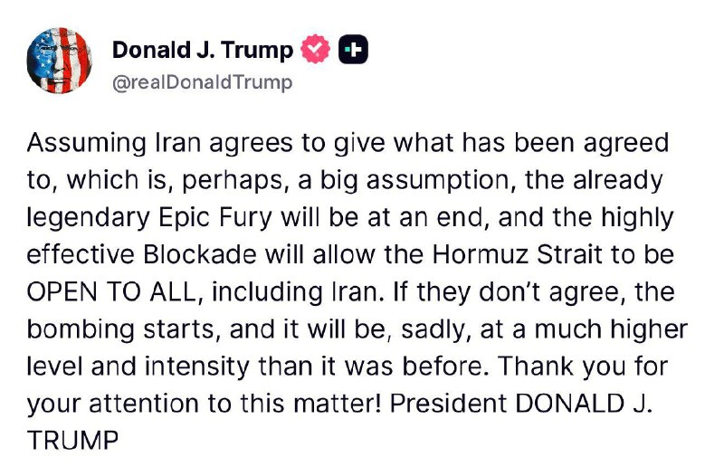

> پست جدید ترامپ اگر جمهوری اسلامی با پیش‌نویس توافق مطرح موافقت کند، عملیات پایان خواهد یافت و اگر موافقت نکند، بمباران با شدت بیشتر از سر گرفته خواهد شد
> 
> 
> 💧 Rainbet.com the #1 Non-KYC Crypto Casino & Sportsbook @rainbetcom
> 
> 😁 @Pm_Afshaa

## 1405/02/16 15:19 — pm_afshaa
> سیدمحمد مرندی، تحلیلگر جمهوری‌اسلامی: آکسیوس ابزاری برای دستکاری بازار کاخ‌سفید است. جمهوری‌اسلامی قبل از سفر ترامپ به چین، کاملا برای یک حمله بزرگ احتمالی آماده‌ست
> 
> 
> 💧 Rainbet.com the #1 Non-KYC Crypto Casino & Sportsbook @rainbetcom
> 
> 😁 @Pm_Afshaa

## 1405/02/16 15:18 — kianmeli1

> 🔴 ‏پست جدید ترامپ
> 
> ترامپ اعلام کرد که اگر جمهوری اسلامی با پیش‌نویس توافق مطرح موافقت کند، عملیات پایان خواهد یافت و اگر موافقت نکند، بمباران با شدت بیشتر از سر گرفته خواهد شد
> https://t.me/kianmeli1

## 1405/02/16 15:13 — pm_afshaa
> 🔴اکسیوس: بسیاری از شرایط ذکر شده تو این یادداشت منوط به دستیابی به توافق نهاییه و احتمال جنگ مجدد یا وضعیت طولانی‌ای که تو اون جنگ متوقف شده اما هیچ چیز واقعاً حل نشده رو باقی می‌ذاره
> 
> 
> 💧 Rainbet.com the #1 Non-KYC Crypto Casino & Sportsbook @rainbetcom
> 
> 😁 @Pm_Afshaa

## 1405/02/16 15:11 — pm_afshaa
> دلار 170

## 1405/02/16 15:11 — pm_afshaa
> قیمت هر بشکه نفت به 97 دلار رسید
> 
> 
> 💧 Rainbet.com the #1 Non-KYC Crypto Casino & Sportsbook @rainbetcom
> 
> 😁 @Pm_Afshaa

## 1405/02/16 15:03 — DEJradio
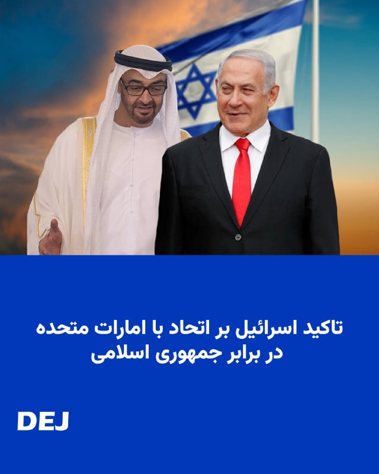

> 🚨📢 تاکید اسرائیل بر اتحاد با امارات متحده در برابر جمهوری اسلامی
> 
> سفارت اسرائیل در امارات متحده عربی اعلام کرد بنیامین نتانیاهو، نخست‌وزیر اسرائیل، در گفت‌وگوی تلفنی با رئیس امارات متحده عربی تأکید کرده است که اسرائیل همانند گذشته در کنار نزدیک‌ترین متحدان خود خواهد ایستاد و به تلاش مشترک برای حفظ صلح و امنیت پایبند می‌ماند. بنا بر این گزارش، نتانیاهو در این تماس، حملات جمهوری اسلامی به امارات متحده عربی را تهدیدی علیه ثبات منطقه توصیف کرده است.
> بر اساس گزارشات منتشر شده در حملات چند روز گذشته جمهوری اسلامی به امارات متحده عربی، سامانه‌های رهگیر و ضد موشکی اسرائیلی، مستقر در امارات کمک شایانی به مهار این حملات ترکیبی پهپادی و موشکی کرده است.
> 
> #امارات #جمهوری_اسلامی
> @DEJradio

## 1405/02/16 14:59 — DEJradio
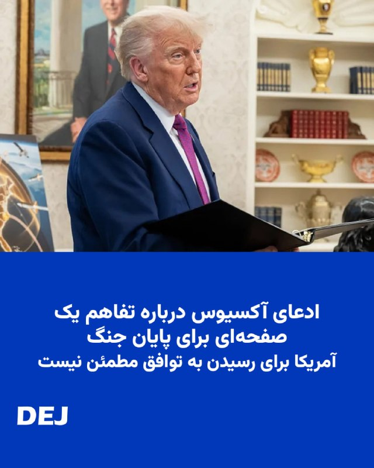

> 🔺📢 ادعای آکسیوس درباره تفاهم یک صفحه‌ای برای پایان جنگ
> آمریکا برای رسیدن به توافق مطمئن نیست
> 
> آکسیوس به نقل از دو مقام آمریکایی و چند منبع آگاه مدعی شده است که کاخ سفید معتقد است به دستیابی به یک تفاهم اولیه با جمهوری اسلامی برای پایان جنگ و آغاز مذاکرات هسته‌ای نزدیک شده است. بر پایه این گزارش، واشینگتن انتظار دارد تهران ظرف۴۸ساعت آینده به چند موضوع کلیدی پاسخ دهد.
> بنا بر این گزارش، تفاهم‌نامۀ پیشنهادی شامل تعلیق غنی‌سازی اورانیوم، لغو تدریجی بخشی از تحریم‌ها و کاهش محدودیت‌ها در تنگۀ هرمز خواهد بود. منابع آگاه می‌گویند مذاکرات برای توافق نهایی ممکن است در اسلام‌آباد یا ژنو ادامه پیدا کند.
> با این حال، مقام‌های آمریکایی می‌گویند اختلافات و شکاف درون حاکمیت جمهوری اسلامی، رسیدن به توافق را همچنان نامطمئن کرده است. مارکو روبیو، وزیر امور خارجۀ آمریکا، تأکید کرد واشینگتن همچنان به دنبال یک راه‌حل دیپلماتیک است، هرچند هنوز هیچ توافق نهایی حاصل نشده است.
> 
> #مذاکرات #جمهوری_اسلامی #توافق
> @DEJradio

## 1405/02/16 14:33 — iaghapour
> 🔻 تسنیم: درآمد طرح اینترنت «پرو» در سال به ۹۶ هزار میلیارد تومن می‌رسه!
> 
> 🔹خب با این رقم‌های نجومی و پول هنگفتی که درمیاد، معلومه که از این تبعیضی که راه انداختن حسابی راضی‌ان. وقتی محدودیت و فیلترینگ این‌قدر براشون سود داره، چرا نباید اینترنت داخلی و بسته رو بیشتر تحویل بگیرن؟
> 
> 🔸این وسط یه تشکر ویژه و خسته نباشید هم باید بگیم به اون دسته از دوستانی که رفتن تو صف اینترنت پرو و این سیستم طبقاتی رو خیلی راحت پذیرفتن. از رئیس فلان اتحادیه و مدیر فلان اداره بگیر تا نماینده صنف لاستیک‌فروش‌ها و یه سری کسب‌وکارهایی که واقعاً بدون اینترنت آزاد هم کارشون لنگ نمی‌موند. تو شرایطی که ۹۹ درصد مردم هیچ دسترسیِ عادی به اینترنت آزاد ندارن، مرسی از شماها که رفتین این اینترنت رو گرفتین و با این کارتون، قشنگ به این تبعیض و نابرابری رسمیت دادین!
> 
> پ.ن: البته به این نکته هم توجه کنید که خبرگذاری داخلی اینو گفته و ممکنه دقیقا مقصودشون از این حرف هم همین باشه که بگن چقدر این طرح خوب و سودآور هستش و...
> 
> 🆔 @iaghapour

## 1405/02/16 14:27 — mamlekate
> 📝 عراقچی در چین: توافقی جامع با آمریکا می‌خواهیم
> 
> عباس عراقچی، وزیر امور خارجه جمهوری اسلامی، که به پکن رفته است، روز چهارشنبه اعلام کرد در مذاکرات با ایالات متحده، تنها «یک توافق عادلانه و جامع» را خواهد پذیرفت. این در حالی است که دونالد ترامپ، رئیس‌جمهوری آمریکا، از «پیشرفت بزرگ» در این روند خبر داده است.
> 
> عراقچی پس از دیدار با وانگ یی، همتای چینی‌اش در پکن، به رسانه‌های ایرانی گفت: «ما تمام تلاشمان را برای حفظ حقوق و منافع مشروعمان در مذاکرات به کار خواهیم گرفت و فقط یک توافق عادلانه و جامع را می‌پذیریم.»
> 
> 
> 📝 منابع آمریکایی و پاکستانی: واشینگتن و تهران به چارچوبی برای پایان جنگ نزدیک شده‌اند
> 
> 📝 جزئیات تفاهم احتمالی یک‌صفحه‌ای آمریکا و ایران برای پایان جنگ به روایت اکسیوس
> 
> هم‌زمان با اعلام تعلیق «پروژه آزادی» و اظهارات دونالد ترامپ درباره این توقف کوتاه‌مدت این طرح به منظور مشخص شدن اینکه تهران و واشنگتن به توافق نهایی می‌رسند یا نه، برخی رسانه‌ها از نزدیک شدن دو کشور به تفاهم برای پایان جنگ خبر دادند.
> 
> رسانه آمریکایی اکسیوس روز چهارشنبه به نقل از منابع آگاه نوشت که ایالات متحده و جمهوری اسلامی به یک «یادداشت تفاهم کوتاه» نزدیک شده‌اند که هدفش توقف جنگ و شروع مذاکرات گسترده‌تر است، هرچند هنوز توافق نهایی نشده است.
> 
> @mamlekate

## 1405/02/16 13:51 — DEJradio
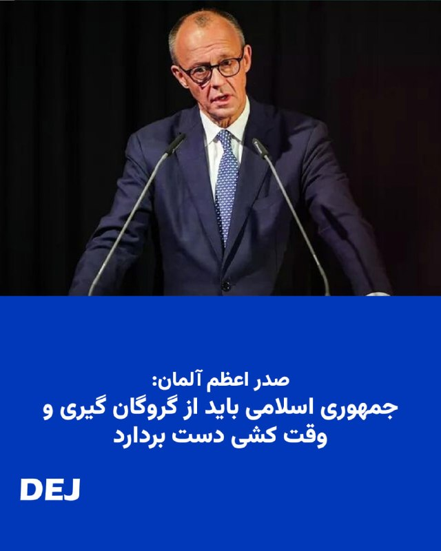

> 🔺📢 صدر اعظم آلمان:
> جمهوری اسلامی باید از گروگان گیری و وقت‌کشی دست بردارد
> 
> صدراعظم آلمان می‌گوید رژیم ایران دیگر نباید منطقه و کل جهان را به گروگان بگیرد و برنامه نظامی - هسته‌ای آنها نیز باید برای همیشه متوقف شود.
> فردریش مرتس با تاکید بر این موضوع که جمهوری اسلامی نمی‌بایست به حملات خود علیه اسرائیل و شرکای آلمان در منطقه ادامه دهد، گفت: «جمهوری اسلامی باید به مذاکره بازگردد و از وقت‌کشی دست بردارد.»
> 
> #مذکرات #جمهوری_اسلامی
> @DEJradio

## 1405/02/16 13:42 — pm_afshaa
> 🔴رویترز: در توافق پیش رو، ایران اورانیوم غنی شده را تحویل خواهد داد
> 
> 
> 💧 Rainbet.com the #1 Non-KYC Crypto Casino & Sportsbook @rainbetcom
> 
> 😁 @Pm_Afshaa

## 1405/02/16 13:37 — pm_afshaa
> 🔴اکسیوس: ایران با تعلیق 12 تا 15 ساله غنی سازی موافقت کرد
> 
> 
> 💧 Rainbet.com the #1 Non-KYC Crypto Casino & Sportsbook @rainbetcom
> 
> 😁 @Pm_Afshaa

## 1405/02/16 13:35 — DEJradio
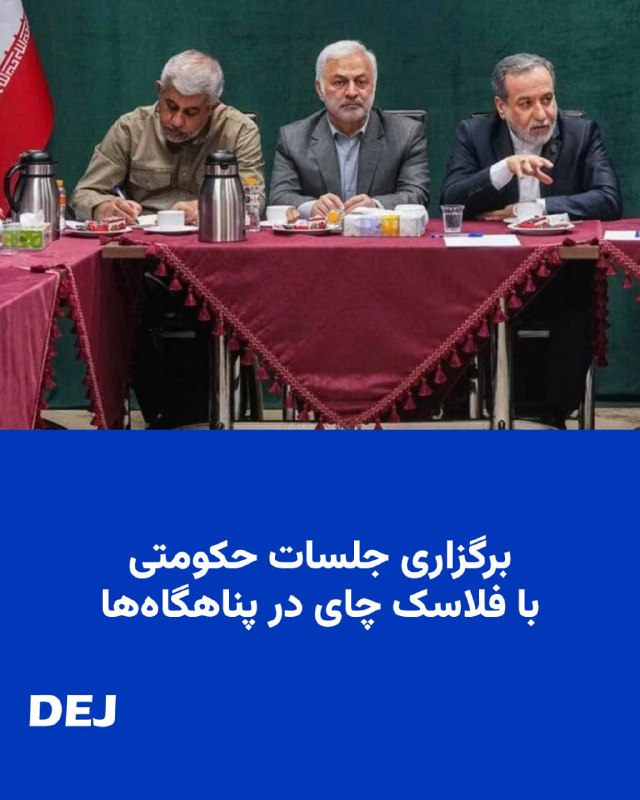

> 🔺📷 برگزاری جلسات حکومتی با فلاسک چای در پناهگاه‌ها
> 
> در حالیکه سخنگوی وزارت خارجه جمهوری اسلامی ادعا می‌کند که این رژیم یک «ابر قدرت»! است، تصاویر منتشر شده نشان میدهد که همچنان مقامات ارشد حکومتی جلسات خود را در پناهگاه‌ها و در اماکن نا معلوم برگزار می کنند.
> 
> #ابرقدرت #جمهوری_اسلامی
> @DEJradio

## 1405/02/16 13:07 — pm_afshaa
> 🔴اکسیوس: آمریکا انتظار داره ظرف 48 ساعت آینده پاسخی از طرف تهران من‌باب چند نکته کلیدی دریافت کنه
> 
> 
> 💧 Rainbet.com the #1 Non-KYC Crypto Casino & Sportsbook @rainbetcom
> 
> 😁 @Pm_Afshaa

## 1405/02/16 13:05 — pm_afshaa
> 🔴اکسیوس: آمریکا و ایران به تدوین یک یادداشت یک صفحه‌ای برای پایان دادن به جنگ نزدیک شدن
> 
> 
> 💧 Rainbet.com the #1 Non-KYC Crypto Casino & Sportsbook @rainbetcom
> 
> 😁 @Pm_Afshaa

## 1405/02/16 13:04 — pm_afshaa
> 🔴اکسیوس: به گفته یک مقام آمریکایی، محدودیت‌های اعمال‌شده از سوی ایران در تنگه و محاصره دریایی آمریکا در طول آن دوره 30 روزه به‌تدریج برداشته خواهد شد
> 
> 
> 💧 Rainbet.com the #1 Non-KYC Crypto Casino & Sportsbook @rainbetcom
> 
> 😁 @Pm_Afshaa

## 1405/02/16 12:36 — DEJradio

> 👑📢 دفتر ارتباطات شاهزاده رضا پهلوی در پستی در شبکه اجتماعی ایکس اعلام کرد:
> " شاهزاده رضا پهلوی همراه با کارآفرینان برجسته ایرانی-آمریکایی به بحث و بررسی راهبردهای بازیابی و شکوفایی تجارت، صنعت و تکنولوژی در ایران خواهند پرداخت."
> شنبه ۲۶ اردیبهشت - سان‌فرانسیسکو، کالیفرنیا
> 
> #شاهزاده_رضا_پهلوی
> @DEJradio

## 1405/02/16 12:25 — DEJradio
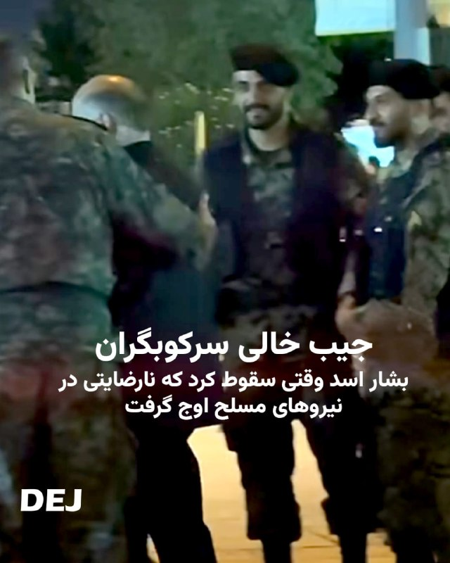

> 🔺📢 جیب خالی سرکوبگران
> بشار اسد وقتی سقوط کرد که نارضایتی در نیروهای مسلح اوج گرفت
> 
> بررسی‌های میدانی نشان می‌دهد برخلاف نمایش‌های خیابانی، جنگ از یک سو و بحران اقتصادی از سوی دیگر به ماشین سرکوب جمهوری اسلامی آسیب جدی وارد کرده است.
> وضعیت دشوار اقتصادی در ایران، عناصر سرکوب را در امان نگذاشته است. جیب نیروهای عملیاتی و خانواده‌هایشان خالی است. در ساختار سرکوب اکنون آن‌هایی پول بیشتری گیرشان می‌آید که مستقیم و غیرمستقیم با پروپاگاندا و بنگاه‌های مالی در ارتباط هستند، اما نیروهای یونیفرم‌پوش به‌شدت در مضیقه هستند و برای تهیه مایحتاج روزانه مشکل دارند.
> در جنگ ۴۰ روزه، بخش عمده‌ای از ساختار نظامی و امنیتی جمهوری اسلامی نابود شد. از یک سو فرماندهی کل قوا، لایه‌ای از فرماندهان رده‌بالا و نیروها و از سوی دیگر مراکز نظامی، پادگان‌ها، مقرهای سرکوب و کلانتری‌ها.
> 
> اگرچه حکومت همچنان بقا کرده، اما آواربرداری و بازسازی ویرانه‌های جنگ کاری زمان‌بر و پرخرج است.
> 
> بعد از جنگ مردم در خیابان، با وضعیتی شبیه حکومت نظامی روبه‌رو شدند.
> تجمعات شبانه و ایست‌های بازرسی در عمل اقدامات امنیتی برای مقابله با تهدیدات خیابانی است. مأموران امنیتی تا دندان مسلح‌اند و حکومت نشان داده که روی مسلح شدن بخشی از هوادارانش برای مقابله با عملیات زمینی احتمالی یا خیزش‌های خیابانی حساب می‌کند.
> 
> حکومت برای بقای خود با چند تهدید روبه‌روست: تکرار حذف‌های هدفمند، فروپاشی اقتصادی، جنگ مجدد، آغاز اعتراضات، خیانت و بی‌تفاوتی در رده‌های فرماندهی، ریزش نظامی‌ها ناشی از خستگی، ناامیدی و ترس، بی‌پولی.
> 
> به‌ظاهر تاکنون حکومت انسجام در ساختار نظامی و امنیتی خود را حفظ کرده است، اما هر آن احتمال فروپاشی این ساختار شبیه آنچه برای بشار اسد در سوریه رخ داد وجود دارد.
> 
> رژیم اسد ناشی از تداوم شرایط بحرانی، پوسیده شده بود اما بقا کرد. حکومتی که بارها حملات به‌مراتب سنگین‌تر از عملیات منجر به فروپاشی را از سر گذرانده بود طی دو هفته فروپاشید. مشکل آنجا شروع شد که بخشی از فرماندهان و نیروها تصمیم گرفتند دیگر نجنگند و سرکوب نکنند. آنها می‌دیدند نظامیان و فرماندهان وابسته به اسد پول‌های هنگفت دارند، اما جیب خودشان خالی‌ست. وفاداری آنها به مرور در اثر خستگی، ناامیدی، بی‌اعتمادی و بی‌پولی از بین رفت.
> 
> #نیروهای_مسلح #سرکوبگران #سقوط
> @DEJradio

## 1405/02/16 11:45 — DEJradio
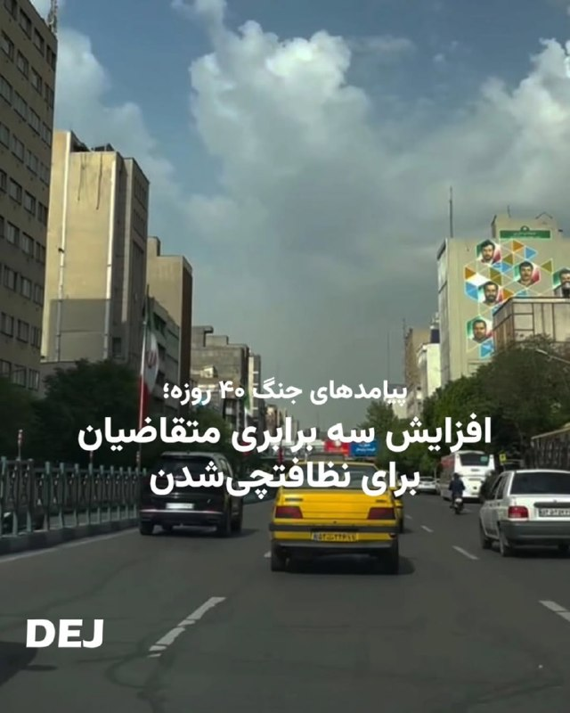

> 🚨📢 کمتر از دو ماه پس از اعلام آتش‌بس موقت، بیکاری و گرانی مردم را عاصی کرده است. گزارش روزنامه «شرق» نشان می‌دهد تقاضا برای مشاغل خدماتی بدون نیاز به تخصص، به‌ویژه نظافت و پذیرایی، در ایران به‌شدت افزایش یافته است.
> 
> بر اساس آمار پلتفرم «آچاره»، ثبت‌نام متقاضیان این مشاغل در اردیبهشت امسال نسبت به سال گذشته ۲۳۹ درصد رشد کرده و هم‌زمان سن متقاضیان و شمار افراد بازگشته به بازار کار نیز افزایش یافته است.
> 
> #آتشبس #بیکاری
> @DEJradio

## 1405/02/16 01:43 — mamlekate
> 📝 الو قشم ۱۶ اردیبهشت ساعد ۰۱:۲۷ دو انفجار کم صدا در مدت زمان ۳۰ ثانیه ولی پرلرزش شنیده شد
> 
> 
> 
> ❓ آپدیت: استانداری هرمزگان می‌گوید ریز‌پرنده‌ها رهگیری شدند
> 
>  @mamlekate

## 1405/02/16 01:15 — mamlekate
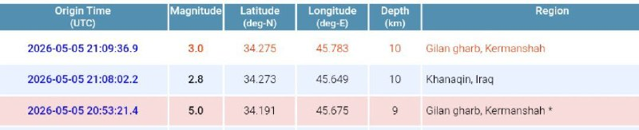

> ساعت ۰۰:۲۳ بامداد زلزله در کرمانشاه (۵ ریشتری ثبت شده که زلزله قابل توجهی محسوب میشه)
> 
> @mamlekate

## 1405/02/15 21:12 — iaghapour
[🎬 Video](telegram/content/iaghapour_2586_1778090656.jpg)

> اکانت های هوش مصنوعیو با یک دهم قیمت بخر 
> ✈️
> 
> 
> 🏳️‍🌈 Gemini Pro :
> - پلن مشابه ChatGPT Plus از شرکت گوگل
> - پشتیبانی از antigravity ( دستیار کد نویسی مشابه کدکس )
> - ساخت عکس و ویدیو + تحقیق عمیق + تجزیه و تحلیل
> - فعالسازی روی ایمیل شما
> - کاملا اختصاصی ( فمیلی نیست )
> - فعالسازی روی ایمیل شما
> 
> 🔆 ChatGPT Go :
> - پلن اقتصادی OpenAI
> - مناسب استفاده روزمره
> - 10 برابر محدودیت کمتر نسبت به نسخه ی رایگان
> - مناسب برنامه نویسی نیست
> 
> 📲 SuperGrok :
> - پلن مشابه ChatGPT Plus
> - تجزیه تحلیل قوی
> - پاسخ های کاملا هوشمند و طبیعی
> - بدون جواب های کلیشه ای
> 
> خرید و توضیحات بیشتر از ربات :
> 
> 🤖 @ChatGPT_StoreBOT

## 1405/02/15 21:12 — iaghapour
> ⭕️ وعده بازگشت به وضعیت عادی؛ توجیه محدودیت‌ها یا امید به بهبود اینترنت؟
> 
> معاون ارتباطات دفتر رئیس‌جمهور به تازگی اعلام کرده که وضعیت فعلی اینترنت مورد تایید دولت نیست و رئیس‌جمهور، محمدرضا عارف را مامور ساماندهی این شرایط کرده است. به گفته او، این محدودیت‌های شدید و قطعی‌ها صرفا تصمیماتی از سوی شورای عالی امنیت ملی و به دلیل شرایط خاص امنیتی و جنگی بوده‌اند.
> 
> 🔹 وعده روزهای بهتر: این مقام مسئول قول داده که با عبور از این شرایط ویژه، اینترنت نه تنها به حالت قبل برمی‌گردد، بلکه وضعیتی بهتر از گذشته پیدا خواهد کرد و وعده‌های انتخاباتی رئیس‌جمهور در این زمینه همچنان پیگیری می‌شوند.
> 
> 🔸 دفاع از اینترنت پرو: در واکنش به انتقادات، دولت ادعا می‌کند طرح «اینترنت پرو» صرفا برای نجات کسب‌وکارها در روزهای محدودیت ایجاد شده و نباید به آن برچسب اینترنت طبقاتی زد؛ چرا که به گفته آن‌ها، در شرایط عادی اصلا نیازی به چنین طرحی نخواهد بود.
> 
> 🔹 کاهش محدودیت‌های عمومی: خبر دیگر این است که قرار شده تدابیر جدیدی برای دسترسی بهتر سایر شهروندان به اینترنت اتخاذ شود تا فشار محدودیت‌های فعلی روی مردم کاهش یابد.
> 
> در حالی که دولت تلاش می‌کند قطعی‌ها و طرح‌های بحث‌برانگیزی مثل اینترنت پرو را صرفا به شرایط اضطراری گره بزند، کاربران و کسب‌وکارها همچنان منتظرند تا ببینند آیا این وعده‌ها در عمل به یک اینترنت آزاد و بدون محدودیت ختم می‌شود یا صرفا وعده‌ای برای کنترل نارضایتی‌های فعلی است.
> 
> 🆔 @iaghapour

## 1405/02/15 19:36 — iaghapour
> ⭕️ ایده عجیب در مجلس: تاسیس «اینستاگرام دولتی» و مدیریت کامل اینترنت!
> 
> نمایندگان مجلس در تازه‌ترین نشست خود با وزیر ارتباطات، از طرح‌ها و نگاه‌های جدیدی برای کنترل بیشتر فضای مجازی پرده برداشتند. در این جلسه، پیشنهاد ایجاد یک پلتفرم کاملا دولتی مشابه اینستاگرام مطرح شد تا به زعم آن‌ها، نیاز کشور برطرف شود.
> 
> 🔹 اینستاگرام دولتی: یکی از نمایندگان با اشاره به بازار سیاه و چند میلیونی فیلترشکن‌ها، رسما پیشنهاد ساخت یک سکوی دولتی شبیه اینستاگرام را برای پر کردن جای خالی این پلتفرم ارائه داده است.
> 
> 🔸 رویای مدیریت اینترنت: نایب رئیس مجلس تاکید کرده که مشکل آن‌ها اصل اینترنت نیست، بلکه می‌خواهند در صحنه بین‌المللی، مدیریت اینترنت کاملا در دست خودشان باشد و این فضا را به یک جبهه تقابل تشبیه کرده است.
> 
> 🔹 فرصت‌سازی از بحران: بخش قابل توجهی از صحبت‌های نمایندگان، حسرت خوردن برای از دست رفتن فرصت در شرایط ملتهب و جنگی است؛ آن‌ها معتقدند باید از این شرایط استفاده می‌کردند تا مردم و کسب‌وکارها به اجبار به سمت سکوهای داخلی کوچ کنند.
> 
> این صحبت‌ها به وضوح نشان می‌دهد که دغدغه اصلی، کاهش نارضایتی مردم از قیمت و کیفیت اینترنت نیست؛ بلکه تلاش برای بومی‌سازی اجباری، قطع ارتباط با شبکه‌های اجتماعی بین‌المللی و کشاندن کاربران به پلتفرم‌های تحت کنترل و نظارت است. / زومیت
> 
> ✍🏻 پ.ن: از سوپر اپلیکیشن های ایتا و سروش و گپ و بله که از تلگرام کپی کردین مشخصه توانایی اینکار رو دارید.
> 
> 🆔 @iaghapour

## 1405/02/15 19:29 — iaghapour
> ⭕️ مرگ خاموش اقتصاد خرد: نابودی ۴۰ درصد از کسب‌وکارهای اینستاگرامی!
> 
> قطعی‌ها و محدودیت‌های اینترنتی فقط حق دسترسی آزاد ما به شبکه‌های اجتماعی را سلب نکرده، بلکه تیشه به ریشه‌ی اقتصاد خرد و معیشت مردم زده است. طبق اعلام پشوتن پورپزشک، عضو هیئت‌مدیره اتحادیه کسب‌وکارهای مجازی، فیلترینگ و اختلالات باعث نابودی بخش عظیمی از مشاغل آنلاین شده است.
> 
> 🔹 فاجعه‌ی آماری: نزدیک به ۴۰ درصد از کسب‌وکارهای اینستاگرامی برای همیشه از بین رفته‌اند؛ این یعنی مرگ مستقیم بیش از ۴۰۰ هزار شغل!
> 
> 🔸 دومینوی ویرانی: وقتی شوکی مثل محدودیت اینترنت وارد می‌شود، ابتدا کسب‌وکارهای کوچک و آسیب‌پذیر می‌میرند، اما این نابودی با کمی تاخیر گریبان شرکت‌های بزرگ اقتصادی را هم خواهد گرفت.
> 
> 🔹 زنجیره‌ی به هم پیوسته: کسب‌وکارهای بزرگ در تولید، تامین و توزیع به شدت به همین کسب‌وکارهای خرد وابسته‌اند. توهم مصونیت برای شرکت‌های بزرگ، در نهایت منجر به فروپاشی خود آن‌ها می‌شود. منبع: زومیت
> 
> 🆔 @iaghapour

## 1405/02/15 18:08 — mamlekate
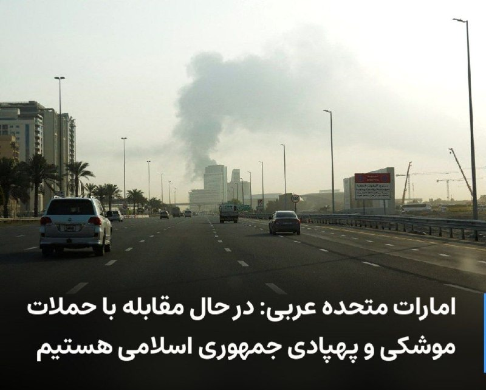

> 📝 امارات متحده عربی: در حال مقابله با حملات موشکی و پهپادی جمهوری اسلامی هستیم
> 
> وزارت دفاع امارات متحده عربی اعلام کرد سامانه های پدافند هوایی این کشور در حال مقابله با حملات موشکی و پهپادی هستند که از سوی ایران انجام می شود و صداهای شنیده شده در سراسر کشور ناشی از عملیات سامانه های پدافندی امارات برای مقابله با موشک های بالستیک، کروز و پهپادها است.
> 
> @mamlekate

## 1405/02/15 17:04 — mamlekate
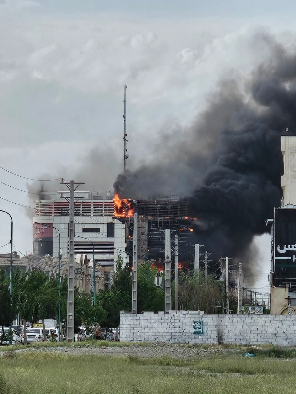

> الو متاسفانه پاساژ تجاری ارغوان فاز۴ اندیشه آتیش گرفته. امیدوارم مردم زودتر تخلیه که کرده باشن اونجا فقط تو دو طبقه ی آخر ۶ و ۷ حداقل ۴تا باشگاه بدنسازی داره
> 
> @mamlekate

## 1405/02/15 14:08 — mamlekate
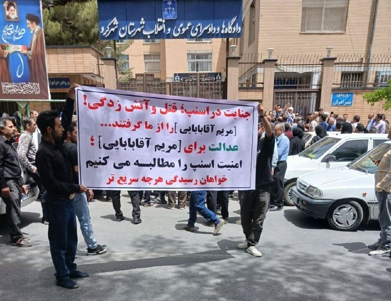

> الو یه راننده اسنپ تو شهرکرد به یه دختر به اسم مریم تجاوز کرده بعد هم آتیشش زده. مردم ریختن دم فرمانداری و استانداری. [عکس از دیروز جلوی دادسرا]
> 
> @mamlekate

## 1405/02/15 10:33 — mamlekate
> 📝 ارزیابی اطلاعاتی آمریکا: حملات اخیر تأثیر محدودی بر برنامه هسته‌ای ایران داشته است
> 
> ارزیابی‌های اطلاعاتی آمریکا نشان می‌دهد حملات اخیر آمریکا و اسرائیل تأثیر محدودی بر برنامه هسته‌ای جمهوری اسلامی داشته و زمان مورد نیاز تهران برای ساخت سلاح هسته‌ای نسبت به تابستان گذشته تغییری نکرده است. خبرگزاری رویترز این موضوع را به نقل از سه منبع آگاه گزارش داده است.
> 
> @mamlekate

## 1405/02/14 22:15 — mamlekate
> 📝 ایران در واکنش به «پروژه آزادی»، شماری از کشتی‌ها و بندر فجیره امارات را هدف قرار داد
> 
> رئیس‌جمهور ایالات متحده تهدید کرد اگر جمهوری اسلامی به کشتی‌های آمریکایی که در حال هدایت شناورها از تنگهٔ هرمز هستند حمله کند، ایران «از صفحه روزگار محو خواهد شد».
> 
> 
> 📝 امارات متحده عربی: ۱۵ موشک و ۴ پهپاد پرتاب‌شده از سوی ایران را رهگیری کردیم
> 
> وزارت دفاع امارات متحده عربی اعلام کرد سامانه‌های پدافند هوایی این کشور روز دوشنبه ۱۲ موشک بالستیک، ۳ موشک کروز و ۴ پهپاد پرتاب‌شده از سوی ایران را رهگیری کرده‌اند که در نتیجه آن ۳ نفر به‌طور متوسط زخمی شدند.
> 
> @mamlekate

## 1405/02/14 19:09 — iaghapour
> اسم این زندگــــــی نبود
> یک مبارزه تمام عیار بود...
> 
> #جوانی #زندگی #جنگ #اینترنت

## 1405/02/14 18:54 — mamlekate
> 📝 سنتکام: دو کشتی تجاری با پرچم آمریکا از تنگه هرمز عبور کردند
> 
> ساعاتی پس از آغاز عملیات  «پروژه آزادی» به منظور تأمین امنیت کشتیرانی تجاری در تنگه هرمز، سنتکام از عبور دو کشتی با پرچم ایالات متحده از تنگه هرمز خبر داد.
> 
> 
> 📝 دو حادثه دریایی در اطراف هرمز، در آستانه اقدام سنتکام برای پشتیبانی از کشتی‌های گرفتار در منطقه
> 
> در کمتر از ۲۴ ساعت، دو حادثه امنیتی برای کشتی‌های تجاری در مسیرهای منتهی به تنگه هرمز گزارش شد؛ همزمان با آنکه ستاد فرماندهی مرکزی آمریکا، سنتکام، اعلام کرد از روز دوشنبه ۱۴ اردیبهشت پشتیبانی از «پروژه آزادی» را با هدف بازگرداندن آزادی کشتیرانی تجاری در تنگه هرمز آغاز می‌کند.
> 
> 
> 📝 احتمال حمله به کشتی کره جنوبی در تنگه هرمز؛ سئول: در حال بررسی هستیم
> 
> 
> 📝 امارات در واکنش به حمله به نفتکش خود در تنگه هرمز: «حمله تروریستی» رژیم ایران نوعی «دزدی دریایی» است
> 
> 
> 
> 📝 دبی ساعت ۱۷ به وقت محلی دوبار هشدار موشک اومده
> 
> 
> 🚀 امروز ۱۴ اردیبهشت دوشنبه عصر حدود ساعت ۶، سه تا موشک از دشتستان بوشهر لانچ کردن
> 
> 📝 سی‌ان‌ان: سامانه گنبد آهنین اسرائیل در امارات متحده عربی یک موشک ایرانی را منهدم کرد
> 
> 
> 📝 قیمت دلار در بازار آزاد ایران به ۱۹۰ هزار تومان رسید
> 
> 
> @mamlekate

## 1405/02/14 16:09 — iaghapour
> ⭕️ حل مشکل دانلود از ریلیز گیت‌هاب با LatestReleaseMirror
> 
> اگر در دانلود فایل‌ها از بخش ریلیزهای (Releases) گیت‌هاب به دلیل محدودیت‌های اینترنت مشکل دارید، این اسکریپت کاربردی دقیقاً برای شما ساخته شده است!
> 
> ابزار LatestReleaseMirror به صورت خودکار فایل‌های آخرین آپدیتِ ریپازیتوری‌های دلخواه شما را دریافت کرده و آن‌ها را به عنوان فایل‌های عادی در ساختار پوشه‌های گیت‌هاب ذخیره می‌کند؛ در نتیجه می‌توانید آن‌ها را به راحتی و حتی با اینترنت داخلی دانلود کنید.
> 
> 🔹 دریافت و آپدیت خودکار آخرین نسخه با استفاده از GitHub Actions.
> 🔸 امکان فیلتر کردن فایل‌های مورد نیاز (مثلاً فقط نسخه‌های ویندوز یا اندروید)
> 🔹 دسته‌بندی تمیز فایل‌های خروجی در مسیرهای مشخص.
> 
> 🔗 لینک ریپازیتوری و راهنمای استفاده
> 
> 🆔 @iaghapour

## 1405/02/14 13:56 — iaghapour
> ركورد جديد سرعت اينترنت ژاپن:
> 
> با سرعت 1.02 پتابيت بر ثانيه، كل نتفليكس را در 1 ثانيه دانلود مى‌كند.
> 
> ✍ ما هم اینجا باید با DNStt وصل بشیم تا بزور بتونیم فقط این خبر رو بخونیم...
> 
> 🆔 @iaghapour

## 1405/02/13 22:28 — iaghapour
> ⭕️ اسکریپت بهینه شده XHTTP Relay ECO برای Vercel Pro
> 
> 🔹 نسخه ECO طوری تیون شده که علاوه بر امنیت سفت‌وسخت v1.3، کم‌هزینه‌ترین رفتار ممکن روی Vercel Pro رو داشته باشه؛ یعنی با کنترل هوشمند Timeout، Inflight، Throttle و Logها، مصرف منابع و هزینه نهایی تا جای ممکن پایین نگه داشته میشه.
> 
> 🔸فقط با GET، HEAD و POST کار می‌کنه تا امنیت بالاتر بره.
> 🔹 احراز هویت فقط از طریق هدر x-relay-key انجام میشه
> 🔸هدرهای اضافی پلتفرم و hop-by-hop رو بی‌رحمانه فیلتر می‌کنیم.
> 🔹روی آپلود و دانلود محدودیت سرعت (Throttling) واقعی گذاشتیم.
> 🔸بردیمش روی Node runtime با لیمیت ۱۲۸ مگابایت رم و مدیریت کانکشن‌های همزمان.
> 
> 🔗 اطلاعات بیشتر در گیت‌هاب پروژه
> 
> 🆔 @iaghapour

## 1405/02/13 14:05 — iaghapour
> ⭕️ ورژن جدید کلاینت اندروید GooseRelayVPN منتشر شد
> 
> کلاینت اندروید GooseRelayVPN که هسته GooseRelay را از طریق Go mobile اجرا می‌کند و رابط کاربری کامل برای مدیریت VPN، پروفایل‌ها، لاگ‌ها و تنظیمات ارائه می‌دهد. این اپ یک SOCKS5 محلی روی اندروید ایجاد می‌کند و ترافیک TCP را از معماری GooseRelay عبور می‌دهد.
> 
> 🔹هسته پروژه به ورژن 1.5.0 آپدیت شد.
> 🔸قابلیت fake dns اضافه شد.
> 🔹باگ ها در این نسخه برطرف شدن.
> 
> 🔗 آدرس گیت‌هاب پروژه
> 
> 🆔 @iaghapour

## 1405/02/12 19:53 — iaghapour

> ⭕️ آموزش ساخت فیلترشکن رایگان و شخصی به 2 روش با نت ملی
> 
> 🔹با استفاده از دو ابزار قدرتمند MHRV و Nova-Proxy، دیگه نیازی به خرید کانفیگ‌ها و سرورهای گرون‌قیمت ندارید. تو این آموزش قدم‌به‌قدم به ۲ روش مختلف پیش میریم تا بتونید یه اتصال پایدار و بدون قطعی داشته باشید. حتماً تا آخر ویدیو همراه من باشید.
> 
> 🔗 لینک ویدیو در یوتیوب
> 
> 🔗 دانلود ویدیو با لینک مستقیم
> 
> 🔹 دانلود کلاینت ویندوز
> 
> 🔸 دانلود کلاینت اندروید
> 
> 
> #آموزش #فیلترشکن #mhrv #novaproxy #رایگان
> برای دور زدن فیلترینگ و آموزش تکنولوژی و هوش مصنوعی ما رو دنبال کنید 💚
> 🆔@iaghapour

## 1405/02/11 15:30 — iaghapour

> ⭕️ پشت‌پرده‌ی «اینترنت پرو»؛ امتیاز ویژه یا تله‌ی نظارتی؟
> 
> این روزها سیم‌کارت‌های بدون فیلتر با نام «اینترنت پرو» در ازای دریافت هزینه و ثبت کامل مشخصات هویتی به فروش می‌رسند. اما هدف اصلی این طرح، دلسوزی برای نیاز اینترنتی اقشار مختلف نیست.
> 
> هدف اصلی و پنهان این ماجرا، چیزی جز «تشخیص هویت دقیق و رصد لحظه‌ایِ کاربر» نیست. 👁‍🗨
> 
> وقتی اینترنت آزاد را مستقیماً با نام و کد ملی خودتان دریافت می‌کنید دقیقاً چه اتفاقی می‌افتد؟
> 
> 🔹 پایان گمنامی: تمام سایت‌هایی که سر می‌زنید و محتوایی که می‌بینید، مستقیماً و شفاف روی نام خودتان ثبت و مانیتور می‌شود.
> 
> 🔸 تزریق خودسانسوری: وقتی می‌دانید هر کلیک شما رصد می‌شود، ناخودآگاه وارد یک «زندان شیشه‌ای» می‌شوید که خودتان هزینه‌اش را داده‌اید!
> 
> 🔹 تجارت با حقوق اولیه: حق بدیهی دسترسی به اینترنت آزاد را مسدود کرده‌اند و حالا همان را به قیمت نقض حریم خصوصی، به عنوان یک «آپشن ویژه» به خودمان می‌فروشند.
> 
> «اینترنت پرو» یک امکان رفاهی نیست؛ ابزاری برای کنترل نقطه‌ای و عادی‌سازیِ اینترنت طبقاتی است. بهای اصلی این سیم‌کارت‌ها پول نیست؛ حریم خصوصی ماست.
> 
> 🆔 @iaghapour

## 1405/02/10 20:06 — iaghapour

> ⭕️ کلاینت اندروید GooseRelayVPN
> 
> 🔹کلاینت اندروید GooseRelayVPN که هسته GooseRelay را از طریق Go mobile اجرا می‌کند و رابط کاربری کامل برای مدیریت VPN، پروفایل‌ها، لاگ‌ها و تنظیمات ارائه می‌دهد. این اپ یک SOCKS5 محلی روی اندروید ایجاد می‌کند و ترافیک TCP را از معماری GooseRelay عبور می‌دهد.
> 
> 🔹پیکربندی مبتنی بر پروفایل
> 🔸وضعیت و تله‌متری در صفحه Home
> 🔹تب Logs برای عیب‌یابی Android/Core
> 🔸قابلیت Split Tunneling و Internet Sharing
> 
> 🔗 آدرس گیت‌هاب پروژه
> 
> 🆔 @iaghapour

## 1405/02/10 13:23 — iaghapour
> 💢 رئیس اتحادیه کسب‌وکارهای مجازی:
> به شرکت‌ها زنگ می‌زنند و پیشنهاد فروش اینترنت بدون فیلتر(پرو) برای کارمندانشان را می‌دهند.
> 
> ⁉️ اگر موضوع واقعاً امنیت ملی است، چطور با پرداخت پول، امنیت تأمین می‌شود؟!
> 
> منبع: کانال خبری
> 
> 🆔 @iaghapour

## 1405/02/10 00:25 — iaghapour
> 

## 1405/02/10 00:24 — iaghapour
> ✍🏻 دوستان، همان‌طور که خودتون در جریان هستید، من در این چند ماه حتی یک مورد تبلیغ فیلترشکن، اوتباند و موارد مشابه قرار ندادم. الان هم واقعاً تمایلی به این کار ندارم، چون شرایط اصلاً به‌گونه‌ای نیست که بشه کسی را معرفی کرد.
> 
> با این حال، در همین چند ماه پیام‌های بسیار زیادی داشتیم که درخواست می‌کردند حتماً یک شخص معتبر را معرفی کنیم؛ چرا که خیلی‌ها از کلاهبرداری‌های پیاپی خسته شدن و ارسال این دست پیام‌ها تا به همین امروز هم ادامه داره.
> 
> به همین دلیل، اگه خودتون موافق باشید، افرادی رو که از قبل با ما همکاری می‌کردند و تا حدودی قابل‌اطمینان هستند، یکی‌یکی به شما معرفی کنیم. در این مورد ذکر چند نکته ضروری هستش:
> 
> 🔸عدم تضمین صددرصدی: ناگفته نماند ما واقعاً نمیتونیم کسی را با اطمینان ۱۰۰ درصدی تأیید کنیم، اما افرادی که معرفی میشن همگی سابقه همکاری با ما را دارن.
> 
> 🔹عدم پذیرش تبلیغ جدید و اوتباند: تا زمانی که شرایط استیبل و پایدار نشود، تبلیغ هیچ فرد جدیدی را قبول نمی‌کنیم. در ضمن، تبلیغ فروش اوتباند هم به‌هیچ‌وجه پذیرفته نمی‌شود.
> 
> 🔸قیمت‌های منصفانه: تمام سعی ما بر اینه افرادی را معرفی کنیم که در این زمینه منصف باشند و قیمت‌های بالایی ارائه ندهند. ولی خب، طبیعتاً نمیشه انتظار قیمت‌های قدیمی را داشت؛ چون همان‌طور که خودتون میدونید در حال حاضر هیچ‌کس با اون قیمت‌های قبلی فروشی نداره.
> 
> اگه تمایل دارید، لطفاً در نظرسنجی زیر شرکت کنید. البته نظر شخصی خودم اینه که اگه در حال حاضر واقعاً مشکل خاصی ندارید، در نظرسنجی همان گزینه (خیر) را انتخاب کنید.

## 1405/02/09 19:21 — iaghapour
> ⚠️ هشدار مهم درباره اسکریپت VPN Over GitHub
> 
> ▪️لطفاً از این ابزار به عنوان فیلترشکن استفاده نکنید!
> 
> 🚫 بن شدن اکانت: تبدیل گیت‌هاب به تونل ترافیک، خلاف قوانین این سایت است و خیلی زود باعث مسدود شدن حساب شما می‌شود.
> 
> 🐢 سرعت بسیار پایین: برای هر ارتباط به یک بار push و pull نیاز دارد که آن را عملاً غیرقابل استفاده می‌کند.
> 
> 🔻خطر برای برنامه‌نویس‌ها: گیت‌هاب یک سایت حیاتی برای توسعه‌دهندگان است؛ سوءاستفاده از آن ممکن است باعث حساسیت شده و دسترسی به این پلتفرم مهم را دوباره از کار بیندازد. (خارج شدن از لیست سفید و...)
> 
> 🆔@iaghapour

## 1405/02/09 16:34 — iaghapour
> ای بابا روش Vercel چرا بسته شد؟ هنوز آموزش نداده بودم که.😁
> 
> سازمان فیلترینگ زرنگ شده ها. فک کنم خودشون رو آپدیت کردن دیگه به کانال من نگاه نمیکنن :)

## 1405/02/09 11:10 — iaghapour
> ‼️دلار 177 و طلا 19,400,000
> 
> شب میخوابی صبح بلند میشی یه پله بدبخت تر میشی!

## 1378/10/11 03:30 — VahidOOnLine
[🎬 Video](telegram/content/VahidOOnLine_238499_1778090660.mp4)

> ‌
> دونالد ترامپ گفت ایالات متحده اجازه نخواهد داد جمهوری اسلامی به سلاح هسته‌ای دست پیدا کند و تأکید کرد: «نخواهیم گذاشت چنین چیزی اتفاق بیفتد.»
> 
> او افزود واشینگتن در حال تعامل با مقام‌هایی است که «بسیار تمایل دارند توافقی انجام دهند» و گفت باید دید آیا این توافق می‌تواند برای آمریکا قابل قبول باشد یا نه.
> 
> ترامپ در ادامه گفت: «ما اوضاع را کاملاً تحت کنترل داریم.»
> 
> او با اشاره به محاصره اعمال‌شده علیه جمهوری اسلامی گفت: «محاصره فوق‌العاده است. نیروی دریایی کار فوق‌العاده‌ای انجام داده؛ مثل یک دیوار فولادی.»
> 
> رئیس‌جمهور آمریکا افزود: «هیچ‌کس عبور نمی‌کند، به‌ویژه ایرانی‌ها؛ آن‌ها به هیچ شکلی نمی‌توانند چیزی را عبور دهند و عملاً از کار افتاده‌اند.»
> 
> ترامپ همچنین گفت: «خواهیم دید آیا آن‌ها موافقت می‌کنند یا نه، و اگر موافقت نکنند، خیلی زود بعد از آن مجبور به موافقت خواهند شد.»
> 
> او در پایان تأکید کرد: «وضعیت به همین شکل است.»
> ‌🏁 🇬🇧 ManotoTV
> 
> 🤖 @VahidOOnLine

## 1378/10/11 03:30 — VahidOOnLine
[🎬 Video](telegram/content/VahidOOnLine_238498_1778090661.mp4)

> ⭕️ انفجار کهنز شهریار از دوربین خودرو؛
> ویدیویی که به‌دلیل قطعی اینترنت با دو ماه تاخیر منتشر شد
> 
> ♦️در ویدیوی منتشر شده که مربوط به یکشنبه ۱۰ اسفندماه است، از دوربین یک خودرو در حال عبور، انفجار در کهنز شهریار ضبط شده است.
> در توضیح همراه این ویدیو که از سوی حساب کاربری «وحید آنلاین» منتشر شده، آمده است: «انفجار حمله به سپاه کهنز شهریار از دوربین ماشین. تازه تونستم به اینترنت وصل بشم.»
> پس از قطع کامل اینترنت در ایران، برخی کاربران که توانسته‌اند از روش‌های مختلف به اینترنت جهانی متصل شوند، اقدام به انتشار ویدیوها و تصاویر پراکنده‌ای از چهل روز جنگ آمریکا و اسرائیل علیه جمهوری اسلامی در شبکه‌های اجتماعی کرده‌اند.
> ‌🇸🇦 Indypersian
> 
> 🤖 @VahidOOnLine

## 1378/10/11 03:30 — VahidOOnLine
[🎬 Video](telegram/content/VahidOOnLine_238483_1778090663.mp4)

> ⭕️ وقوع آتش‌سوزی در جاده اندیمشک–اهواز
> 
> ♦️ویدیویی که در شبکه‌های اجتماعی منتشر شده، صحنه‌هایی از وقوع آتش‌سوزی و برخاستن دود غلیظ در روز چهارشنبه ۱۶ اردیبهشت‌ماه در محدوده جاده اندیمشک – اهواز را نشان می‌دهد.
> بر اساس تصاویر منتشرشده، دود سیاه و گسترده‌ای از محل حادثه به آسمان برخاسته است. با این حال، تاکنون اطلاعات رسمی درباره علت وقوع این آتش‌سوزی و میزان خسارات احتمالی منتشر نشده است.
> ‌🇸🇦 Indypersian
> 
> 🤖 @VahidOOnLine

## 1378/10/11 03:30 — mwarmonitor
[🎬 Video](telegram/content/mwarmonitor_8578_1778090665.mp4)

> 📝 این انگلِ بدذات که تا دیروز با مکیدن خون مردم در لجن‌زار سایت‌های شرط‌بندی غوطه‌ور بود، حالا که تیپای قانون را خورده و بوی دیپورت و بی‌پولی بالا گرفته، ناگهان ردای زهد به تن کرده تا وقاحت را به سقف بچسباند. این آفتاب‌پرستِ بی‌ریشه که تمام زندگی‌اش بر پایه‌ی کلاهبرداری و مال‌حرام بنا شده، حالا با ریشِ نفاق و تظاهر به معنویت، قصد دارد از اعتقادات مردم هم نردبانی برای فرار از رسوایی بسازد. پویان مختاری نماد بارز یک جانورِ فرصت‌طلب است که وقتی بوی زندان می‌شنود، از جکوزیِ فساد به هیئتِ ریا پناه می‌برد؛ اما نه آن محاسنِ قلابی و نه این نمایش‌های تهوع‌آور، بوی تعفنِ دزدی‌هایش را پاک نخواهد کرد. این حرامزاده‌ی نان‌به‌نرخ‌روز‌خور باید بداند که با «یا حسین» گفتن، پرونده‌ی سیاه غارتگری‌اش بسته نمی‌شود و جز نفرت و تفِ لعنتِ ملت، نصیبی نخواهد داشت.
> 
> @mwarmonitor

## 1378/10/11 03:30 — DEJradio
[🎬 Video](telegram/content/DEJradio_4449_1778090666.mp4)

> 🔺🎥 پرواز ریز پرنده‌ها و پهپادهای شناسایی در قشم
> 
> بامداد روز چهارشنبه ۱۶ اردیبهشت پدافند شهرستان قشم فعال شده و با ریزپرنده‌ها مقابله کرده است.
> 
> به گزارش خبرگزاری مهر، طبق اعلام استانداری هرمزگان صدای شنیده شده در جزیره قشم، ناشی از مقابله با ریزپرنده‌ها و پهپادهای شناسایی بوده است و هیچ برخورد، خسارت و یا انفجاری در قشم اتفاق نیافتاده است.
> 
> #قشم #ریزپرنده
> @DEJradio

## 1378/10/11 03:30 — DEJradio
[🎬 Video](telegram/content/DEJradio_4446_1778090668.mp4)

> 🎥
> ⭕️ مارکو روبیو در بخشی از نشستی که روز سه‌شنبه در کاخ سفید برگزار شد گفت : "ایران در بسیاری از جهات کشوری مدرن است و میراث و تاریخ فوق‌العاده‌ای دارد[...] مردم ایران خواهان یک زندگی طبیعی هستند."
> 
> #مارکو_روبیو #ایران
> @DEJradio

## 1378/10/11 03:30 — DEJradio
[🎬 Video](telegram/content/DEJradio_4444_1778090669.mp4)

> 🔺📢 “بـ.ـسیجی، سـ.ـپاهی شما از همه دزدها دزدترید
> 
> یک شهروند با ارسال یک ویدیو خطاب به نیروهای بـ.ـسیج و سـ.ـپاه گفت که «شما از همه دزدها دزدترید.»
> 
> #بسیج #IRGCterrorists
> @DEJradio

## 1378/10/11 03:30 — mamlekate
[🎬 Video](telegram/content/mamlekate_103458_1778090671.mp4)

> 📝 دونالد ترامپ: «پروژه آزادی» مدت کوتاهی متوقف می‌شود؛ محاصره دریایی جمهوری اسلامی ادامه دارد
> 
> 
> دونالد ترامپ، رئیس‌جمهوری آمریکا عصر سه‌شنبه اعلام کرد که به دلیل دستیابی به «پیشرفت بزرگ» در مذاکرات با ایران در جهت حصول توافق برای پایان دادن به جنگ و بازگشایی تنگه هرمز، عملیات نظامی جدید آمریکا، موسوم به «پروژه آزادی» را که در این تنگه در حال اجرا بود، موقتا تعلیق می‌کند.
> 
> آقای ترامپ در شبکه اجتماعی «تروت‌سوشال» نوشت: «بنا بر درخواست پاکستان و دیگر کشورها و با توجه به موفقیت نظامی چشمگیری که در جریان کارزار علیه کشور ایران داشته‌ایم و همچنین با توجه به این واقعیت که پیشرفت بزرگی در مسیر دستیابی به توافق کامل و نهایی با نمایندگان ایران حاصل شده است، ما متقابلا توافق کرده‌ایم که در حالی که محاصره با قوت کامل برقرار خواهد بود، «پروژه آزادی» برای مدت کوتاهی متوقف شود تا مشخص شود آیا توافق می‌تواند نهایی و امضا شود یا نه.»
> 
> euronewspe
> @mamlekate

## 1378/10/11 03:30 — mamlekate
[🎬 Video](telegram/content/mamlekate_103456_1778090672.mp4)

> مهدی تاج، رییس فدراسیون فوتبال در گفتگویی با صدا و سیمای جمهوری اسلامی که ۱۵ اردیبهشت در حاشیه تجمعات شبانه هواداران حکومت در تهران انجام شده است، گفت که جیانی اینفانتینو، رییس فیفا باید تضمین بدهد که مشابه اتفاقی که برای او در فرودگاه ونکوور کانادا افتاد، برای تیم ملی نیفتد: «اینفانتینو باید تضمین جدی به ما بدهد؛ حق توهین به سپاه پاسداران ندارند. ضمانتی به ما داده شود که ماجرایی مثل کانادا پیش نیاید، اگر توهین کنند، تیم ممکن است برگردد.»
> IranintlTV
> 
> از حضور پرتعداد مردم ایران با پرچم شیروخورشید توی پر بیننده ترین رخداد ورزشی جهان بشدت وحشت دارند. چون خوب می‌دونن اون بخش بزرگی از مردم جهان که پیگیر مسائل سیاسی نیستن، از این طریق می‌فهمن که مردم ایران این حکومت اسلامی رو نمی‌خوان. این دست و پا زدن و "تضمین" خواستن، فقط واسه اینه که نذارن صدای مردم در پرایم‌تایم رسانه‌ای به گوش دنیا برسه. انگار جام جهانی لیگ آزادگانه بدون تماشاگر برگزار کنند.
> 
> @mamlekate

## 1378/10/11 03:30 — mamlekate
[🎬 Video](telegram/content/mamlekate_103454_1778090673.mp4)

> طبق پیام‌های توی الو متاسفانه توی حادثه آتش‌سوزی امروز تعداد زیادی از جمله چند زن داخل یکی از باشگاه‌های ورزشی زنانه برج ارغوان کشته شدند. پاساژ ۶ تا باشگاه بزرگ داره. «الکی میگن کسی نمرده.»
> 
> @mamlekate

## 1378/10/11 03:30 — mamlekate
[🎬 Video](telegram/content/mamlekate_103453_1778090674.mp4)

> 🔥 علی انصاری، جوان ۲۵ ساله ایرانی، از برکت AI میلیاردر شد.
> 
> او زاده ایران ، بنیان‌گذار micro1 هست. شرکتش داده‌های تخصصی را برای آموزش مدل‌های هوش مصنوعی لیبل می‌زند و سریع رشد کرد.
> 
> اکنون شرکت اش در حال مذاکره برای ارزش ۲.۵ میلیارد دالری هست.
> 
> DaneshParwar_
> @mamlekate

## 1378/10/11 03:30 — mamlekate
[🎬 Video](telegram/content/mamlekate_103452_1778090676.mp4)

> ‌
> دونالد ترامپ، رئیس‌جمهور آمریکا، در پاسخ به پرسشی درباره احتمال مسلح‌کردن معترضان در ایران گفت آن‌ها «می‌خواهند اعتراض کنند، اما سلاحی ندارند».
> 
> او گفت در تجمع‌های گسترده، حضور چند فرد مسلح می‌تواند باعث شود معترضان غیرمسلح با مشاهده کشته‌شدن افراد «عقب‌نشینی کنند».
> 
> ترامپ همچنین با اشاره به اعتراضات دیماه گفت «۴۲ هزار معترض غیرمسلح» در یک ماه کشته شده‌اند و افزود در این تجمع‌ها از تک‌تیراندازها استفاده شده است.
> 
> او در عین حال گفت نمی‌خواهد چنین شرایطی تکرار شود، اما تاکید کرد نبود سلاح یکی از دلایل کاهش تداوم اعتراضات است.
> 
> ManotoTV
> @mamlekate

## 1378/10/11 03:30 — mamlekate
[🎬 Video](telegram/content/mamlekate_103448_1778090677.mp4)

> پاساژ تجاری ارغوان فاز۴ اندیشه
> 
> @mamlekate مملکته

## 1378/10/11 03:30 — mamlekate
[🎬 Video](telegram/content/mamlekate_103444_1778090678.mp4)

> دونالد ترامپ، رئیس‌جمهور آمریکا، در گفت‌وگو با هیو هیویت گفت آمریکا «عمدا» ارتش ایران را زیاد هدف قرار نداده، زیرا ارتش را «بسیار میانه‌روتر» از نیروهای وفادار به جمهوری اسلامی می‌داند.
> 
> او با اشاره به تجربه عراق گفت یکی از بدترین اشتباه‌ها در آن کشور کنار گذاشتن همه رهبران بود، زیرا پس از آن «هیچ‌کس نمی‌دانست رهبر کیست» و در نهایت داعش پدید آمد. ترامپ افزود آمریکا نمی‌خواهد چنین سناریویی در ایران تکرار شود.
> 
> ManotoTV
> @mamlekate

## 1378/10/11 03:30 — mamlekate
[🎬 Video](telegram/content/mamlekate_103443_1778090680.mp4)

> حسین‌علی حاجی دلیگانی، عضو مجلس شورای اسلامی، شامگاه دوشنبه ۱۴ اردیبهشت در یک برنامه تلویزیونی ادعا کرد که توان تخریب همزمان ۱۶ جفت موشک سجیل، به اندازه یک «بمب اتمی» است.
> 
> این عضو پیشین سپاه پاسداران در همین برنامه مدعی شد که نیروهای مسلح جمهوری اسلامی «هنوز» از موشک رستاخیز در جنگ استفاده نکرده‌اند.
> 
> Indypersian
> @mamlekate

## 1378/10/11 03:30 — VahidOnline
[🎬 Video](telegram/content/VahidOnline_75282_1778090681.mp4)

> 'یکشنبه ۱۰ اسفند'
> ویدیوی دریافتی با شرح: 'انفجار حمله به سپاه کهنز #شهریار از دوربین ماشین. تازه تونستم به اینترنت وصل بشم.'
> Vahid
> 
> 📡 @VahidOnline

## 1378/10/11 03:30 — VahidOnline
[🎬 Video](telegram/content/VahidOnline_75277_1778090681.mp4)

> محمدباقر قالیباف، رئیس‌ مجلس شورای اسلامی و مذاکره‌کننده ارشد ایران در مذاکرات با آمریکا، می‌گوید واشینگتن با اجرای محاصره دریایی و فشار اقتصادی قصد دارد «ما را تسلیم کند» و درباره تأثیر این فشارها بر وضعیت جامعه ابراز نگرانی کرد.
> او در یک فایل صوتی که رسانه‌های ایران روز چهارشنبه منتشر کردند، گفت: «ما احتمال حمله نظامی و مخصوصاً حملات تروریستی را کم نمی‌دانیم اما آن بخشی از طراحی دشمن که به جامعه باز می‌گردد، ضعیف‌کردن ایران از درون است.»
> وزیر خزانه‌داری آمریکا روز یکشنبه اعلام کرد که دولت دونالد ترامپ همزمان با جنگ، «محاصره اقتصادی» علیه ایران را ترتیب داده و در حال «خفه کردن» حکومت ایران است. او مدعی شد که جمهوری اسلامی حتی قادر نیست حقوق سربازان خود را بپردازد.
> قالیباف در فایل صوتی خود جنگ اخیر را «یکی از بزرگ‌ترین جنگ‌های معاصر ایران» خواند و با طرح این ادعا که پیروزی در این جنگ، «ایران را به یک بازیگر مؤثر در نظام بین‌المللی تبدیل می‌کند» افزود که رسیدن به چنین هدفی «با سختی‌هایی همراه است.»
> او با اذعان به «فشارهای اقتصادی» به مردم ایران خواستار «انجام وظیفه» همه مسئولان اجرایی کشور شد و افزود مردم هم باید «اقداماتی» انجام دهند.
> رئیس مجلس شورای اسلامی در ادامه «صرفه‌جویی» را مهم‌ترین خواسته از مردم خواند و همچنین خطاب به نیروهای «بسیج» گفت که «واسطه میان مردم و مسئولان دولتی و خیران» شوند.
> 
> ساعتی پیش از قالیباف، مسعود پزشکیان، رئیس‌جمهور ایران، نیز در پیامی در شبکه ایکس نوشت که «از افزایش قیمت‌ها مطلع هستم» و در توضیح دلیل آن گفت: «بخشی از آن مربوط به تغییر قیمت‌های مواد اولیه یا مشکلات مرتبط با جنگ ظالمانه‌ای است که مردم می‌دانند.»
> این مواضع در حالی اتخاذ شده که قیمت ارز در روزهای اخیر به ارقام بی‌سابقه‌ای رسیده و گزارش‌های رسانه‌های ایران حاکی از افزایش شدید قیمت‌ها و گرانی شدید کالاها در کشور است.
> @VahidHeadline
> محمدباقر قالیباف، رییس مجلس، گفت احتمال حمله نظامی کم نیست، اما «دشمن» به فشار اقتصادی امید بسته و بر اساس گزارش‌های «غلط» تصمیم‌گیری کرده است.
> او افزود ملت ایران حتی در شرایط فشار اقتصادی، به خاطر دین و اعتقادات خود مشکلات را تحمل می‌کنند.
> قالیباف گفت باید از ظرفیت ایرانیان خارج از کشور برای شکست «دشمن» استفاده شود و نخبگان نیز منتظر مراجعه مسئولان نمانند و راه‌حل‌ها و پیشنهادهای خود را ارائه دهند.
> او همچنین خواستار راه‌اندازی پویش «ایران همدل» مانند دوران کرونا شد.
> @VahidOOnLine
> فایل صوتی ۱۰ دقیقه‌ای و متن منتشرشده در منابع حکومتی رو گذاشتم اینجا
> 
> 📡 @VahidOnline

## 1378/10/11 03:30 — kianmeli1
[🎬 Video](telegram/content/kianmeli1_87193_1778090682.mp4)

> 🔴ترامپ : اگه الان قبول نکنن، خیلی زود یه جوری می‌کنیم که خودشون بیان قبول کنن
> 
> دورشون یه “دیوار فولادی” کشیدیم
> https://t.me/kianmeli1

## 1378/10/11 03:30 — kianmeli1
[🎬 Video](telegram/content/kianmeli1_87192_1778090683.mp4)

> 🔴سامانه ضد پهپاد لیزری Guangjian-21A چین که روی کامیون نصب می‌شود، در فرودگاه بین‌المللی دبی مشاهده شده است که احتمالاً برای دفاع در برابر حملات پهپادی احتمالی ایران مستقر شده است.
> https://t.me/kianmeli1

# Telegram Channel Archive

